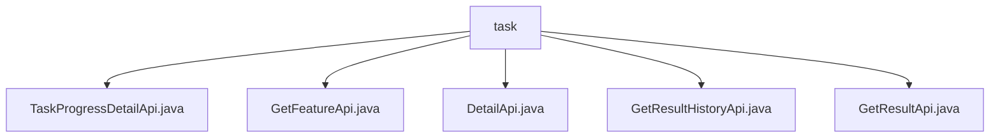

# Basic Information

|      |      |
|------|------|
| Name | task |
| Language | .java |
| Code Path | WeFe/board/board-service/src/main/java/com/welab/wefe/board/service/api/project/job/task |
| Package Name | docs.board.board-service.src.main.java.com.welab.wefe.board.service.api.project.job.task |
| Brief Description | TaskProgressDetailApi retrieves task progress details, path task/progress/detail. GetFeatureApi fetches feature columns, path flow/job/task/feature. DetailApi queries task details and results, path flow/job/task/detail. GetResultHistoryApi obtains historical results, path flow/job/task/result_history. GetResultApi retrieves node execution results, path flow/job/task/result. |

# Description

## Overview  
The core responsibility of this module is to provide task management-related APIs, including progress querying, feature retrieval, detail viewing, and historical result tracing. The interface specifications adhere to the REST style, with all paths prefixed by `flow/job/task` or `task/progress`, inheriting the `AbstractApi` base class. Input and output are validated through annotations to ensure data integrity. Key data structures include `TaskProgressOuputModel` (progress), `TaskResultOutputModel` (results), and `JobOutputModel` (task model), all mapped from the database via service layers such as `TaskProgressService` or `TaskService`. External dependencies are limited to the Spring framework and internal service-layer components. For example, `GetFeatureApi` retrieves feature statistics through `TaskResultService`.  

## Primary Business Scenarios  
The module supports full lifecycle management of tasks, akin to workflow tracking in a ticketing system. Typical scenarios include: users viewing task details and execution results via `DetailApi` (e.g., setting `needResult=true` to fetch results); tracing historical records via `GetResultHistoryApi` (filtered by role/type); and monitoring real-time progress via `TaskProgressDetailApi`. The interaction mode is exclusively synchronous HTTP requests, with API types covering queries (GET) and conditional searches (POST). For instance, `GetResultApi` supports a dual-parameter query strategy: prioritizing exact matches by `taskId`, followed by combined queries using `flowId+nodeId`, with intelligent deduplication applied to results.

### Package Internal Structure View

This flowchart illustrates the hierarchical structure of task-related APIs in the WeFe project. The root node is the `task` folder, which contains five Java file nodes: `TaskProgressDetailApi`, `GetFeatureApi`, `DetailApi`, `GetResultHistoryApi`, and `GetResultApi`. All API files are directly subordinate to the `task` directory without intermediate subdirectory levels, forming a clear flat structure. Each node represents a specific API implementation class designed to handle different functionalities such as task progress tracking, feature retrieval, detail queries, etc.

# File List

| Name   | Type  | Description |
|-------|------|-------------|
| [TaskProgressDetailApi.java](TaskProgressDetailApi.md) | file | Task Progress Details API class, which queries progress by task ID and role, returning the mapped output model. Input requires validation of the task ID and role fields. |
| [GetFeatureApi.java](GetFeatureApi.md) | file | API for obtaining feature calculation results. The input requires a process ID and a node ID, and the output includes feature statistics, CV, IV, and other information. |
| [DetailApi.java](DetailApi.md) | file | The DetailApi class is used to retrieve task details, querying task information through TaskService. Based on the input parameters, it determines whether to return the task results and encapsulates them into Output. The input parameters include task ID, etc., and mandatory fields must be validated. |
| [GetResultHistoryApi.java](GetResultHistoryApi.md) | file | API for retrieving historical task execution results, which queries task records by flowId, flowNodeId, and role, returning a list containing detailed task information. |
| [GetResultApi.java](GetResultApi.md) | file | API for retrieving task execution results, which queries node execution results by taskId or flowId plus nodeId, returning a list containing task status, timestamps, configurations, and other information. It processes input parameters, invokes TaskService to fetch data, filters out duplicate results, and returns the response. |

