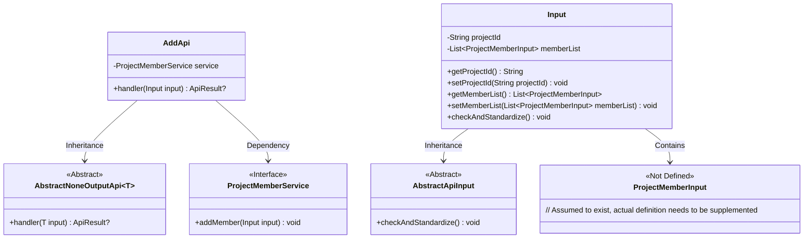
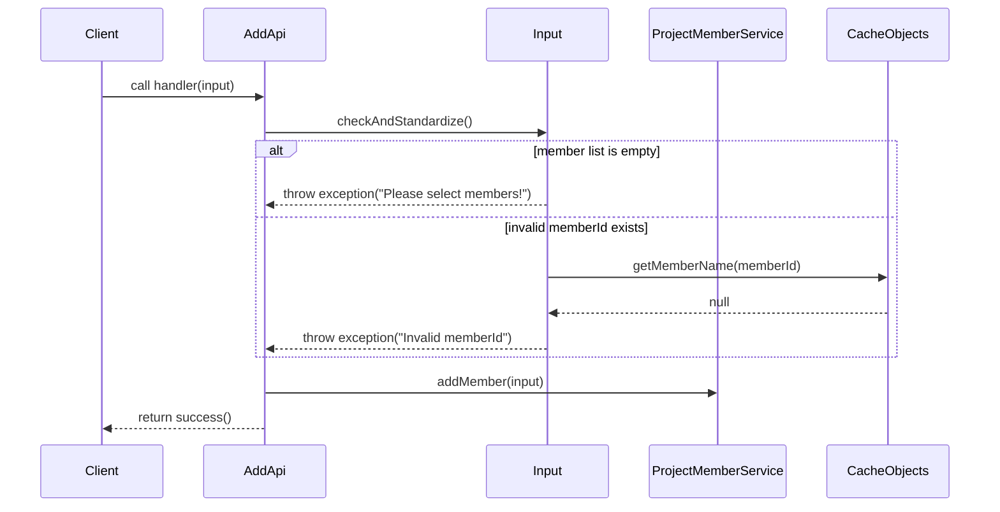

# Basic Information

|      |      |
|------|------|
| Name | AddApi |
| Language | .java |
| Code Path | WeFe/board/board-service/src/main/java/com/welab/wefe/board/service/api/project/member/AddApi.java |
| Package Name | com.welab.wefe.board.service.api.project.member |
| Dependencies | ['com.welab.wefe.board.service.dto.entity.ProjectMemberInput', 'com.welab.wefe.board.service.service.CacheObjects', 'com.welab.wefe.board.service.service.ProjectMemberService', 'com.welab.wefe.common.StatusCode', 'com.welab.wefe.common.exception.StatusCodeWithException', 'com.welab.wefe.common.fieldvalidate.annotation.Check', 'com.welab.wefe.common.web.api.base.AbstractNoneOutputApi', 'com.welab.wefe.common.web.api.base.Api', 'com.welab.wefe.common.web.dto.AbstractApiInput', 'com.welab.wefe.common.web.dto.ApiResult', 'org.apache.commons.collections4.CollectionUtils', 'org.springframework.beans.factory.annotation.Autowired', 'java.util.List'] |
| Brief Description | This is an API class for adding project members, which includes input validation for project ID and member list, invokes the ProjectMemberService to add members, and returns an empty result upon success. |

# Description

This is a Java class named AddApi, used for adding project members. It inherits from AbstractNoneOutputApi and processes input of type Input. The class contains an auto-injected instance of ProjectMemberService, and the handler method calls service.addMember to process the input and return a successful result. The Input inner class extends AbstractApiInput and includes two required fields: projectId and memberList, representing the project ID and member list, respectively. The checkAndStandardize method validates the input, ensuring that memberList is not empty and each member's memberId is valid; otherwise, it throws an exception.

# Class Summary

| Name   | Type  | Description |
|-------|------|-------------|
| AddApi | class | This is an API class for adding project members, with the path "project/member/add". It takes the project ID and a list of members as input, validates the input's effectiveness, and then calls the service to add members. Input validation includes non-null checks and member ID validity checks. |

## Class AddApi

|      |      |
|------|------|
| Access Modifier | @Api(path = "project/member/add", name = "add project member");public |
| Type | class |
| Name | AddApi |
| Description | This is an API class for adding project members, with the path "project/member/add". It takes the project ID and a list of members as input, validates the input's effectiveness, and then calls the service to add members. Input validation includes non-null checks and member ID validity checks. |

### UML Class Diagram

This class diagram illustrates the structural relationships of AddApi and its related classes. AddApi inherits from the generic class AbstractNoneOutputApi and relies on the ProjectMemberService interface to implement member addition functionality. Input, as a nested class, inherits AbstractApiInput and contains projectId and memberList fields, validating parameter validity through the checkAndStandardize method. ProjectMemberInput serves as the data carrier for member items, with its specific definition requiring supplementation. The overall structure reflects a layered design of standardized input validation and business logic processing at the API layer.

### Internal Method Call Graph

```mermaid
graph TD
    A["Class AddApi"]
    B["Annotation: @Api(path='project/member/add', name='add project member')"]
    C["Inheritance: AbstractNoneOutputApi<Input>"]
    D["Dependency Injection: @Autowired ProjectMemberService service"]
    E["Overridden Method: handler(Input input)"]
    F["Static Inner Class: Input"]
    G["Field: String projectId"]
    H["Field: List<ProjectMemberInput> memberList"]
    I["Methods: getProjectId/setProjectId"]
    J["Methods: getMemberList/setMemberList"]
    K["Overridden Method: checkAndStandardize()"]
    L["Validation Logic: CollectionUtils.isEmpty(memberList)"]
    M["Loop Validation: CacheObjects.getMemberName(item.memberId)"]
    N["Throws Exception: StatusCodeWithException"]

    A --> B
    A --> C
    A --> D
    A --> E
    A --> F
    F --> G
    F --> H
    F --> I
    F --> J
    F --> K
    K --> L
    K --> M
    L --> N
    M --> N
```

Flowchart Description: This flowchart illustrates the structure of the AddApi class and the detailed composition of its inner class Input. AddApi serves as the API entry point inheriting from an abstract class, executing business logic through ProjectMemberService. The Input class contains project ID and member list fields, with parameter validation performed in the checkAndStandardize method, including null checks and member ID validity verification. Any validation failure throws specific exceptions.

Sequence Diagram Description: The sequence diagram depicts the complete flow from client invocation to final response. It first validates input parameters, immediately returning errors if the member list is empty or contains invalid member IDs. Otherwise, it adds members via ProjectMemberService before returning a success result. The validation process involves interaction with CacheObjects to verify member ID validity.

### Field List

| Name  | Type  | Description |
|-------|-------|------|
| service | ProjectMemberService | Automatically inject the ProjectMemberService service instance. |

### Method List

| Name  | Type  | Description |
|-------|-------|------|
| handler | ApiResult<?> | Process the input and invoke the service to add a member, returning the result upon success. |

