# Basic Information

|      |      |
|------|------|
| Name | ExitProjectApi |
| Language | .java |
| Code Path | WeFe/board/board-service/src/main/java/com/welab/wefe/board/service/api/project/member/ExitProjectApi.java |
| Package Name | com.welab.wefe.board.service.api.project.member |
| Dependencies | ['com.welab.wefe.board.service.service.ProjectService', 'com.welab.wefe.common.exception.StatusCodeWithException', 'com.welab.wefe.common.fieldvalidate.annotation.Check', 'com.welab.wefe.common.web.api.base.AbstractNoneOutputApi', 'com.welab.wefe.common.web.api.base.Api', 'com.welab.wefe.common.web.dto.AbstractApiInput', 'com.welab.wefe.common.web.dto.ApiResult', 'org.springframework.beans.factory.annotation.Autowired'] |
| Brief Description | Define the exit project API, which requires passing in the project ID, calls the ProjectService to handle the exit logic, and returns no data. |

# Description

The code defines an API class named ExitProjectApi, which handles user requests to exit a project. The API path is "project/exit", and its name is "Exit Project". It inherits from AbstractNoneOutputApi, with the input parameter being the inner class Input containing a required field projectId (project ID). The processing logic is implemented through the exitProject method of ProjectService, returning an empty result upon success. The entire API encapsulates the functionality of exiting a project, including input validation and business logic invocation.

# Class Summary

| Name   | Type  | Description |
|-------|------|-------------|
| ExitProjectApi | class | Define the exit project API, which requires passing the project ID, calls the ProjectService to handle the exit logic, and returns no data. |


## Class ExitProjectApi

|      |      |
|------|------|
| Access Modifier | @Api(path = "project/exit", name = "退出项目", desc = "exit project");public |
| Type | class |
| Name | ExitProjectApi |
| Description | Define the exit project API, which requires passing the project ID, calls the ProjectService to handle the exit logic, and returns no data. |


### UML Class Diagram

```mermaid
classDiagram
    class ExitProjectApi {
        -ProjectService projectService
        +handler(Input input) ApiResult~?~
    }
    class AbstractNoneOutputApi~T~ {
        <<Abstract>>
        +handler(T input) ApiResult~?~
    }
    class ProjectService {
        <<Interface>>
        +exitProject(ExitProjectApi$Input input)
    }
    class ExitProjectApi$Input {
        -String projectId
        +String getProjectId()
        +void setProjectId(String projectId)
    }
    class AbstractApiInput {
        <<Abstract>>
    }

    ExitProjectApi --> AbstractNoneOutputApi~Input~ : Extends
    ExitProjectApi --> ProjectService : Depends
    ExitProjectApi$Input --> AbstractApiInput : Extends
```

This class diagram illustrates the structural design of the Exit Project API. The ExitProjectApi inherits from the generic class AbstractNoneOutputApi and relies on the ProjectService interface to implement business logic. The input parameter Input is a nested static class that extends the base class AbstractApiInput, containing a project ID field and its accessor methods. The entire design adheres to layered architecture principles, achieving code reuse through inheritance, reducing coupling via interface dependencies, and enabling generic validation capabilities for input parameters through base class inheritance.


### Internal Method Call Graph

```mermaid
graph TD
    A["Class ExitProjectApi"]
    B["Annotation: @Api(path='project/exit', name='Exit Project', desc='exit project')"]
    C["Inheritance: AbstractNoneOutputApi<Input>"]
    D["Dependency Injection: @Autowired ProjectService"]
    E["Overridden Method: handler(Input input)"]
    F["Inner Class: Input"]
    G["Validation Annotation: @Check(name='Project ID', require=true)"]
    H["Field: String projectId"]
    I["Method: getProjectId()"]
    J["Method: setProjectId(String)"]
    K["Invocation: projectService.exitProject(input)"]
    L["Return: success()"]

    A --> B
    A --> C
    A --> D
    A --> E
    E --> K
    E --> L
    A --> F
    F --> G
    F --> H
    F --> I
    F --> J
```



This flowchart illustrates the complete structure of the ExitProjectApi class, from class annotations and inheritance to the details of the inner Input class. The main flow shows the handler method receiving input parameters, invoking the projectService.exitProject() service, and returning a success result. The Input inner class contains the project ID field with its getter/setter methods, validated by the @Check annotation. The entire design demonstrates clear hierarchical relationships and API processing logic.

### Field List

| Name  | Type  | Description |
|-------|-------|------|
| projectService | ProjectService | Using @Autowired to automatically inject an instance of ProjectService. |

### Method List

| Name  | Type  | Description |
|-------|-------|------|
| handler | ApiResult<?> | This method overrides the parent class handler, invokes the projectService to exit the project, takes an Input object as the parameter, returns an empty result upon success, and throws a StatusCodeWithException in case of exceptions. |


