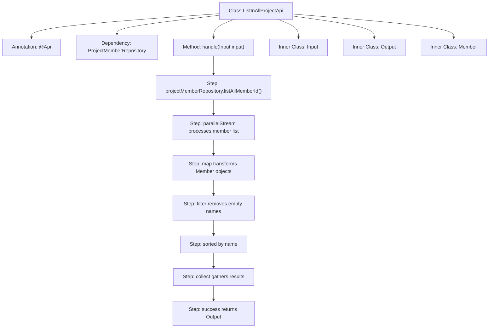

# Basic Information

|      |      |
|------|------|
| Name | ListInAllProjectApi |
| Language | .java |
| Code Path | WeFe/board/board-service/src/main/java/com/welab/wefe/board/service/api/project/member/ListInAllProjectApi.java |
| Package Name | com.welab.wefe.board.service.api.project.member |
| Dependencies | ['com.welab.wefe.board.service.database.repository.ProjectMemberRepository', 'com.welab.wefe.board.service.service.CacheObjects', 'com.welab.wefe.common.exception.StatusCodeWithException', 'com.welab.wefe.common.util.StringUtil', 'com.welab.wefe.common.web.api.base.AbstractApi', 'com.welab.wefe.common.web.api.base.Api', 'com.welab.wefe.common.web.dto.AbstractApiInput', 'com.welab.wefe.common.web.dto.ApiResult', 'org.springframework.beans.factory.annotation.Autowired', 'java.util.Comparator', 'java.util.List', 'java.util.stream.Collectors'] |
| Brief Description | API for retrieving a list of all members collaborating with me, which queries the project member repository and returns a sorted list of member information. |

# Description

The code defines an API class named `ListInAllProjectApi`, which is used to retrieve a list of all members collaborating with the current user. The API path is `project/member/all`. It fetches all member IDs via `ProjectMemberRepository`, processes them in parallel, maps the IDs to names as `Member` objects, filters out members with empty names, and sorts them by name. The input class `Input` is empty, while the output class `Output` contains the sorted list of `Member` objects. The `Member` class includes two fields: `memberId` and `memberName`.

# Class Summary

| Name   | Type  | Description |
|-------|------|-------------|
| ListInAllProjectApi | class | API to retrieve a list of all members collaborating with me, processing member IDs via parallel streams, filtering and sorting them before returning the member information list. |


## Class ListInAllProjectApi

|      |      |
|------|------|
| Access Modifier | @Api(path = "project/member/all", name = "Get a list of all the members who work with me");public |
| Type | class |
| Name | ListInAllProjectApi |
| Description | API to retrieve a list of all members collaborating with me, processing member IDs via parallel streams, filtering and sorting them before returning the member information list. |


### UML Class Diagram

```mermaid
classDiagram
    class ListInAllProjectApi {
        -ProjectMemberRepository projectMemberRepository
        +handle(Input input) ApiResult~Output~
    }
    <<interface>> AbstractApi~Input, Output~
    ListInAllProjectApi --|> AbstractApi~Input, Output~ : extends
    ListInAllProjectApi --> ProjectMemberRepository : depends
    ListInAllProjectApi --> Input : contains
    ListInAllProjectApi --> Output : contains
    ListInAllProjectApi --> Member : contains

    class AbstractApi~T, R~ {
        <<Interface>>
        +handle(T input) ApiResult~R~
    }

    class Input {
    }
    Input --|> AbstractApiInput : extends

    class Output {
        -List~Member~ list
        +Output(List~Member~ list)
        +getList() List~Member~
        +setList(List~Member~ list) void
    }

    class Member {
        +String memberId
        +String memberName
        +Member()
        +Member(String memberId, String memberName)
    }

    class ProjectMemberRepository {
        +listAllMemberId() List~String~
    }
```

This code describes an API class `ListInAllProjectApi` for retrieving a list of all project members. It inherits from the generic abstract class `AbstractApi` and contains two inner classes: the input parameter `Input` and the output result `Output`. The main functionality involves obtaining a list of member IDs through `ProjectMemberRepository`, processing them in parallel, and encapsulating the results into an output list containing `Member` objects. The class diagram clearly illustrates inheritance relationships, dependencies, and inner class structures. The `Member` class stores member IDs and names, `Output` encapsulates the result list, and `ProjectMemberRepository` provides data access capabilities.


### Internal Method Call Graph



This code defines an API class for retrieving a list of all project members collaborating with the current user. The flowchart illustrates the complete process from querying member IDs in the database, through parallel stream processing, object transformation, empty name filtering, sorting by name, and finally returning the result list. The inner class structure is clear: Input represents empty input, Output contains the member list, and the Member class stores member ID and name information.

### Field List

| Name  | Type  | Description |
|-------|-------|------|
| projectMemberRepository | ProjectMemberRepository | Using @Autowired to automatically inject an instance of ProjectMemberRepository. |

### Method List

| Name  | Type  | Description |
|-------|-------|------|
| handle | ApiResult<Output> | This method retrieves all member IDs from the project member repository, processes them in parallel to generate member objects, filters out entries with empty names, and returns the resulting list sorted by name. |


