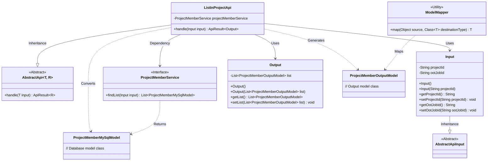
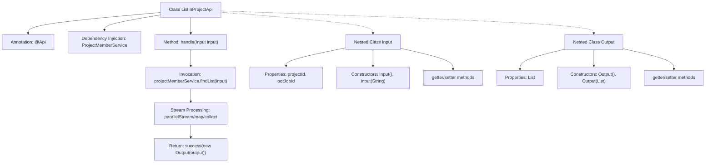

# Basic Information

|      |      |
|------|------|
| Name | ListInProjectApi |
| Language | .java |
| Code Path | WeFe/board/board-service/src/main/java/com/welab/wefe/board/service/api/project/member/ListInProjectApi.java |
| Package Name | com.welab.wefe.board.service.api.project.member |
| Dependencies | ['com.welab.wefe.board.service.database.entity.job.ProjectMemberMySqlModel', 'com.welab.wefe.board.service.dto.entity.project.ProjectMemberOutputModel', 'com.welab.wefe.board.service.service.ProjectMemberService', 'com.welab.wefe.common.exception.StatusCodeWithException', 'com.welab.wefe.common.fieldvalidate.annotation.Check', 'com.welab.wefe.common.web.api.base.AbstractApi', 'com.welab.wefe.common.web.api.base.Api', 'com.welab.wefe.common.web.dto.AbstractApiInput', 'com.welab.wefe.common.web.dto.ApiResult', 'com.welab.wefe.common.web.util.ModelMapper', 'org.springframework.beans.factory.annotation.Autowired', 'java.util.List', 'java.util.stream.Collectors'] |
| Brief Description | API to retrieve the project member list requires a project ID as input and outputs the member list. It uses ProjectMemberService to query data and converts it into the output model. |

# Description

The code defines an API class named `ListInProjectApi`, which is used to retrieve a list of project members. It inherits from `AbstractApi`, accepts an `Input` parameter, and returns an `Output` result. The `Input` class includes a mandatory project ID and an optional `ootJobId` field. The `Output` class contains a list of project members. The API queries member data through `projectMemberService` and converts it into an output model using parallel streams. Upon successful processing, it returns an `ApiResult` containing the member list.

# Class Summary

| Name   | Type  | Description |
|-------|------|-------------|
| ListInProjectApi | class | API class for retrieving project member list, including input parameter project ID and output member list, which queries through ProjectMemberService and maps the results. |

## Class ListInProjectApi

|      |      |
|------|------|
| Access Modifier | @Api(path = "project/member/list", name = "Get the list of members in the project");public |
| Type | class |
| Name | ListInProjectApi |
| Description | API class for retrieving project member list, including input parameter project ID and output member list, which queries through ProjectMemberService and maps the results. |

### UML Class Diagram

This code describes the implementation structure of a project member list query API. The ListInProjectApi inherits from the generic abstract class AbstractApi, processes Input parameters, and returns an Output result containing a list of ProjectMemberOutputModel. After obtaining the database model through ProjectMemberService, it uses ModelMapper to convert it into an output model. The Input class includes project ID and job ID fields, while the Output class encapsulates the output list. The entire workflow demonstrates a complete processing chain from data retrieval to result conversion, reflecting clear hierarchical structure and separation of responsibilities.

### Internal Method Call Graph

This flowchart illustrates the core structure and execution flow of the ListInProjectApi class. The class defines an interface through the @Api annotation and contains the main processing method handle(), which first invokes the service layer to retrieve data, then performs model transformation via parallel streams, and finally returns encapsulated results. The nested classes Input and Output handle input parameters and output data respectively, including necessary properties and access methods. The overall presentation demonstrates a clear API processing chain and class structural relationships.

### Field List

| Name  | Type  | Description |
|-------|-------|------|
| projectMemberService | ProjectMemberService | Automatically inject the ProjectMemberService instance. |

### Method List

| Name  | Type  | Description |
|-------|-------|------|
| handle | ApiResult<Output> | Process the input data, query the project member list, convert it into the output model, and return a successful result. |

