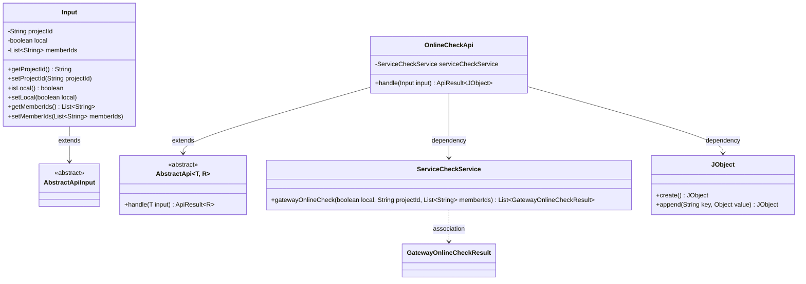

# Basic Information

|      |      |
|------|------|
| Name | OnlineCheckApi |
| Language | .java |
| Code Path | WeFe/board/board-service/src/main/java/com/welab/wefe/board/service/api/project/member/OnlineCheckApi.java |
| Package Name | com.welab.wefe.board.service.api.project.member |
| Dependencies | ['com.welab.wefe.board.service.service.ServiceCheckService', 'com.welab.wefe.common.exception.StatusCodeWithException', 'com.welab.wefe.common.fieldvalidate.annotation.Check', 'com.welab.wefe.common.util.JObject', 'com.welab.wefe.common.web.api.base.AbstractApi', 'com.welab.wefe.common.web.api.base.Api', 'com.welab.wefe.common.web.dto.AbstractApiInput', 'com.welab.wefe.common.web.dto.ApiResult', 'org.springframework.beans.factory.annotation.Autowired', 'java.util.List'] |
| Brief Description | The OnlineCheckApi interface is used to check the gateway and board connection status of other members. The input parameters include the project ID, whether it is local, and a list of member IDs, returning a list of connection status results. |

# Description

The code defines an API class named `OnlineCheckApi`, which is used to check whether the gateways and boards of other members are connected. The API path is `project/member/online_check`, and it accepts input parameters including the project ID, local flag, and a list of member IDs. The check is performed by invoking the `gatewayOnlineCheck` method of `serviceCheckService`, and it returns a `JObject` containing the check results. The input class `Input` inherits from `AbstractApiInput` and includes fields for the project ID, local flag, and a list of member IDs, along with their getter and setter methods.

# Class Summary

| Name   | Type  | Description |
|-------|------|-------------|
| OnlineCheckApi | class | Online inspection API for verifying the gateway and board connection status of other members. The input includes project ID, local flag, and member ID list, and returns a connection check result list. |

## Class OnlineCheckApi

|      |      |
|------|------|
| Access Modifier | @Api(;        path = "project/member/online_check",;        name = "Check if the gateway and board of other members are connected";);public |
| Type | class |
| Name | OnlineCheckApi |
| Description | Online inspection API for verifying the gateway and board connection status of other members. The input includes project ID, local flag, and member ID list, and returns a connection check result list. |

### UML Class Diagram

This code describes an online check API implementation for verifying the connectivity of other members' gateways and boards. OnlineCheckApi inherits from the generic abstract class AbstractApi, processes Input parameters, and returns results in JObject format. The Input class inherits from AbstractApiInput and contains fields such as project ID, local flag, and member ID list. ServiceCheckService provides core functionality for gateway online checks, while JObject is used to construct JSON-formatted response results. The overall design reflects clear hierarchical structure and separation of responsibilities.

### Internal Method Call Graph

```mermaid
graph TD
    A["Class OnlineCheckApi"]
    B["Inheritance: AbstractApi<Input, JObject>"]
    C["Annotation: @Api"]
    D["Dependency Injection: @Autowired ServiceCheckService"]
    E["Overridden Method: handle(Input input)"]
    F["Invocation: serviceCheckService.gatewayOnlineCheck()"]
    G["Return: success(JObject)"]
    H["Static Inner Class Input"]
    I["Property: String projectId"]
    J["Property: boolean local"]
    K["Property: List<String> memberIds"]
    L["Getter/Setter Methods"]

    A --> B
    A --> C
    A --> D
    A --> E
    E --> F
    E --> G
    A --> H
    H --> I
    H --> J
    H --> K
    H --> L
```

This code defines an API class named OnlineCheckApi for checking gateway and board connectivity of other members. The class inherits from AbstractApi and executes actual online check logic through @ServiceCheckService. The flowchart illustrates the class structure, dependency relationships, and method invocation flow, including input parameter processing and service call procedures. The static inner class Input encapsulates request parameters such as project ID, local flag, and member ID list.

### Field List

| Name  | Type  | Description |
|-------|-------|------|
| serviceCheckService | ServiceCheckService | The code snippet uses the @Autowired annotation to automatically inject an instance of ServiceCheckService. |

### Method List

| Name  | Type  | Description |
|-------|-------|------|
| handle | ApiResult<JObject> | The method processes the gateway's online check request and returns a list of check results. The input parameters include a local flag, project ID, and member ID. The results are encapsulated as an ApiResult object. |

