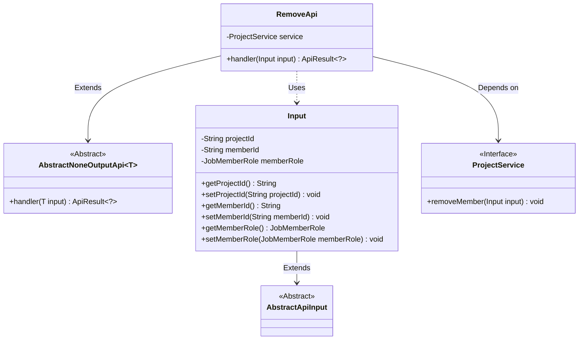

# Basic Information

|      |      |
|------|------|
| Name | RemoveApi |
| Language | .java |
| Code Path | WeFe/board/board-service/src/main/java/com/welab/wefe/board/service/api/project/member/RemoveApi.java |
| Package Name | com.welab.wefe.board.service.api.project.member |
| Dependencies | ['com.welab.wefe.board.service.service.ProjectService', 'com.welab.wefe.common.exception.StatusCodeWithException', 'com.welab.wefe.common.fieldvalidate.annotation.Check', 'com.welab.wefe.common.web.api.base.AbstractNoneOutputApi', 'com.welab.wefe.common.web.api.base.Api', 'com.welab.wefe.common.web.dto.AbstractApiInput', 'com.welab.wefe.common.web.dto.ApiResult', 'com.welab.wefe.common.wefe.enums.JobMemberRole', 'org.springframework.beans.factory.annotation.Autowired'] |
| Brief Description | The API class for removing project members requires providing the project ID, member ID, and role, and then calls the ProjectService to execute the removal operation. |

# Description

This code defines an API class named `RemoveApi`, designed for removing project members. The API path is `project/member/remove`, which inherits from `AbstractNoneOutputApi`, with the input parameter being the inner class `Input`. `Input` includes three mandatory fields: project ID, member ID, and member role (the role must be specified to handle self-federated scenarios). The request is processed via the `removeMember` method of `ProjectService`, returning an `ApiResult` upon success. The class provides getter and setter methods for each field.

# Class Summary

| Name   | Type  | Description |
|-------|------|-------------|
| RemoveApi | class | Remove project member API, requires project ID, member ID, and role, calls ProjectService for processing. |

## Class RemoveApi

|      |      |
|------|------|
| Access Modifier | @Api(path = "project/member/remove", name = "remove project member");public |
| Type | class |
| Name | RemoveApi |
| Description | Remove project member API, requires project ID, member ID, and role, calls ProjectService for processing. |

### UML Class Diagram

This code demonstrates the implementation structure of a project member removal API. The RemoveApi inherits from the generic abstract class AbstractNoneOutputApi, processes parameters of type Input, and executes actual business logic through the ProjectService interface. The Input class contains validation fields such as project ID, member ID, and role, inheriting from the base class AbstractApiInput. The class diagram clearly reflects the inheritance, dependency, and usage relationships between components, embodying Spring-style dependency injection and layered design patterns.

### Internal Method Call Graph

```mermaid
graph TD
    A["Class RemoveApi"]
    B["Annotation: @Api"]
    C["Inheritance: AbstractNoneOutputApi<Input>"]
    D["Dependency Injection: @Autowired ProjectService"]
    E["Overridden Method: handler(Input input)"]
    F["Inner Class: Input"]
    G["Validation Annotation: @Check projectId"]
    H["Validation Annotation: @Check memberId"]
    I["Validation Annotation: @Check memberRole"]
    J["getter/setter Methods"]

    A --> B
    A --> C
    A --> D
    A --> E
    A --> F
    F --> G
    F --> H
    F --> I
    F --> J
```

This code defines an API class named RemoveApi for removing project members. The class inherits from AbstractNoneOutputApi and contains an inner class Input for receiving parameters, executing member removal operations through ProjectService. The flowchart illustrates the main structure of the class, including annotations, inheritance relationships, dependency injection, core methods, and parameter validation logic. The Input class defines three mandatory fields with parameter validation via @Check annotations.

### Field List

| Name  | Type  | Description |
|-------|-------|------|
| service | ProjectService | Automatically inject the ProjectService instance. |

### Method List

| Name  | Type  | Description |
|-------|-------|------|
| handler | ApiResult<?> | Java method override, calling the service to remove a member and return a successful result. |

