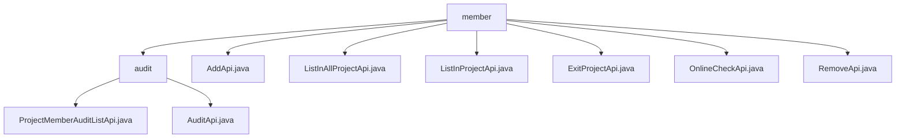

# Basic Information

|      |      |
|------|------|
| Name | member |
| Language | .java |
| Code Path | WeFe/board/board-service/src/main/java/com/welab/wefe/board/service/api/project/member |
| Package Name | docs.board.board-service.src.main.java.com.welab.wefe.board.service.api.project.member |
| Brief Description | This module manages the project member review process, providing APIs to query pending review lists and submit review results. It supports filtering by project or member ID, and requires comments for rejections. The module includes functionalities such as member addition, list querying, exit, online checking, and removal, all implemented through specific APIs, relying on a unified base class and service layer to handle business logic. |

# Description

## Overview  
The core responsibility of this module is to manage the full lifecycle operations of project members, including member addition, deletion, modification, query, approval workflows, and online status checks. The interface specifications adhere to the RESTful style and comprise 7 APIs: member addition (AddApi), list queries (ListInProjectApi/ListInAllProjectApi), removal (RemoveApi), exit (ExitProjectApi), online check (OnlineCheckApi), and APIs related to approval workflows. Key data structures include Member (basic member information), Input/Output generic parameter models, and the ProjectMemberAudit series of structures. Dependencies involve business service layers such as ProjectMemberService and ProjectService, as well as the AbstractApi base class. For example, member addition requires ID validity checks, and list queries employ parallel streams to optimize performance.  

## Key Business Scenarios  
Typical scenarios cover the entire member management lifecycle: administrators handle join requests via approval APIs, maintain member relationships using addition/deletion APIs, and members can actively trigger exit operations. The interaction model resembles CRM systems, featuring a closed loop of status query-operation execution-result feedback. Functional completeness is demonstrated by support for single and batch operations, such as ListInAllProjectApi enabling cross-project member aggregation. APIs are categorized into data operation types (e.g., POST-type AddApi) and status query types (e.g., GET-type OnlineCheckApi). Integration examples include member management panels and automated approval systems. Mandatory validation designs (e.g., RemoveApi requiring role parameters) are similar to permission management systems.

### Package Internal Structure View

This flowchart illustrates the API file structure under the project/member directory in the board-service module of the WeFe project. The top level is the member directory, which contains 7 direct child files and 1 audit subdirectory. The audit directory further includes 2 API files related to auditing. The entire structure clearly reflects the hierarchical design of APIs for project member management functionality.

# File List

| Name   | Type  | Description |
|-------|------|-------------|
| [AddApi.java](AddApi.md) | file | This is an API class for adding project members, which includes input validation for project ID and member list, invokes the ProjectMemberService to add members, and returns an empty result upon success. |
| [ListInAllProjectApi.java](ListInAllProjectApi.md) | file | API to retrieve a list of all members collaborating with me, which queries the project member repository and returns a sorted list of member information. |
| [ListInProjectApi.java](ListInProjectApi.md) | file | API for retrieving the project member list requires the project ID as input and outputs the member list. It uses ProjectMemberService to query data and converts it into the output model. |
| [ExitProjectApi.java](ExitProjectApi.md) | file | Define the exit project API, which requires passing in the project ID, calls the ProjectService to handle the exit logic, and returns no data. |
| [OnlineCheckApi.java](OnlineCheckApi.md) | file | The OnlineCheckApi interface is used to check the gateway and board connection status of other members. The input parameters include project ID, whether it is local, and a list of member IDs, returning a list of connection status results. |
| [RemoveApi.java](RemoveApi.md) | file | API class for removing project members requires providing the project ID, member ID, and role, and then calls ProjectService to execute the removal operation. |
| [audit](audit/_module.md) | package | The `ProjectMemberAuditListApi` class is used to query the audit status of project members, with the path `project/member/add/audit/list`. It takes a project ID and an optional member ID as input and outputs an audit list. The `AuditApi` class is used to audit new members, with the path `project/member/add/audit`. It requires a project ID, member ID, audit result, and comments as input, where comments are mandatory when rejecting. |

