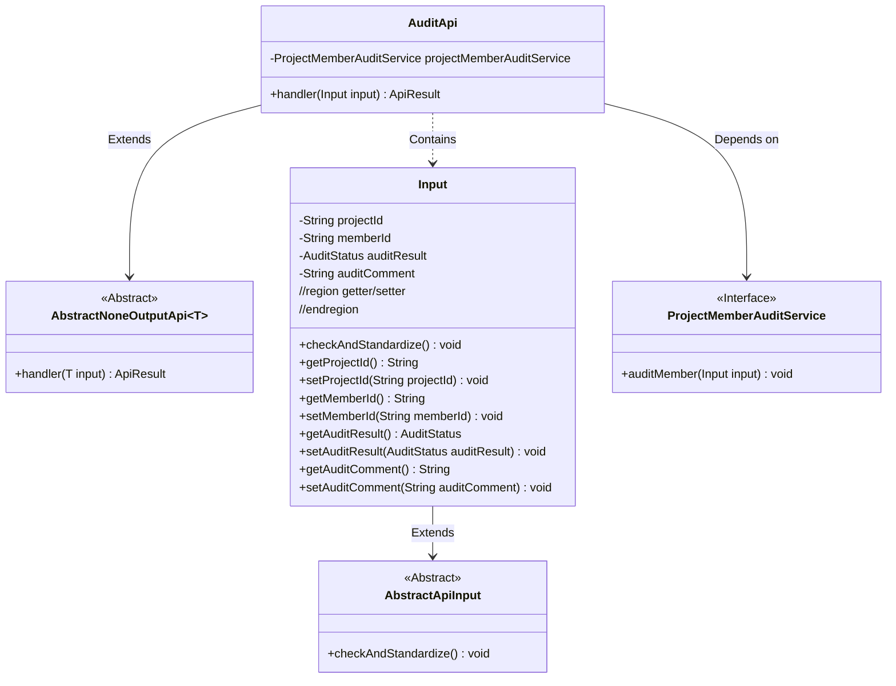

# Basic Information

|      |      |
|------|------|
| Name | AuditApi |
| Language | .java |
| Code Path | WeFe/board/board-service/src/main/java/com/welab/wefe/board/service/api/project/member/audit/AuditApi.java |
| Package Name | com.welab.wefe.board.service.api.project.member.audit |
| Dependencies | ['com.welab.wefe.board.service.service.ProjectMemberAuditService', 'com.welab.wefe.common.StatusCode', 'com.welab.wefe.common.exception.StatusCodeWithException', 'com.welab.wefe.common.fieldvalidate.annotation.Check', 'com.welab.wefe.common.util.StringUtil', 'com.welab.wefe.common.web.api.base.AbstractNoneOutputApi', 'com.welab.wefe.common.web.api.base.Api', 'com.welab.wefe.common.web.dto.AbstractApiInput', 'com.welab.wefe.common.web.dto.ApiResult', 'com.welab.wefe.common.wefe.enums.AuditStatus', 'org.springframework.beans.factory.annotation.Autowired'] |
| Brief Description | The API class for auditing new project members includes input parameters such as project ID, member ID, audit result, and comments. A reason must be provided when rejecting. It calls the audit service to process the request and returns a successful result. |

# Description

The code defines an API class named AuditApi, which is used to audit newly added project members. The API path is "project/member/add/audit". This class inherits from AbstractNoneOutputApi, with the input parameter being the inner class Input. Input includes required fields such as project ID, member ID, audit result, and approval comments, where approval comments must be filled in when the audit result is rejection. The processing logic implements the audit functionality through the auditMember method of ProjectMemberAuditService.

# Class Summary

| Name   | Type  | Description |
|-------|------|-------------|
| AuditApi | class | The `AuditApi` class is used to review newly added project members, containing mandatory fields such as project ID, member ID, review result, and comments. A reason must be provided when rejecting an application. It invokes the `ProjectMemberAuditService` to handle the review logic. |

## Class AuditApi

|      |      |
|------|------|
| Access Modifier | @Api(path = "project/member/add/audit", name = "audit newly added project members");public |
| Type | class |
| Name | AuditApi |
| Description | The `AuditApi` class is used to review newly added project members, containing mandatory fields such as project ID, member ID, review result, and comments. A reason must be provided when rejecting an application. It invokes the `ProjectMemberAuditService` to handle the review logic. |

### UML Class Diagram

This code demonstrates the implementation structure of a project member audit API. AuditApi inherits from the generic abstract class AbstractNoneOutputApi, processes parameters of type Input, and executes audit operations through the ProjectMemberAuditService interface. The Input class extends AbstractApiInput, containing audit parameters such as project ID and member ID, and implements parameter validation logic. The class diagram clearly presents inheritance, dependency, and composition relationships, reflecting layered design and interface segregation principles.

### Internal Method Call Graph

```mermaid
graph TD
    A["Class AuditApi"]
    B["Inheritance: AbstractNoneOutputApi<Input>"]
    C["Annotation: @Api"]
    D["Dependency Injection: ProjectMemberAuditService"]
    E["Overridden Method: handler(Input input)"]
    F["Inner Class Input"]
    G["Inheritance: AbstractApiInput"]
    H["Properties: projectId, memberId, auditResult, auditComment"]
    I["Method: checkAndStandardize()"]
    J["getter/setter methods"]
    K["Invocation: projectMemberAuditService.auditMember(input)"]
    L["Return: success()"]
    M["Validation: Reason required for rejection"]

    A --> B
    A --> C
    A --> D
    A --> E
    A --> F
    F --> G
    F --> H
    F --> I
    F --> J
    E --> K
    K --> L
    I --> M
```

Flowchart Description: This flowchart illustrates the structure and workflow of the audit API class. AuditApi inherits from an abstract class and overrides the handler method, executing member audits through ProjectMemberAuditService. The inner Input class contains audit parameters and validation logic, specifically enforcing reason entry when rejecting audits. The entire process starts from the API entry point, performs parameter validation, and completes the audit operation by invoking the service layer.

### Field List

| Name  | Type  | Description |
|-------|-------|------|
| projectMemberAuditService | ProjectMemberAuditService | Use @Autowired to automatically inject an instance of the ProjectMemberAuditService. |

### Method List

| Name  | Type  | Description |
|-------|-------|------|
| handler | ApiResult<?> | Method override, call the audit service to process the input, and return the result upon success. |

