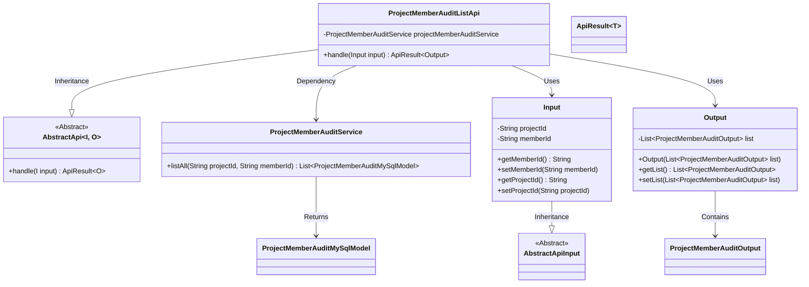

# Basic Information

|      |      |
|------|------|
| Name | ProjectMemberAuditListApi |
| Language | .java |
| Code Path | WeFe/board/board-service/src/main/java/com/welab/wefe/board/service/api/project/member/audit/ProjectMemberAuditListApi.java |
| Package Name | com.welab.wefe.board.service.api.project.member.audit |
| Dependencies | ['com.welab.wefe.board.service.database.entity.job.ProjectMemberAuditMySqlModel', 'com.welab.wefe.board.service.dto.entity.ProjectMemberAuditOutput', 'com.welab.wefe.board.service.service.ProjectMemberAuditService', 'com.welab.wefe.common.exception.StatusCodeWithException', 'com.welab.wefe.common.fieldvalidate.annotation.Check', 'com.welab.wefe.common.web.api.base.AbstractApi', 'com.welab.wefe.common.web.api.base.Api', 'com.welab.wefe.common.web.dto.AbstractApiInput', 'com.welab.wefe.common.web.dto.ApiResult', 'com.welab.wefe.common.web.util.ModelMapper', 'org.springframework.beans.factory.annotation.Autowired', 'java.util.List', 'java.util.stream.Collectors'] |
| Brief Description | Project Member Approval List API, queries the approval status of new members by project ID and member ID, and returns a list of approval results. |

# Description

The code defines an API class named `ProjectMemberAuditListApi`, which is used to retrieve the audit status of new members in a project. The API path is `project/member/add/audit/list`. The input parameters include a mandatory project ID and an optional member ID. When the member ID is empty, it queries all members. The processing logic fetches the audit list via `projectMemberAuditService` and converts it into a list of output objects using parallel streams. The output consists of a list of type `ProjectMemberAuditOutput`. The entire API inherits from `AbstractApi` and implements generic input-output handling.

# Class Summary

| Name   | Type  | Description |
|-------|------|-------------|
| ProjectMemberAuditListApi | class | The API class `ProjectMemberAuditListApi` is used to retrieve the audit status of new project members. The input parameters include the project ID and an optional member ID, and the output is an audit list. The data is processed by `projectMemberAuditService` and the result is returned. |

## Class ProjectMemberAuditListApi

|      |      |
|------|------|
| Access Modifier | @Api(path = "project/member/add/audit/list", name = "Get the review status of new members in the project");public |
| Type | class |
| Name | ProjectMemberAuditListApi |
| Description | The API class `ProjectMemberAuditListApi` is used to retrieve the audit status of new project members. The input parameters include the project ID and an optional member ID, and the output is an audit list. The data is processed by `projectMemberAuditService` and the result is returned. |

### UML Class Diagram

This code represents an API class for handling project member audit lists, inheriting from the generic abstract class AbstractApi with nested Input and Output classes. Its core functionality involves retrieving audit list data through ProjectMemberAuditService and performing model conversion using parallel streams. The class diagram illustrates inheritance relationships (Input inherits from AbstractApiInput), dependencies, and containment relationships (Output contains a list of ProjectMemberAuditOutput, while ProjectMemberAuditService returns a list of ProjectMemberAuditMySqlModel). The overall structure is clear with well-defined responsibilities, adhering to object-oriented design principles.

### Internal Method Call Graph

This code defines an API class for processing project member audit lists, which inherits from an abstract base class and implements core business logic. The flowchart illustrates the complete workflow from request handling to result return: first retrieving data through the service layer, then efficiently transforming it using parallel streams, and finally encapsulating the response. The nested Input and Output classes handle request parameters and response data structures respectively, demonstrating clear separation of responsibilities. The entire process includes key steps such as parameter validation, data querying, model transformation, and result packaging.

### Field List

| Name  | Type  | Description |
|-------|-------|------|
| projectMemberAuditService | ProjectMemberAuditService | Using @Autowired to automatically inject an instance of ProjectMemberAuditService. |

### Method List

| Name  | Type  | Description |
|-------|-------|------|
| handle | ApiResult<Output> | The method processes input parameters, queries the project member review list, maps them in parallel to the output type, and returns a successful result. |

