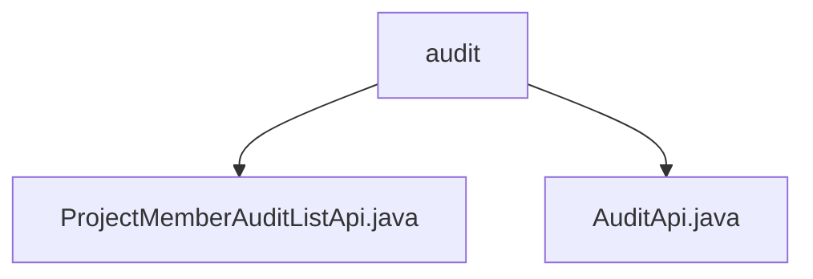

# Basic Information

|      |      |
|------|------|
| Name | audit |
| Language | .java |
| Code Path | WeFe/board/board-service/src/main/java/com/welab/wefe/board/service/api/project/member/audit |
| Package Name | docs.board.board-service.src.main.java.com.welab.wefe.board.service.api.project.member.audit |
| Brief Description | The `ProjectMemberAuditListApi` class is used to query the audit status of project members, with the path `project/member/add/audit/list`. It takes a project ID and an optional member ID as input and outputs an audit list. The `AuditApi` class is used to audit new members, with the path `project/member/add/audit`. It requires a project ID, member ID, audit result, and comments as input, where comments are mandatory when rejecting. |

# Description

## Overview  
The core responsibility of this module is to manage the approval process for project member join requests, including querying pending lists and executing business approval operations. The interface specification consists of two APIs: `ProjectMemberAuditListApi` queries the approval status list via the `project/member/add/audit/list` path, supporting filtering by project or member ID; `AuditApi` submits approval results via the `project/member/add/audit` path, mandating the inclusion of comments when rejecting. Key data structures include `ProjectMemberAuditOutput` (list item output) and `AuditApi.Input` (approval input parameters). Dependencies include the unified `AbstractApi` base class and the `ProjectMemberAuditService` service layer. For example, list queries use parallel streams to optimize data transformation, while approval operations require validation of comment completeness.

## Primary Business Scenarios  
A typical scenario involves project administrators handling member join requests, first viewing pending requests via the list API, then invoking the approval API to approve or reject them. The interaction model resembles a ticketing system, forming a query-decision-feedback loop. Functional completeness is demonstrated by supporting batch queries and single-item approvals, such as returning a full list when member ID is empty. API types are categorized as data retrieval (RESTful GET) and operation execution (POST). Integration examples include frontend approval consoles and automated approval workflows. The design of mandatory rejection comments mirrors risk control system rules.

### Package Internal Structure View

This flowchart illustrates the API file structure of the project member audit module. The top-level node is the "audit" directory, which contains two Java API files: ProjectMemberAuditListApi.java handles audit list functionality, while AuditApi.java provides basic audit operations. This concise hierarchical relationship clearly reflects the core file composition of the audit feature module.

# File List

| Name   | Type  | Description |
|-------|------|-------------|
| [ProjectMemberAuditListApi.java](ProjectMemberAuditListApi.md) | file | Project Member Approval List API, which queries the approval status of new members by project ID and member ID, and returns a list of approval results. |
| [AuditApi.java](AuditApi.md) | file | The API class for auditing newly added project members includes input parameters such as project ID, member ID, audit result, and comments. A reason must be provided when rejecting. It calls the audit service to process the request and returns a successful result. |

