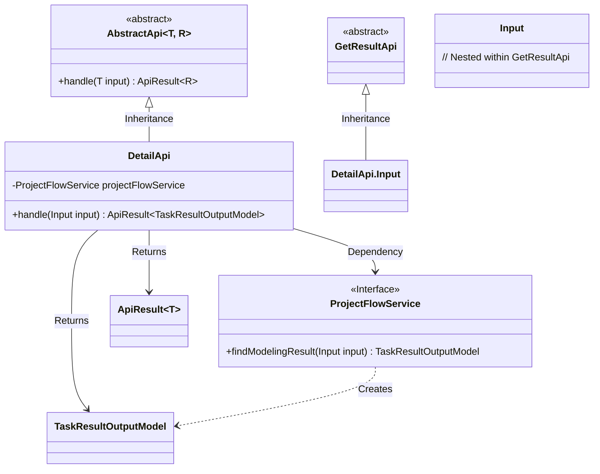
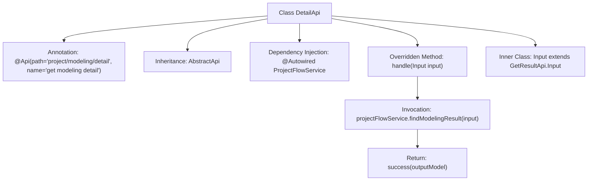

# Basic Information

|      |      |
|------|------|
| Name | DetailApi |
| Language | .java |
| Code Path | WeFe/board/board-service/src/main/java/com/welab/wefe/board/service/api/project/modeling/DetailApi.java |
| Package Name | com.welab.wefe.board.service.api.project.modeling |
| Dependencies | ['com.welab.wefe.board.service.api.project.job.task.GetResultApi', 'com.welab.wefe.board.service.dto.entity.job.TaskResultOutputModel', 'com.welab.wefe.board.service.service.ProjectFlowService', 'com.welab.wefe.common.exception.StatusCodeWithException', 'com.welab.wefe.common.web.api.base.AbstractApi', 'com.welab.wefe.common.web.api.base.Api', 'com.welab.wefe.common.web.dto.ApiResult', 'org.springframework.beans.factory.annotation.Autowired'] |
| Brief Description | API class for obtaining modeling details, inherits from AbstractApi, uses ProjectFlowService to query results and returns TaskResultOutputModel. The input class inherits from GetResultApi.Input. |

# Description

This is a Java class named DetailApi, which extends AbstractApi and is used to retrieve modeling details. The class is annotated with the Api annotation, specifying the path as "project/modeling/detail" and the name as "get modeling detail". It utilizes the ProjectFlowService to handle requests, with the input parameter being the Input class (inheriting from GetResultApi.Input) and the output type as TaskResultOutputModel. The handle method calls the findModelingResult method of projectFlowService to obtain the result and returns a successful response.

# Class Summary

| Name   | Type  | Description |
|-------|------|-------------|
| DetailApi | class | The DetailApi class inherits from AbstractApi, retrieves modeling results through projectFlowService, takes an extension of GetResultApi.Input as input, and outputs TaskResultOutputModel. |

## Class DetailApi

|      |      |
|------|------|
| Access Modifier | @Api(path = "project/modeling/detail", name = "get modeling detail");public |
| Type | class |
| Name | DetailApi |
| Description | The DetailApi class inherits from AbstractApi, retrieves modeling results through projectFlowService, takes an extension of GetResultApi.Input as input, and outputs TaskResultOutputModel. |

### UML Class Diagram

This class diagram illustrates that DetailApi inherits from AbstractApi and depends on the ProjectFlowService interface to obtain modeling results. DetailApi processes Input parameters (inherited from GetResultApi.Input) and returns an ApiResult containing TaskResultOutputModel. The ProjectFlowService interface handles business logic, generating output models via the findModelingResult method. The overall structure demonstrates clear hierarchical relationships and dependency directions, aligning with API design patterns.

### Internal Method Call Graph

This flowchart illustrates the structure and workflow of the DetailApi class. The class defines an API path through the @Api annotation, inherits from the AbstractApi template class, implements the handle method, internally queries modeling results using ProjectFlowService, and returns a successful response. The Input nested class inherits fields from GetResultApi.Input. The overall process clearly demonstrates the complete chain from request processing to result return.

### Field List

| Name  | Type  | Description |
|-------|-------|------|
| projectFlowService | ProjectFlowService | Using @Autowired to automatically inject an instance of ProjectFlowService. |

### Method List

| Name  | Type  | Description |
|-------|-------|------|
| handle | ApiResult<TaskResultOutputModel> | This method overrides the parent class logic, invokes the service to retrieve task results, and encapsulates the response. The input parameter is `Input`, the output is `ApiResult<TaskResultOutputModel>`, and it may throw a `StatusCodeWithException` exception. |

