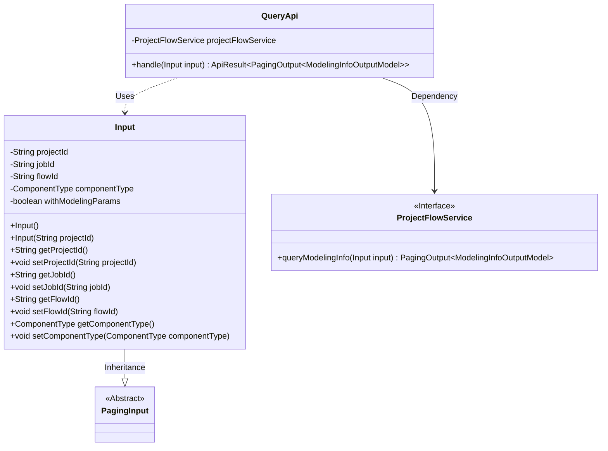

# Basic Information

|      |      |
|------|------|
| Name | QueryApi |
| Language | .java |
| Code Path | WeFe/board/board-service/src/main/java/com/welab/wefe/board/service/api/project/modeling/QueryApi.java |
| Package Name | com.welab.wefe.board.service.api.project.modeling |
| Dependencies | ['com.welab.wefe.board.service.dto.base.PagingInput', 'com.welab.wefe.board.service.dto.base.PagingOutput', 'com.welab.wefe.board.service.dto.entity.modeling_config.ModelingInfoOutputModel', 'com.welab.wefe.board.service.service.ProjectFlowService', 'com.welab.wefe.common.exception.StatusCodeWithException', 'com.welab.wefe.common.fieldvalidate.annotation.Check', 'com.welab.wefe.common.web.api.base.AbstractApi', 'com.welab.wefe.common.web.api.base.Api', 'com.welab.wefe.common.web.dto.ApiResult', 'com.welab.wefe.common.wefe.enums.ComponentType', 'org.springframework.beans.factory.annotation.Autowired'] |
| Brief Description | The QueryApi class is used for paginated querying of modeling information, including input parameters such as project ID and task ID. It invokes the ProjectFlowService to process the request and returns paginated results. |

# Description

This is an API class named QueryApi for paginated query of modeling information, which inherits from AbstractApi. It uses ProjectFlowService to process query requests and returns paginated ModelingInfoOutputModel results. The input class Input includes optional query conditions such as project ID, task ID, flow ID, component type, as well as a boolean flag indicating whether to include modeling node parameters. All input fields have validation annotations and provide getter and setter methods. The API path is "project/modeling/query".

# Class Summary

| Name   | Type  | Description |
|-------|------|-------------|
| QueryApi | class | API class for paginated query of modeling information, including input parameters such as project ID and task ID, which invokes ProjectFlowService for processing and returns paginated results. |

## Class QueryApi

|      |      |
|------|------|
| Access Modifier | @Api(path = "project/modeling/query", name = "query modeling by pagination");public |
| Type | class |
| Name | QueryApi |
| Description | API class for paginated query of modeling information, including input parameters such as project ID and task ID, which invokes ProjectFlowService for processing and returns paginated results. |

### UML Class Diagram

Class Diagram Description: This diagram illustrates the QueryApi class and its related structures. QueryApi inherits from AbstractApi and contains an inner class Input. Input inherits from PagingInput and includes multiple attributes with corresponding getter/setter methods. QueryApi relies on the ProjectFlowService interface to perform the queryModelingInfo operation, returning paginated modeling information results. The overall structure reflects layered design and dependency relationships.

### Internal Method Call Graph

```mermaid
graph TD
    A["Class QueryApi"]
    B["Annotation: @Api(path='project/modeling/query', name='query modeling by pagination')"]
    C["Inheritance: AbstractApi<Input, PagingOutput<ModelingInfoOutputModel>>"]
    D["Dependency Injection: @Autowired ProjectFlowService projectFlowService"]
    E["Overridden Method: handle(Input input)"]
    F["Inner Class: Input extends PagingInput"]
    G["Input Properties: String projectId, String jobId, String flowId, ComponentType componentType, boolean withModelingParams"]
    H["Input Methods: getter/setter for each property"]
    I["Input Constructors: Input(), Input(String projectId)"]
    J["Input Validation Annotations: @Check(name='project id') etc."]

    A --> B
    A --> C
    A --> D
    A --> E
    A --> F
    F --> G
    F --> H
    F --> I
    F --> J
    E --> D
    E --> F
```

This code defines an API class named QueryApi for paginated querying of modeling information. The class inherits from AbstractApi and contains a handle method that processes requests by invoking the queryModelingInfo method of ProjectFlowService. The inner class Input defines query parameters including project ID, job ID, and other fields, along with validation annotations. The flowchart illustrates the class structure, inheritance relationships, dependency injection, method calls, and inner class composition, clearly presenting the code's organizational structure and data flow.

### Field List

| Name  | Type  | Description |
|-------|-------|------|
| projectFlowService | ProjectFlowService | Automatically inject the ProjectFlowService service instance. |

### Method List

| Name  | Type  | Description |
|-------|-------|------|
| handle | ApiResult<PagingOutput<ModelingInfoOutputModel>> | Rewrite method handles modeling information queries, returning paginated results or exceptions. |

