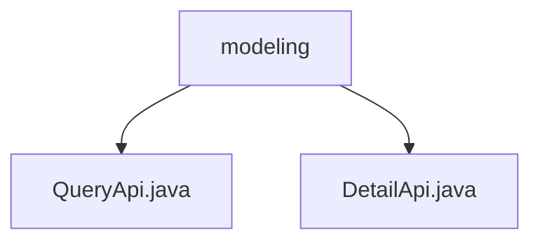

# Basic Information

|      |      |
|------|------|
| Name | modeling |
| Language | .java |
| Code Path | WeFe/board/board-service/src/main/java/com/welab/wefe/board/service/api/project/modeling |
| Package Name | docs.board.board-service.src.main.java.com.welab.wefe.board.service.api.project.modeling |
| Brief Description | The QueryApi is an API for paginated querying of modeling information, with the path "project/modeling/query". Its input includes optional conditions and boolean flags, and it outputs paginated results. The DetailApi is an API for retrieving modeling details, with the path "project/modeling/detail". Its input inherits from GetResultApi.Input, and it outputs TaskResultOutputModel. |

# Description

## Overview  
The core responsibility of this module is to provide modeling information query and detail retrieval functionalities, including two APIs: paginated query and detail query. The interface specifications adhere to the RESTful style, with paths designated as "project/modeling/query" and "project/modeling/detail" respectively. Key data structures include ModelingInfoOutputModel (pagination results) and TaskResultOutputModel (detail results), with input parameters validated using annotation checks to ensure data integrity. The only external dependency is the ProjectFlowService. For example, QueryApi supports multi-criteria combined queries such as project ID and task ID, while DetailApi inherits GetResultApi.Input to retrieve a single result.  

## Primary Business Scenarios  
The module primarily handles modeling information retrieval scenarios: paginated queries support multi-condition filtering (similar to a database WHERE clause), and detail queries provide precise result fetching. Both interaction modes follow synchronous request-response patterns, with functional completeness reflected in covering both list and detail data dimensions. Typical applications include data display in modeling task monitoring consoles. API types include query (QueryApi) and retrieval (DetailApi), enabling frontend workflows such as combined calls to first fetch a list and then view details.

### Package Internal Structure View

This flowchart illustrates the API file structure of the modeling module in the WeFe project. The root node "modeling" contains two Java interface files: QueryApi.java for query operations and DetailApi.java for detail retrieval. This structure reflects a typical layered API design, organizing interface files with different functionalities under the same module directory for easier maintenance and scalability.

# File List

| Name   | Type  | Description |
|-------|------|-------------|
| [QueryApi.java](QueryApi.md) | file | The QueryApi class is used for paginated querying of modeling information, including input parameters such as project ID and task ID. It invokes the ProjectFlowService to process the request and returns paginated results. |
| [DetailApi.java](DetailApi.md) | file | API class for obtaining modeling details, inherits from AbstractApi, uses ProjectFlowService to query results and returns TaskResultOutputModel. The input class inherits from GetResultApi.Input. |

