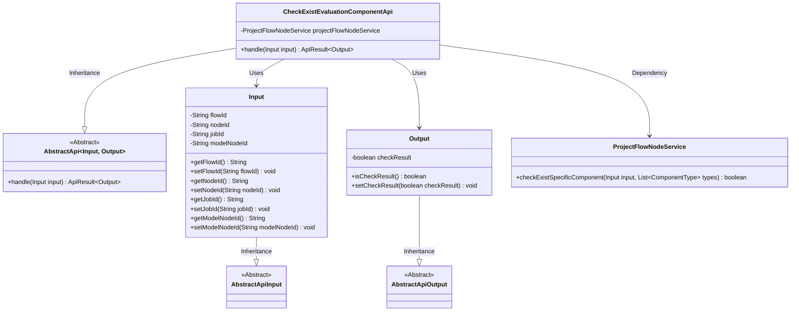
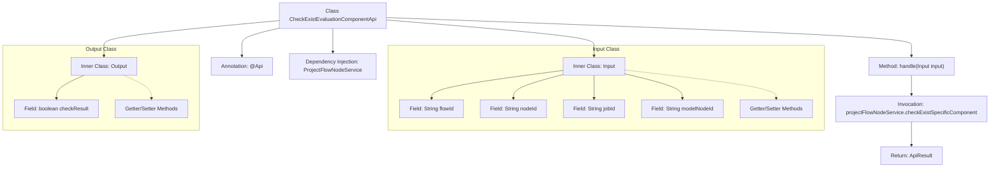

# Basic Information

|      |      |
|------|------|
| Name | CheckExistEvaluationComponentApi |
| Language | .java |
| Code Path | WeFe/board/board-service/src/main/java/com/welab/wefe/board/service/api/project/node/CheckExistEvaluationComponentApi.java |
| Package Name | com.welab.wefe.board.service.api.project.node |
| Dependencies | ['com.welab.wefe.board.service.service.ProjectFlowNodeService', 'com.welab.wefe.common.exception.StatusCodeWithException', 'com.welab.wefe.common.fieldvalidate.annotation.Check', 'com.welab.wefe.common.web.api.base.AbstractApi', 'com.welab.wefe.common.web.api.base.Api', 'com.welab.wefe.common.web.dto.AbstractApiInput', 'com.welab.wefe.common.web.dto.AbstractApiOutput', 'com.welab.wefe.common.web.dto.ApiResult', 'com.welab.wefe.common.wefe.enums.ComponentType', 'org.springframework.beans.factory.annotation.Autowired', 'java.util.Arrays'] |
| Brief Description | Check if there is an API for evaluating components in the process flow. The input includes parameters such as process ID and node ID, and the output is a Boolean check result. |

# Description

This API is used to check whether an evaluation component exists in the process. It inherits from the abstract API class and handles input and output parameters. The input parameters include the process ID, node ID (used in non-OOT mode), task ID, and model node ID (used in OOT mode). The output parameter is a Boolean value indicating the check result. Internally, the API calls the ProjectFlowNodeService to perform the specific check, and the result is encapsulated as an ApiResult object.

# Class Summary

| Name   | Type  | Description |
|-------|------|-------------|
| CheckExistEvaluationComponentApi | class | Check whether there is an API for evaluating components in the process flow. The input includes the process ID, node ID, task ID, and model node ID, and the output is a Boolean check result. |

## Class CheckExistEvaluationComponentApi

|      |      |
|------|------|
| Access Modifier | @Api(path = "project/flow/node/check_exist_evaluation_component", name = "Check whether there are evaluation components in the process");public |
| Type | class |
| Name | CheckExistEvaluationComponentApi |
| Description | Check whether there is an API for evaluating components in the process flow. The input includes the process ID, node ID, task ID, and model node ID, and the output is a Boolean check result. |

### UML Class Diagram

This code demonstrates an API implementation for checking the existence of evaluation components in a workflow. The core class CheckExistEvaluationComponentApi inherits from the generic abstract class AbstractApi, processes Input parameters, and returns Output results. The Input class contains parameters such as flow ID and node ID, while the Output class contains a boolean check result. The API leverages the ProjectFlowNodeService to perform the actual validation logic. The overall design follows a layered pattern, with both input and output classes inheriting from their respective abstract base classes, demonstrating strong encapsulation and extensibility.

### Internal Method Call Graph

This flowchart illustrates the core structure of the CheckExistEvaluationComponentApi class, including API annotations, service dependencies, input/output inner classes, and handler methods. The handle method checks the existence of a specific component by invoking projectFlowNodeService, ultimately returning the encapsulated result via ApiResult. The Input class contains parameters such as flow ID and node ID, while the Output class encapsulates a boolean check result. Collectively, this implements the functionality to verify the existence of evaluation components within workflow nodes.

### Field List

| Name  | Type  | Description |
|-------|-------|------|
| projectFlowNodeService | ProjectFlowNodeService | Automatically inject the ProjectFlowNodeService service instance. |

### Method List

| Name  | Type  | Description |
|-------|-------|------|
| handle | ApiResult<Output> | This method overrides the parent class logic, checks whether specific component types (such as Evaluation) exist in the input, and returns an ApiResult containing the inspection results. It handles exceptions with StatusCodeWithException. |

