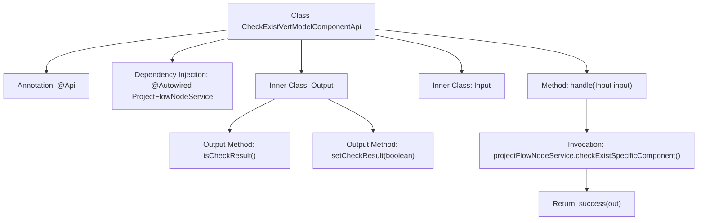

# Basic Information

|      |      |
|------|------|
| Name | CheckExistVertModelComponentApi |
| Language | .java |
| Code Path | WeFe/board/board-service/src/main/java/com/welab/wefe/board/service/api/project/node/CheckExistVertModelComponentApi.java |
| Package Name | com.welab.wefe.board.service.api.project.node |
| Dependencies | ['com.welab.wefe.board.service.service.ProjectFlowNodeService', 'com.welab.wefe.common.exception.StatusCodeWithException', 'com.welab.wefe.common.fieldvalidate.annotation.Check', 'com.welab.wefe.common.web.api.base.AbstractApi', 'com.welab.wefe.common.web.api.base.Api', 'com.welab.wefe.common.web.dto.AbstractApiOutput', 'com.welab.wefe.common.web.dto.ApiResult', 'com.welab.wefe.common.wefe.enums.ComponentType', 'org.springframework.beans.factory.annotation.Autowired', 'java.util.Arrays'] |
| Brief Description | Check if there are APIs for vertical model components in the inspection process. The input inherits from the inspection evaluation component API, and the output includes a Boolean inspection result. |

# Description

This API class is used to check whether a vertical model component exists in the workflow, with the path "project/flow/node/check_exist_vert_model_component". It inherits from an abstract API class, and its input parameters are derived from CheckExistEvaluationComponentApi.Input. The output includes a boolean field indicating the check result. The ProjectFlowNodeService service checks whether the input parameters contain specific component types (VertLR and VertSecureBoost) and encapsulates the check result in the output object for return. The entire process may throw a StatusCodeWithException.

# Class Summary

| Name   | Type  | Description |
|-------|------|-------------|
| CheckExistVertModelComponentApi | class | Check if there is an API for vertical model components in the inspection process. The input inherits from the inspection evaluation component API, and the output includes a Boolean inspection result. |


## Class CheckExistVertModelComponentApi

|      |      |
|------|------|
| Access Modifier | @Api(path = "project/flow/node/check_exist_vert_model_component", name = "Check whether there are vert model components in the process");public |
| Type | class |
| Name | CheckExistVertModelComponentApi |
| Description | Check if there is an API for vertical model components in the inspection process. The input inherits from the inspection evaluation component API, and the output includes a Boolean inspection result. |


### UML Class Diagram

```mermaid
classDiagram
    class CheckExistVertModelComponentApi {
        -ProjectFlowNodeService projectFlowNodeService
        +handle(Input input) ApiResult~Output~
    }
    <<Interface>> CheckExistVertModelComponentApi {
    }

    class AbstractApi~T, R~ {
        <<Abstract>>
    }

    class ProjectFlowNodeService {
        +checkExistSpecificComponent(Input input, List~ComponentType~ types) boolean
    }

    class Input {
    }

    class CheckExistEvaluationComponentApi {
    }

    class Output {
        -boolean checkResult
        +isCheckResult() boolean
        +setCheckResult(boolean checkResult) void
    }

    class AbstractApiOutput {
        <<Abstract>>
    }

    class ComponentType {
        <<Enum>>
        +VertLR
        +VertSecureBoost
    }

    CheckExistVertModelComponentApi --|> AbstractApi : Extends
    CheckExistVertModelComponentApi --> ProjectFlowNodeService : Depends on
    CheckExistVertModelComponentApi --> Input : Uses
    CheckExistVertModelComponentApi --> Output : Uses
    Input --|> CheckExistEvaluationComponentApi.Input : Extends
    Output --|> AbstractApiOutput : Extends
    ProjectFlowNodeService ..> ComponentType : Uses
```

This code demonstrates an API implementation for checking the existence of vertical model components in a flow node. The `CheckExistVertModelComponentApi` extends the generic abstract class `AbstractApi`, depends on `ProjectFlowNodeService` for business logic processing, and uses nested classes `Input` and `Output` as parameter and return types. The `Input` class inherits from another API's input class, while `Output` inherits from a base API output class and contains a boolean check result. This design reflects clear hierarchical relationships and separation of responsibilities, encapsulating core business logic within the service class while maintaining simplicity at the API layer.


### Internal Method Call Graph



This flowchart illustrates the structure of the CheckExistVertModelComponentApi class and its key method invocation relationships. The class defines the interface path via the @Api annotation, inherits AbstractApi, and implements the handle method to process input/output. The inner class Input inherits from the parent class input, while Output contains validation result fields with corresponding getter/setter methods. The core logic involves checking for the existence of a specific component type through projectFlowNodeService, ultimately returning encapsulated results. The process clearly presents the complete chain from request handling to service invocation.

### Field List

| Name  | Type  | Description |
|-------|-------|------|
| projectFlowNodeService | ProjectFlowNodeService | Automatically inject project process node service instances. |

### Method List

| Name  | Type  | Description |
|-------|-------|------|
| handle | ApiResult<Output> | This method overrides the parent class logic, invokes a service to check whether a specific component type (VertLR or VertSecureBoost) exists in the input, and encapsulates the check result as an Output object for return. If successful, it returns an ApiResult containing the result. |


