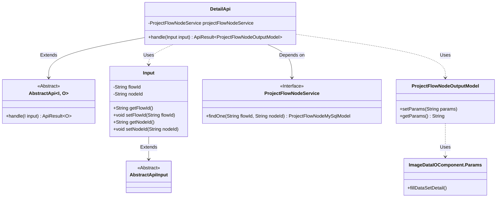

# Basic Information

|      |      |
|------|------|
| Name | DetailApi |
| Language | .java |
| Code Path | WeFe/board/board-service/src/main/java/com/welab/wefe/board/service/api/project/node/DetailApi.java |
| Package Name | com.welab.wefe.board.service.api.project.node |
| Dependencies | ['com.welab.wefe.board.service.component.deep_learning.ImageDataIOComponent', 'com.welab.wefe.board.service.database.entity.job.ProjectFlowNodeMySqlModel', 'com.welab.wefe.board.service.dto.entity.job.ProjectFlowNodeOutputModel', 'com.welab.wefe.board.service.service.ProjectFlowNodeService', 'com.welab.wefe.common.exception.StatusCodeWithException', 'com.welab.wefe.common.fieldvalidate.annotation.Check', 'com.welab.wefe.common.util.JObject', 'com.welab.wefe.common.web.api.base.AbstractApi', 'com.welab.wefe.common.web.api.base.Api', 'com.welab.wefe.common.web.dto.AbstractApiInput', 'com.welab.wefe.common.web.dto.ApiResult', 'com.welab.wefe.common.web.util.ModelMapper', 'com.welab.wefe.common.wefe.enums.ComponentType', 'org.springframework.beans.factory.annotation.Autowired'] |
| Brief Description | API class for retrieving process node details, which queries node information via flowId and nodeId, and supplements dataset details if the node type is ImageDataIO. |

# Description

The code defines an API class named `DetailApi`, which is used to retrieve the details of a project workflow node. The API path is `"project/flow/node/detail"`, and it accepts input parameters including the flow ID and node ID. The node data is queried via `ProjectFlowNodeService`, and if it does not exist, an empty result is returned. If the node exists, the MySQL model is mapped to the output model while retaining the original parameters. For nodes of type `ImageDataIO`, additional processing is performed to populate dataset details. The input class `Input` inherits from `AbstractApiInput` and includes the required fields `flowId` and `nodeId`, along with their getter/setter methods.

# Class Summary

| Name   | Type  | Description |
|-------|------|-------------|
| DetailApi | class | API class for retrieving node details, which takes a process ID and node ID as input, queries the node information, and returns it. If the node type is ImageDataIO, additional dataset information is populated. |

## Class DetailApi

|      |      |
|------|------|
| Access Modifier | @Api(path = "project/flow/node/detail", name = "get node detail");public |
| Type | class |
| Name | DetailApi |
| Description | API class for retrieving node details, which takes a process ID and node ID as input, queries the node information, and returns it. If the node type is ImageDataIO, additional dataset information is populated. |

### UML Class Diagram

This code demonstrates an API implementation for retrieving project flow node details. The core class DetailApi inherits from the generic abstract class AbstractApi, processes Input parameters, and returns ProjectFlowNodeOutputModel results. It queries node data through ProjectFlowNodeService, with special handling for filling dataset information of ImageDataIO type nodes. The class diagram clearly presents inheritance relationships, dependency relationships, and usage relationships, including 6 main classes and 1 inner class, reflecting data transformation and business logic in the API processing flow.

### Internal Method Call Graph

```mermaid
graph TD
    A["Class DetailApi"]
    B["Inheritance: AbstractApi<Input, ProjectFlowNodeOutputModel>"]
    C["Dependency Injection: ProjectFlowNodeService"]
    D["Method: handle(Input input)"]
    E["Call: projectFlowNodeService.findOne"]
    F["Condition: one == null?"]
    G["Return: success()"]
    H["Mapping: ModelMapper.map"]
    I["Setting: output.setParams"]
    J["Condition: componentType == ImageDataIO?"]
    K["Conversion: params.toJavaObject"]
    L["Population: params.fillDataSetDetail"]
    M["Serialization: JObject.create"]
    N["Return: success(output)"]
    O["Inner Class Input"]
    P["Property: String flowId"]
    Q["Property: String nodeId"]
    R["getter/setter methods"]

    A --> B
    A --> C
    A --> D
    D --> E
    E --> F
    F --Yes--> G
    F --No--> H
    H --> I
    I --> J
    J --Yes--> K
    K --> L
    L --> M
    M --> I
    J --No--> N
    A --> O
    O --> P
    O --> Q
    O --> R
```

Flowchart Description: This flowchart illustrates the processing logic of the DetailApi class, starting from inheritance relationships and dependency injection to the core flow of the handle method. It first queries node data through projectFlowNodeService, returning an empty success result if nonexistent. For existing data, it performs model mapping and parameter configuration. Special handling is applied to ImageDataIO-type nodes, populating dataset information and re-serializing parameters. Finally, it returns a response containing the processed results. The inner class Input includes two essential parameters (flowId and nodeId) and their accessor methods.

### Field List

| Name  | Type  | Description |
|-------|-------|------|
| projectFlowNodeService | ProjectFlowNodeService | Automatically inject project process node service instances. |

### Method List

| Name  | Type  | Description |
|-------|-------|------|
| handle | ApiResult<ProjectFlowNodeOutputModel> | This method processes project workflow node query requests. If the node does not exist, it returns an empty result; if it exists, it maps and outputs the model. If the node type is ImageDataIO, it supplements the dataset information before returning the result. |

