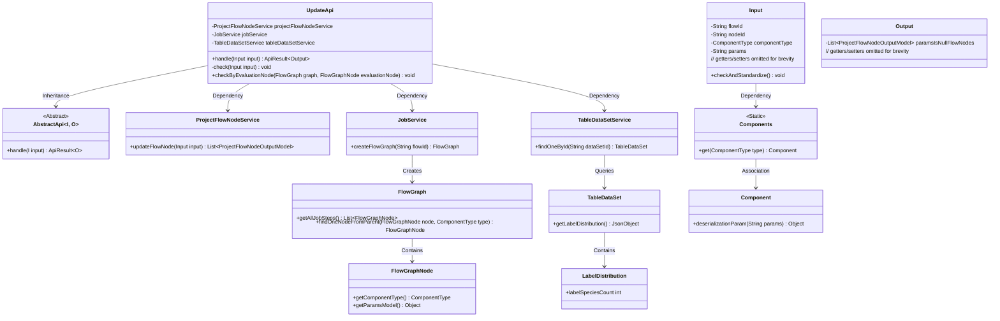
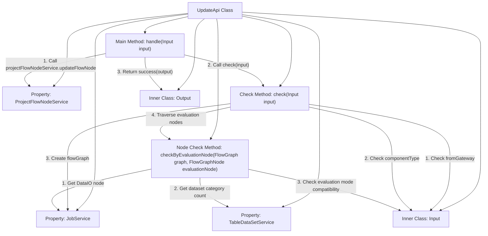
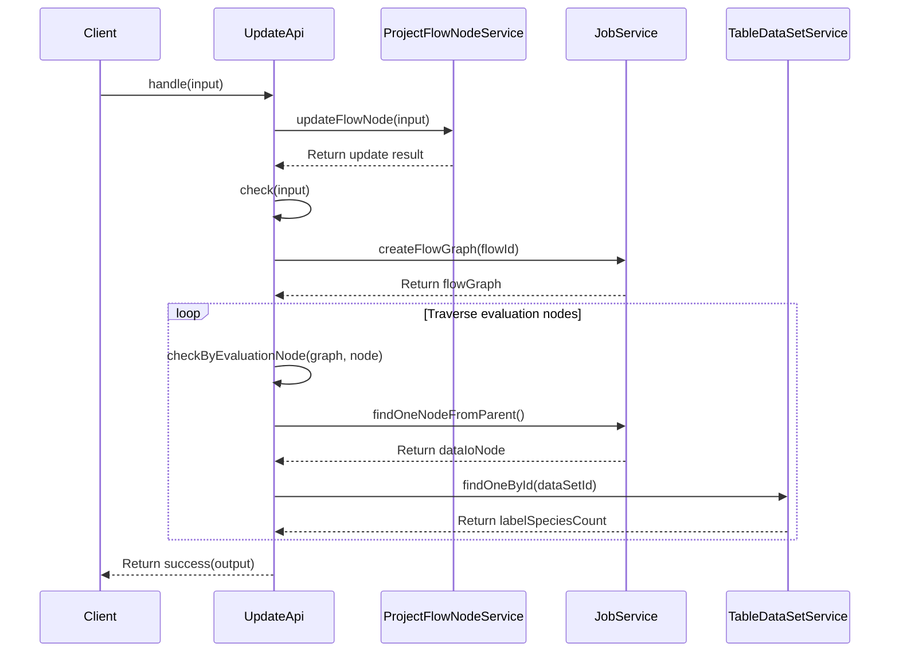

# Basic Information

|      |      |
|------|------|
| Name | UpdateApi |
| Language | .java |
| Code Path | WeFe/board/board-service/src/main/java/com/welab/wefe/board/service/api/project/node/UpdateApi.java |
| Package Name | com.welab.wefe.board.service.api.project.node |
| Dependencies | ['com.welab.wefe.board.service.component.Components', 'com.welab.wefe.board.service.component.DataIOComponent', 'com.welab.wefe.board.service.component.EvaluationComponent', 'com.welab.wefe.board.service.component.enums.EvaluationType', 'com.welab.wefe.board.service.dto.entity.job.ProjectFlowNodeOutputModel', 'com.welab.wefe.board.service.dto.vo.data_set.table_data_set.LabelDistribution', 'com.welab.wefe.board.service.exception.FlowNodeException', 'com.welab.wefe.board.service.model.FlowGraph', 'com.welab.wefe.board.service.model.FlowGraphNode', 'com.welab.wefe.board.service.service.JobService', 'com.welab.wefe.board.service.service.ProjectFlowNodeService', 'com.welab.wefe.board.service.service.data_resource.table_data_set.TableDataSetService', 'com.welab.wefe.common.exception.StatusCodeWithException', 'com.welab.wefe.common.fieldvalidate.annotation.Check', 'com.welab.wefe.common.web.api.base.AbstractApi', 'com.welab.wefe.common.web.api.base.Api', 'com.welab.wefe.common.web.dto.AbstractApiInput', 'com.welab.wefe.common.web.dto.ApiResult', 'com.welab.wefe.common.wefe.enums.ComponentType', 'org.springframework.beans.factory.annotation.Autowired', 'java.util.Arrays', 'java.util.List', 'java.util.stream.Collectors'] |
| Brief Description | API class for updating node information, which checks whether the evaluation component matches the number of dataset categories and provides alerts if they do not match. The input includes process ID, node ID, component type, and parameters, and the output is a node list. |

# Description

The code defines an API class named `UpdateApi`, which is used to update project workflow node information. The API path is `project/flow/node/update`, inheriting from `AbstractApi`, and processes the input `Input` and output `Output`. Its primary functions include: updating workflow nodes via `projectFlowNodeService`, and checking whether the number of classifications matches the evaluation component's selected mode when editing the workflow. The validation logic involves constructing a `graph`, traversing evaluation components, and verifying the consistency between the dataset's classification count and the evaluation mode, throwing an exception with a prompt if they do not match. The input class `Input` includes fields such as workflow ID, node ID, component type, and parameters, along with validity checks. The output class `Output` contains a list of workflow nodes with empty parameters.

# Class Summary

| Name   | Type  | Description |
|-------|------|-------------|
| UpdateApi | class | API class for updating node information, including input/output processing and evaluation of component-dataset matching check logic. |

## Class UpdateApi

|      |      |
|------|------|
| Access Modifier | @Api(path = "project/flow/node/update", name = "update node info");public |
| Type | class |
| Name | UpdateApi |
| Description | API class for updating node information, including input/output processing and evaluation of component-dataset matching check logic. |

### UML Class Diagram

The diagram illustrates the structural relationships of UpdateApi and its related classes. UpdateApi inherits from the generic abstract class AbstractApi and relies on three service classes to handle core business logic. The Input class is responsible for parameter validation, while the Output class encapsulates response data. The system collaborates through multiple service classes to complete flow node update operations, involving core functionalities such as flow graph construction, dataset queries, and component parameter validation. The class diagram clearly presents the collaborative relationships between components, particularly highlighting the flexible architectural design achieved through generics and interfaces.

### Internal Method Call Graph

This code implements a flow node update API, with core functionalities including updating node information and validating the compatibility between evaluation components and datasets. The flowchart illustrates the class structure and method invocation relationships, while the sequence diagram details the complete call chain from client request to result return. The core validation logic involves traversing evaluation nodes in the flow graph to check if their category counts match with associated datasets. In case of mismatch, an exception is thrown to alert the user.

### Field List

| Name  | Type  | Description |
|-------|-------|------|
| projectFlowNodeService | ProjectFlowNodeService | Using @Autowired to automatically inject an instance of ProjectFlowNodeService. |
| tableDataSetService | TableDataSetService | Using @Autowired to automatically inject an instance of TableDataSetService. |
| jobService | JobService | Using @Autowired to automatically inject an instance of JobService. |

### Method List

| Name  | Type  | Description |
|-------|-------|------|
| handle | ApiResult<Output> | This method overrides the parent class logic, takes Input parameters, invokes the service to update the process node, and generates Output. After performing validation, it returns a successful result and may throw status code exceptions. |
| check | void | Check the input component type, only process DataIO and Evaluation types. If not initiated by a gateway, traverse all Evaluation nodes in the flowchart and validate them one by one. |
| checkByEvaluationNode | void | Check whether the number of evaluation nodes matches the dataset classification count. If the evaluation mode is binary classification but the dataset classification count exceeds 2, or if it is non-binary classification but the dataset classification count does not exceed 2, throw an exception indicating a mismatch. |

