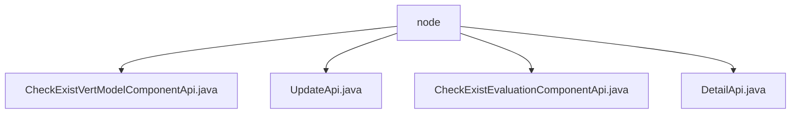

# Basic Information

|      |      |
|------|------|
| Name | node |
| Language | .java |
| Code Path | WeFe/board/board-service/src/main/java/com/welab/wefe/board/service/api/project/node |
| Package Name | docs.board.board-service.src.main.java.com.welab.wefe.board.service.api.project.node |
| Brief Description | Check the vertical model component API, path `project/flow/node/check_exist_vert_model_component`, returns a boolean result. Update the flow node API, path `project/flow/node/update`, checks if the number of classifications matches the evaluation mode. Check the evaluation component API, returns a boolean result. Get node details API, path `project/flow/node/detail`, queries and returns node data. |

# Description

## Overview  
The core responsibility of this module is to manage project flow nodes, including checking the existence of vertical models/evaluation components, updating node information, and retrieving node details. The interface specifications uniformly inherit from the abstract API class, with both input and output containing core fields such as flow ID and node ID. For example, the `CheckExistEvaluationComponentApi` verifies the existence of an evaluation component. Key data structures include the flow node parameter list, component type enumerations (e.g., `VertLR`/`ImageDataIO`), and exception encapsulation objects. The primary external dependency is the `ProjectFlowNodeService`, which acts like a central processor to coordinate node operations.  

## Key Business Scenarios  
The main business processes involve node information maintenance (update/query) and component compliance checks. The interaction mode follows standard API calls, such as the `UpdateApi` validating the match between classification counts and evaluation modes during flow editing. Functional completeness is reflected in full lifecycle management, from node creation (component checks) to updates (parameter validation) and queries (detail population). A typical application is in model training flows, where the `DetailApi` retrieves node parameters, the `UpdateApi` adjusts configurations, and the `CheckExistVertModelComponentApi` validates compliance. API types cover CRUD operations and validation interfaces.

### Package Internal Structure View

This flowchart illustrates the API file structure under the project's node module. The root node "node" contains four API implementation classes, which handle vertical model component verification, update operations, evaluation component verification, and detail query functionalities respectively. All API files reside at the same hierarchical level with no nested relationships, reflecting the flat design structure of the project's node module.

# File List

| Name   | Type  | Description |
|-------|------|-------------|
| [CheckExistVertModelComponentApi.java](CheckExistVertModelComponentApi.md) | file | Check whether the API of a vertical model component exists in the inspection process. The input inherits from the inspection evaluation component API, and the output includes a Boolean inspection result. |
| [UpdateApi.java](UpdateApi.md) | file | API class for updating node information, which checks whether the number of component evaluation categories matches the dataset classification count and issues a reminder if they do not match. The input includes process ID, node ID, component type, and parameters, while the output is a node list. |
| [CheckExistEvaluationComponentApi.java](CheckExistEvaluationComponentApi.md) | file | Check whether there is an evaluation component API in the process flow. The input includes parameters such as process ID and node ID, and the output is a Boolean check result. |
| [DetailApi.java](DetailApi.md) | file | API class for retrieving process node details, which queries node information by flowId and nodeId, and supplements dataset details if the node type is ImageDataIO. |

