# Basic Information

|      |      |
|------|------|
| Name | AddApi |
| Language | .java |
| Code Path | WeFe/board/board-service/src/main/java/com/welab/wefe/board/service/api/project/project/AddApi.java |
| Package Name | com.welab.wefe.board.service.api.project.project |
| Dependencies | ['com.welab.wefe.board.service.database.entity.job.ProjectMySqlModel', 'com.welab.wefe.board.service.database.repository.ProjectRepository', 'com.welab.wefe.board.service.dto.entity.ProjectDataSetInput', 'com.welab.wefe.board.service.dto.entity.ProjectMemberInput', 'com.welab.wefe.board.service.service.CacheObjects', 'com.welab.wefe.board.service.service.ProjectService', 'com.welab.wefe.common.StatusCode', 'com.welab.wefe.common.exception.StatusCodeWithException', 'com.welab.wefe.common.fieldvalidate.annotation.Check', 'com.welab.wefe.common.web.Launcher', 'com.welab.wefe.common.web.api.base.AbstractApi', 'com.welab.wefe.common.web.api.base.Api', 'com.welab.wefe.common.web.dto.AbstractApiInput', 'com.welab.wefe.common.web.dto.ApiResult', 'com.welab.wefe.common.wefe.enums.JobMemberRole', 'com.welab.wefe.common.wefe.enums.ProjectType', 'org.apache.commons.collections4.CollectionUtils', 'org.springframework.beans.factory.annotation.Autowired', 'java.util.HashSet', 'java.util.List', 'java.util.Set'] |
| Brief Description | The `AddApi` class is used to add new projects, handling both input and output processing. Input requires validation of project name uniqueness, non-empty partner fields, and no duplicate members. The output returns the project ID. |

# Description

The code defines a class named `AddApi`, which handles API requests for adding new projects. The class inherits from `AbstractApi` and includes input parameters `Input` and output results `Output`. The `Input` class contains fields such as project name, type, description, member list, dataset, etc., and enforces strict parameter validation, such as ensuring project names are not duplicated, collaborators are not empty, and members are not repeated. The `Output` class only includes the project ID. The processing logic adds the project via `ProjectService` and returns the project ID.

# Class Summary

| Name   | Type  | Description |
|-------|------|-------------|
| AddApi | class | The `AddApi` class is used to add new projects, incorporating input parameter validation and project name duplication checks, and outputs the project ID. Input parameters include project name, type, description, member list, etc., which are mandatory and require no duplicate members. |


## Class AddApi

|      |      |
|------|------|
| Access Modifier | @Api(path = "project/add", name = "add new project");public |
| Type | class |
| Name | AddApi |
| Description | The `AddApi` class is used to add new projects, incorporating input parameter validation and project name duplication checks, and outputs the project ID. Input parameters include project name, type, description, member list, etc., which are mandatory and require no duplicate members. |


### UML Class Diagram

```mermaid
classDiagram
    class AbstractApi~T, R~ {
        <<Abstract>>
        +handle(T input) ApiResult~R~
    }
    
    class AddApi {
        -ProjectService service
        +handle(Input input) ApiResult~Output~
    }
    
    class ProjectService {
        +addProject(AddApi$Input input) String
    }
    
    class AddApi$Input {
        -String projectId
        -List~ProjectMemberInput~ members
        -String name
        -ProjectType projectType
        -String desc
        -List~ProjectDataSetInput~ promoterDataSetList
        -List~ProjectMemberInput~ providerList
        -List~ProjectMemberInput~ promoterList
        -JobMemberRole role
        +checkAndStandardize() void
        // Getters/Setters omitted
    }
    
    class AddApi$Output {
        -String projectId
        +Output(String projectId)
        +getProjectId() String
        +setProjectId(String projectId) void
    }
    
    class ProjectMemberInput {
        // Implementation details omitted
    }
    
    class ProjectDataSetInput {
        // Implementation details omitted
    }
    
    class ProjectType {
        // Enum type
    }
    
    class JobMemberRole {
        // Enum type
    }
    
    class StatusCodeWithException {
        // Exception class
    }
    
    class ApiResult~T~ {
        // Generic result class
    }
    
    AbstractApi <|-- AddApi
    AddApi --> ProjectService : depends
    AddApi *-- AddApi$Input
    AddApi *-- AddApi$Output
    AddApi$Input --> ProjectMemberInput : contains
    AddApi$Input --> ProjectDataSetInput : contains
    AddApi$Input --> ProjectType : uses
    AddApi$Input --> JobMemberRole : uses
    AddApi$Input ..|> AbstractApiInput : implements
    AddApi ..|> AbstractApi : implements
```

This code demonstrates an API implementation for adding projects, including input parameter validation and business logic processing. The class diagram clearly shows the relationship where AddApi inherits from AbstractApi and contains two inner classes Input and Output. The Input class handles parameter validation with multiple project-related fields, while the Output class encapsulates the response. ProjectService is injected for actual business operations. The design exemplifies clear separation of responsibilities, decoupling input validation from business processing, adhering to sound API design principles.


### Internal Method Call Graph

```mermaid
graph TD
    A["Class AddApi"]
    B["Annotation: @Api(path='project/add', name='add new project')"]
    C["Inheritance: AbstractApi<Input, Output>"]
    D["Dependency Injection: @Autowired ProjectService service"]
    E["Overridden Method: handle(Input input)"]
    F["Static Inner Class: Output"]
    G["Static Inner Class: Input"]
    H["Method: service.addProject(input)"]
    I["Return: success(new Output(projectId))"]
    J["Output Constructor: Output(String projectId)"]
    K["Input Method: checkAndStandardize()"]
    L["Input Attributes: Multiple @Check annotated fields"]
    M["Validation: Project name uniqueness"]
    N["Validation: Partner non-null"]
    O["Validation: No duplicate initiator members"]
    P["Validation: No role conflicts"]

    A --> B
    A --> C
    A --> D
    A --> E
    A --> F
    A --> G
    E --> H
    E --> I
    F --> J
    G --> K
    G --> L
    K --> M
    K --> N
    K --> O
    K --> P
```



This flowchart illustrates the complete structure of the AddApi class, including API annotations, service injection, request processing flow, and nested Input/Output classes. The core logic resides in the handle method which creates projects via ProjectService. The Input class contains complex validation logic: verifying project name uniqueness (through database queries), checking mandatory fields, ensuring non-empty partner lists, detecting duplicate members, and role conflicts. Only after passing all validations will it generate an Output response containing projectId. The flowchart clearly presents the complete call chain from API entry to business validation.

### Field List

| Name  | Type  | Description |
|-------|-------|------|
| service | ProjectService | Automatically inject the ProjectService instance. |

### Method List

| Name  | Type  | Description |
|-------|-------|------|
| handle | ApiResult<Output> | This method processes the input and invokes the service to add an item, returning a successful result containing the item ID. |


