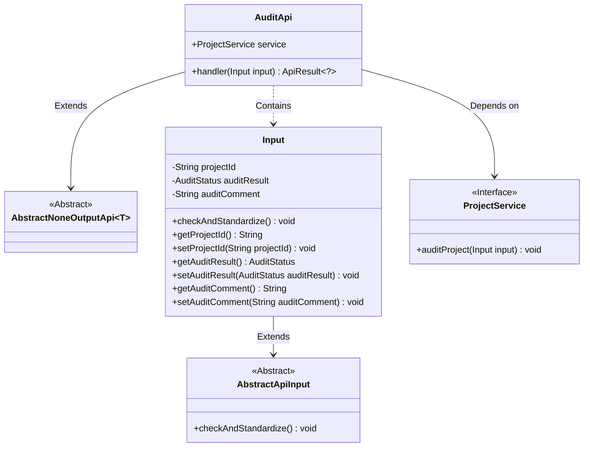

# Basic Information

|      |      |
|------|------|
| Name | AuditApi |
| Language | .java |
| Code Path | WeFe/board/board-service/src/main/java/com/welab/wefe/board/service/api/project/project/AuditApi.java |
| Package Name | com.welab.wefe.board.service.api.project.project |
| Dependencies | ['com.welab.wefe.board.service.service.ProjectService', 'com.welab.wefe.common.StatusCode', 'com.welab.wefe.common.exception.StatusCodeWithException', 'com.welab.wefe.common.fieldvalidate.annotation.Check', 'com.welab.wefe.common.util.StringUtil', 'com.welab.wefe.common.web.api.base.AbstractNoneOutputApi', 'com.welab.wefe.common.web.api.base.Api', 'com.welab.wefe.common.web.dto.AbstractApiInput', 'com.welab.wefe.common.web.dto.ApiResult', 'com.welab.wefe.common.wefe.enums.AuditStatus', 'org.springframework.beans.factory.annotation.Autowired'] |
| Brief Description | Audit API, used to handle requests for user consent to join a project. The input includes the project ID, audit result, and approval comments. Comments must be provided if the request is rejected. The ProjectService is called to complete the audit. |

# Description

AuditApi is an API class designed to handle project join audit requests, with the path "project/add/audit". It inherits from AbstractNoneOutputApi and takes Input, an inner class, as its parameter. Input consists of three fields: project ID, audit result, and approval comments. The project ID and audit result are mandatory fields. When the audit result is "disagree", approval comments must be provided. This API processes audit requests through the auditProject method of ProjectService and returns an empty result upon success. The Input class also includes getter and setter methods for its fields and implements parameter validation logic.

# Class Summary

| Name   | Type  | Description |
|-------|------|-------------|
| AuditApi | class | API for reviewing project join requests requires the project ID and review outcome. Approval comments must be provided when rejecting. The request is processed by calling ProjectService, and the result is returned. |

## Class AuditApi

|      |      |
|------|------|
| Access Modifier | @Api(path = "project/add/audit", name = "Check whether you agree to join a project by yourself");public |
| Type | class |
| Name | AuditApi |
| Description | API for reviewing project join requests requires the project ID and review outcome. Approval comments must be provided when rejecting. The request is processed by calling ProjectService, and the result is returned. |

### UML Class Diagram

This code describes the implementation of an audit API, primarily used to handle requests for user approval to join a project. The AuditApi inherits from AbstractNoneOutputApi, includes an internal Input class to encapsulate request parameters, and executes business logic through the ProjectService interface. The Input class inherits from AbstractApiInput, implementing parameter validation logic, particularly enforcing the requirement to provide approval comments when the audit result is disapproval. The class diagram clearly illustrates inheritance, dependency, and composition relationships between classes, demonstrating a well-structured layered design.

### Internal Method Call Graph

```mermaid
graph TD
    A["Class AuditApi"]
    B["Inheritance: AbstractNoneOutputApi<Input>"]
    C["Annotation: @Api"]
    D["Dependency Injection: @Autowired ProjectService"]
    E["Overridden Method: handler(Input input)"]
    F["Static Inner Class Input"]
    G["Inheritance: AbstractApiInput"]
    H["Fields: projectId, auditResult, auditComment"]
    I["Method: checkAndStandardize()"]
    J["getter/setter methods"]
    K["Invocation: service.auditProject(input)"]
    L["Return: success()"]
    M["Validation: StringUtil.isBlank(auditComment)"]
    N["Throw Exception: StatusCodeWithException"]

    A --> B
    A --> C
    A --> D
    A --> E
    E --> K
    E --> L
    A --> F
    F --> G
    F --> H
    F --> I
    F --> J
    I --> M
    M -->|true| N
```

Flowchart Description: This flowchart illustrates the structure of the AuditApi class and its internal relationships. The main class inherits from AbstractNoneOutputApi, includes ProjectService dependency injection, and implements the handler method. The static inner class Input inherits from AbstractApiInput, containing three fields and their validation logic. When the audit result is "disagree" and the comment is empty, it throws an invalid parameter exception. The handler method invokes the service-layer audit method and returns a success result, forming a complete API processing flow.

### Field List

| Name  | Type  | Description |
|-------|-------|------|
| service | ProjectService | Automatically inject the ProjectService instance. |

### Method List

| Name  | Type  | Description |
|-------|-------|------|
| handler | ApiResult<?> | Rewrite the handler method to call service.auditProject for processing the input, returning an empty result on success and throwing StatusCodeWithException in case of exceptions. |

