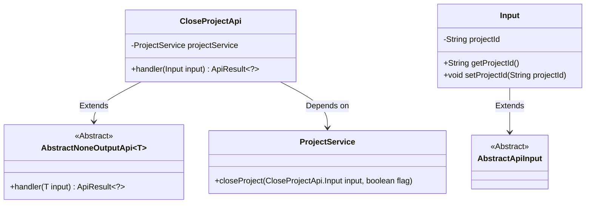
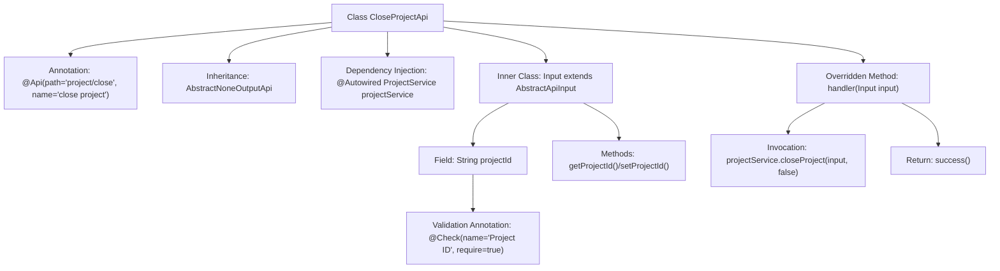
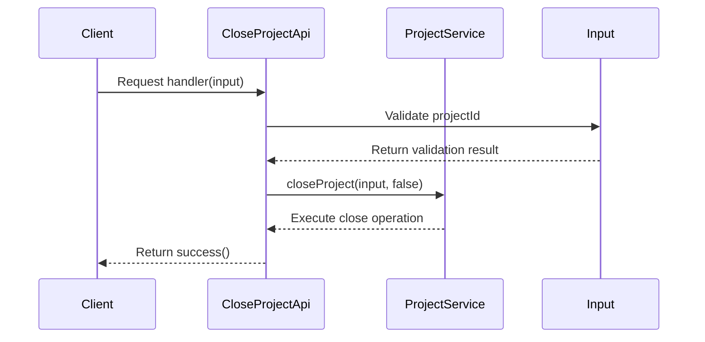

# Basic Information

|      |      |
|------|------|
| Name | CloseProjectApi |
| Language | .java |
| Code Path | WeFe/board/board-service/src/main/java/com/welab/wefe/board/service/api/project/project/CloseProjectApi.java |
| Package Name | com.welab.wefe.board.service.api.project.project |
| Dependencies | ['com.welab.wefe.board.service.service.ProjectService', 'com.welab.wefe.common.exception.StatusCodeWithException', 'com.welab.wefe.common.fieldvalidate.annotation.Check', 'com.welab.wefe.common.web.api.base.AbstractNoneOutputApi', 'com.welab.wefe.common.web.api.base.Api', 'com.welab.wefe.common.web.dto.AbstractApiInput', 'com.welab.wefe.common.web.dto.ApiResult', 'org.springframework.beans.factory.annotation.Autowired'] |
| Brief Description | Project Closure API class, inherits from the no-output abstract API, invokes the project service to close a specified project by ID, and requires the input to include the necessary project ID parameter. |

# Description

The code defines an API endpoint for closing projects, with the path "project/close". This API inherits from an abstract base class with no output and accepts input parameters containing the project ID. The core logic executes the project closure operation through ProjectService, with input parameters undergoing non-null validation. Upon successful execution, it returns a success status; exceptions throw status code errors.

# Class Summary

| Name   | Type  | Description |
|-------|------|-------------|
| CloseProjectApi | class | This is an API class for closing projects, with the path "project/close". It executes the close operation via ProjectService, and the input parameter is the mandatory project ID. |

## Class CloseProjectApi

|      |      |
|------|------|
| Access Modifier | @Api(path = "project/close", name = "close project");public |
| Type | class |
| Name | CloseProjectApi |
| Description | This is an API class for closing projects, with the path "project/close". It executes the close operation via ProjectService, and the input parameter is the mandatory project ID. |

### UML Class Diagram

Class Diagram Description: This diagram illustrates that the CloseProjectApi class inherits from the generic class AbstractNoneOutputApi<Input> and depends on ProjectService. The Input class, as an inner class, extends AbstractApiInput and contains the projectId attribute with getter/setter methods. Both AbstractNoneOutputApi and AbstractApiInput are abstract classes providing foundational functionality for extension. The overall structure reflects a typical layered design of API processors.

### Internal Method Call Graph

This code defines a project closure API interface by inheriting an abstract class to implement no-output response logic. The flowchart illustrates class structure relationships, including annotations, dependency injection, inner input class, and core business invocations. The sequence diagram depicts the complete process from client request to service call, highlighting parameter validation and service-layer interactions. The code utilizes annotations for path mapping and parameter validation, ultimately invoking ProjectService to complete the project closure operation.

### Field List

| Name  | Type  | Description |
|-------|-------|------|
| projectService | ProjectService | Use @Autowired to automatically inject an instance of ProjectService. |

### Method List

| Name  | Type  | Description |
|-------|-------|------|
| handler | ApiResult<?> | Method override, call projectService to close the project and return a successful result. |

