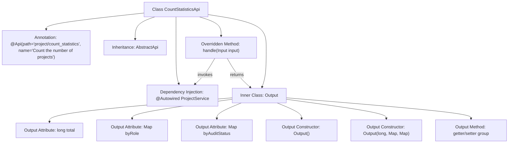

# Basic Information

|      |      |
|------|------|
| Name | CountStatisticsApi |
| Language | .java |
| Code Path | WeFe/board/board-service/src/main/java/com/welab/wefe/board/service/api/project/project/CountStatisticsApi.java |
| Package Name | com.welab.wefe.board.service.api.project.project |
| Dependencies | ['com.welab.wefe.board.service.service.ProjectService', 'com.welab.wefe.common.exception.StatusCodeWithException', 'com.welab.wefe.common.web.api.base.AbstractApi', 'com.welab.wefe.common.web.api.base.Api', 'com.welab.wefe.common.web.dto.ApiResult', 'com.welab.wefe.common.wefe.enums.AuditStatus', 'com.welab.wefe.common.wefe.enums.JobMemberRole', 'org.springframework.beans.factory.annotation.Autowired', 'java.util.Map'] |
| Brief Description | The CountStatisticsApi class is used to count the number of projects, including total counts, categorized statistics by role and review status. It processes inputs through the ProjectService and returns the results. |

# Description

CountStatisticsApi is an API class designed for counting project quantities, inheriting from AbstractApi. It processes input parameters through ProjectService and returns statistical results. The output class Output contains three fields: total represents the total number of projects, byRole counts projects by role, and byAuditStatus counts projects by audit status. The Output class provides a no-argument constructor, a parameterized constructor, as well as getter and setter methods for each field. The API path is project/count_statistics, with its primary function being project quantity statistics.

# Class Summary

| Name   | Type  | Description |
|-------|------|-------------|
| CountStatisticsApi | class | The CountStatisticsApi class is used to count project quantities, returning the total number as well as categorized statistics by role and review status. It processes inputs and outputs results through the ProjectService. |


## Class CountStatisticsApi

|      |      |
|------|------|
| Access Modifier | @Api(path = "project/count_statistics", name = "Count the number of projects");public |
| Type | class |
| Name | CountStatisticsApi |
| Description | The CountStatisticsApi class is used to count project quantities, returning the total number as well as categorized statistics by role and review status. It processes inputs and outputs results through the ProjectService. |


### UML Class Diagram

```mermaid
classDiagram
    class CountStatisticsApi {
        -ProjectService projectService
        +handle(QueryApi~Input~ input) ApiResult~Output~
    }
    CountStatisticsApi --> ProjectService : depends
    CountStatisticsApi --> QueryApi~Input~ : depends
    CountStatisticsApi --> ApiResult~Output~ : depends

    class Output {
        -long total
        -Map~JobMemberRole, Long~ byRole
        -Map~AuditStatus, Long~ byAuditStatus
        +Output()
        +Output(long total, Map~JobMemberRole, Long~ byRole, Map~AuditStatus, Long~ byAuditStatus)
        +getTotal() long
        +setTotal(long total) void
        +getByRole() Map~JobMemberRole, Long~
        +setByRole(Map~JobMemberRole, Long~ byRole) void
        +getByAuditStatus() Map~AuditStatus, Long~
        +setByAuditStatus(Map~AuditStatus, Long~ byAuditStatus) void
    }
    CountStatisticsApi *-- Output : contains

    class ProjectService {
        <<Interface>>
        +statistics(QueryApi~Input~ input) CountStatisticsApi~Output~
    }
    CountStatisticsApi ..|> AbstractApi~QueryApi~Input~, CountStatisticsApi~Output~~ : implements
```

This code demonstrates a project count statistics API class `CountStatisticsApi`, which inherits from `AbstractApi` and handles project statistics requests. The class diagram clearly shows the dependency relationship between `CountStatisticsApi` and the `ProjectService` interface, as well as the structure of its internal static class `Output`. The `Output` class encapsulates statistical results, including total counts and categorized statistics by role and audit status. The overall design reflects clear responsibility division, achieving loose coupling through generic parameters and dependency injection.


### Internal Method Call Graph



This flowchart illustrates the complete structure of the CountStatisticsApi class, including API annotations, parent class inheritance, service injection, and the inner Output class. The core processing flow is: the handle method retrieves project data via projectService, then encapsulates it into an Output object containing total count, role distribution, and audit status. The inner Output class implements data encapsulation through dual constructors and getter/setter methods, enabling multi-dimensional display of statistical results.

### Field List

| Name  | Type  | Description |
|-------|-------|------|
| projectService | ProjectService | Using @Autowired to automatically inject an instance of ProjectService. |

### Method List

| Name  | Type  | Description |
|-------|-------|------|
| handle | ApiResult<Output> | Java method override, calling projectService to count input data and return successful results. |


