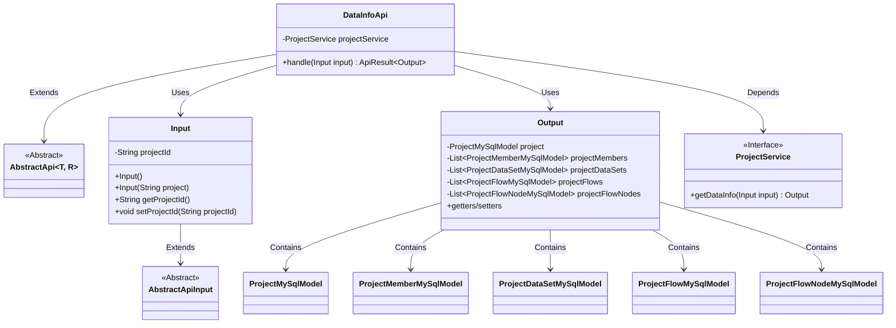

# Basic Information

|      |      |
|------|------|
| Name | DataInfoApi |
| Language | .java |
| Code Path | WeFe/board/board-service/src/main/java/com/welab/wefe/board/service/api/project/project/DataInfoApi.java |
| Package Name | com.welab.wefe.board.service.api.project.project |
| Dependencies | ['com.welab.wefe.board.service.database.entity.job', 'com.welab.wefe.board.service.service.ProjectService', 'com.welab.wefe.common.exception.StatusCodeWithException', 'com.welab.wefe.common.fieldvalidate.annotation.Check', 'com.welab.wefe.common.web.api.base.AbstractApi', 'com.welab.wefe.common.web.api.base.Api', 'com.welab.wefe.common.web.dto.AbstractApiInput', 'com.welab.wefe.common.web.dto.ApiResult', 'org.springframework.beans.factory.annotation.Autowired', 'java.util.List'] |
| Brief Description | API class DataInfoApi, path project/data/info, retrieves project information including datasets, members, workflows, and nodes. Input requires a project ID, and the output contains project details along with related data lists. |

# Description

The code defines an API class named DataInfoApi, which is used to retrieve project and related information. The API path is project/data/info, and its functionalities include fetching project datasets, project members, project workflows, and workflow node information. The input parameter Input contains a mandatory project ID field, while the output Output includes the project model, member list, dataset list, workflow list, and workflow node list. The request is processed by ProjectService, which returns the results.

# Class Summary

| Name   | Type  | Description |
|-------|------|-------------|
| DataInfoApi | class | API interfaces for retrieving project information along with its datasets, members, workflows, and node details, requiring the project ID to be provided. |

## Class DataInfoApi

|      |      |
|------|------|
| Access Modifier | @Api(;        path = "project/data/info",;        name = "Get the project and the information in the project",;        desc = "Get the project and the data set, project members, project process, project process node information in the project.";);public |
| Type | class |
| Name | DataInfoApi |
| Description | API interfaces for retrieving project information along with its datasets, members, workflows, and node details, requiring the project ID to be provided. |

### UML Class Diagram

This diagram illustrates the structure of the DataInfoApi class and its relationships. DataInfoApi inherits from the generic class AbstractApi with Input and Output as type parameters. The Input class extends AbstractApiInput and contains a project ID field, while the Output class aggregates project-related model collections. DataInfoApi depends on the ProjectService interface to fetch data and processes requests through its handle method. Models such as ProjectMySqlModel are aggregated by the Output class to form a complete project information response structure.

### Internal Method Call Graph

```mermaid
graph TD
    A["Class DataInfoApi"]
    B["Annotation: @Api"]
    C["Inheritance: AbstractApi<Input, Output>"]
    D["Dependency Injection: @Autowired ProjectService"]
    E["Overridden Method: handle(Input input)"]
    F["Inner Class: Input"]
    G["Inner Class: Output"]
    H["Input Property: String projectId"]
    I["Input Methods: get/setProjectId()"]
    J["Output Properties: ProjectMySqlModel etc. (5 data types)"]
    K["Output Methods: getters/setters for each property"]

    A --> B
    A --> C
    A --> D
    A --> E
    A --> F
    A --> G
    F --> D
    F --> G
    F --> H
    H --> I
    G --> J
    J --> K
```

This flowchart illustrates the complete structure of the DataInfoApi class, including API annotations, parent class inheritance, service injection, and core processing methods. It highlights how the handle method retrieves project data through ProjectService, with detailed mappings of the property and method structures of the two inner classes Input and Output. The Input class is responsible for receiving the project ID parameter, while the Output encapsulates five types of project-related data models. The entire process demonstrates the complete chain from request handling to data return.

### Field List

| Name  | Type  | Description |
|-------|-------|------|
| projectService | ProjectService | Using @Autowired to automatically inject an instance of ProjectService. |

### Method List

| Name  | Type  | Description |
|-------|-------|------|
| handle | ApiResult<Output> | Rewrite the handle method to call projectService.getDataInfo for processing the input and return a successful result. |

