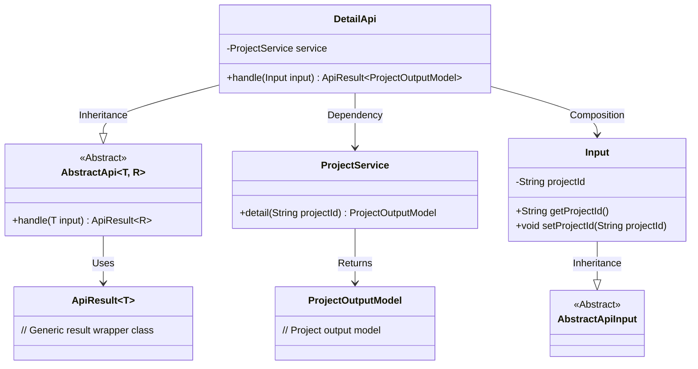
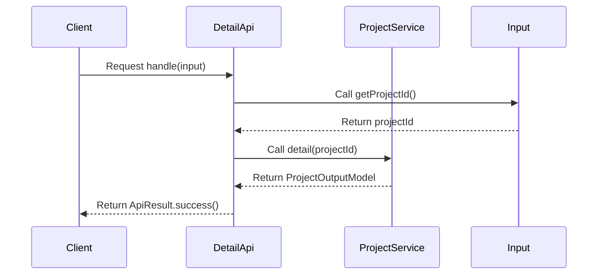

# Basic Information

|      |      |
|------|------|
| Name | DetailApi |
| Language | .java |
| Code Path | WeFe/board/board-service/src/main/java/com/welab/wefe/board/service/api/project/project/DetailApi.java |
| Package Name | com.welab.wefe.board.service.api.project.project |
| Dependencies | ['com.welab.wefe.board.service.dto.entity.project.ProjectOutputModel', 'com.welab.wefe.board.service.service.ProjectService', 'com.welab.wefe.common.exception.StatusCodeWithException', 'com.welab.wefe.common.fieldvalidate.annotation.Check', 'com.welab.wefe.common.web.api.base.AbstractApi', 'com.welab.wefe.common.web.api.base.Api', 'com.welab.wefe.common.web.dto.AbstractApiInput', 'com.welab.wefe.common.web.dto.ApiResult', 'org.springframework.beans.factory.annotation.Autowired'] |
| Brief Description | The DetailApi class handles project detail requests, retrieves the details by calling ProjectService with projectId, and returns the ProjectOutputModel result. The input parameter Input includes the required primary key projectId. |

# Description

The code defines an API class named `DetailApi` for handling project detail query requests. The class annotation specifies the API path as `"project/detail"` and the name as `"Project details"`. This class inherits from `AbstractApi`, using generics to designate the input type as the inner class `Input` and the output type as `ProjectOutputModel`. The `ProjectService` is injected via the `Autowired` annotation. The core method `handle` accepts an `Input` parameter, calls the `service.detail` method to retrieve project details, and returns a successful result. The inner class `Input` extends `AbstractApiInput`, containing a required `projectId` field with a validation annotation labeled `"Project primary key"`, and provides getter and setter methods.

# Class Summary

| Name   | Type  | Description |
|-------|------|-------------|
| DetailApi | class | Project Details API, path is project/detail, queries project details by projectId, returns ProjectOutputModel. The input parameter projectId is required. |

## Class DetailApi

|      |      |
|------|------|
| Access Modifier | @Api(path = "project/detail", name = "Project details");public |
| Type | class |
| Name | DetailApi |
| Description | Project Details API, path is project/detail, queries project details by projectId, returns ProjectOutputModel. The input parameter projectId is required. |

### UML Class Diagram

Class Diagram Description: This structure illustrates an abstract template-based API implementation system. DetailApi inherits from the generic abstract class AbstractApi, processes Input parameters, and returns ProjectOutputModel results. Input, as a nested class inheriting AbstractApiInput, contains a project ID field with accessor methods. DetailApi utilizes ProjectService via dependency injection to fetch project details, demonstrating a clear hierarchy and type-safe data flow.

### Internal Method Call Graph

```mermaid
graph TD
    A["Class DetailApi"]
    B["Annotation: @Api"]
    C["Inheritance: AbstractApi<Input, ProjectOutputModel>"]
    D["Dependency Injection: @Autowired ProjectService"]
    E["Overridden Method: handle(Input input)"]
    F["Inner Class: Input"]
    G["Validation Annotation: @Check"]
    H["Methods: getProjectId/setProjectId"]
    I["Invocation: service.detail(input.getProjectId())"]
    J["Return: ApiResult.success()"]

    A --> B
    A --> C
    A --> D
    A --> E
    E --> I
    I --> J
    A --> F
    F --> G
    F --> H
```

This code defines a DetailApi class for handling project details, which inherits from the abstract template class AbstractApi. The main workflow involves receiving input parameters via the handle method, extracting projectId from Input, invoking ProjectService to retrieve detail data, and finally wrapping the result into a success response. The inner class Input contains the project ID field with its getter/setter methods and implements parameter validation using the @Check annotation. The flowchart illustrates the class structure and invocation relationships, while the sequence diagram depicts the request processing flow.

### Field List

| Name  | Type  | Description |
|-------|-------|------|
| service | ProjectService | Using @Autowired to automatically inject an instance of ProjectService. |

### Method List

| Name  | Type  | Description |
|-------|-------|------|
| handle | ApiResult<ProjectOutputModel> | Process the input and return the project details, invoking the service to fetch detailed information corresponding to the project ID upon success. |

