# Basic Information

|      |      |
|------|------|
| Name | QueryApi |
| Language | .java |
| Code Path | WeFe/board/board-service/src/main/java/com/welab/wefe/board/service/api/project/project/QueryApi.java |
| Package Name | com.welab.wefe.board.service.api.project.project |
| Dependencies | ['com.welab.wefe.board.service.dto.base.PagingInput', 'com.welab.wefe.board.service.dto.base.PagingOutput', 'com.welab.wefe.board.service.dto.entity.project.ProjectQueryOutputModel', 'com.welab.wefe.board.service.service.ProjectService', 'com.welab.wefe.common.exception.StatusCodeWithException', 'com.welab.wefe.common.fieldvalidate.annotation.Check', 'com.welab.wefe.common.web.api.base.AbstractApi', 'com.welab.wefe.common.web.api.base.Api', 'com.welab.wefe.common.web.dto.ApiResult', 'com.welab.wefe.common.wefe.enums.AuditStatus', 'com.welab.wefe.common.wefe.enums.JobMemberRole', 'com.welab.wefe.common.wefe.enums.ProjectType', 'org.springframework.beans.factory.annotation.Autowired'] |
| Brief Description | API for querying project lists, including pagination and various filtering conditions such as name, status, time, role, etc., which invokes the ProjectService to process the request. |

# Description

The code defines a class named `QueryApi` for querying project lists. It inherits from `AbstractApi`, processes input of type `Input`, and outputs paginated `ProjectQueryOutputModel`. The class injects the `ProjectService` service and invokes `service.query` through the `handle` method to process query requests. The `Input` class inherits from `PagingInput` and includes multiple query condition fields such as project name, partner ID, review status, creation time range, role type, project status, and project type. Each field has corresponding getter and setter methods, with some fields additionally annotated with SQL injection prevention validation.

# Class Summary

| Name   | Type  | Description |
|-------|------|-------------|
| QueryApi | class | API for querying project list, including pagination and various filtering conditions such as name, partner, status, time range, etc. |


## Class QueryApi

|      |      |
|------|------|
| Access Modifier | @Api(path = "project/query", name = "Query project list");public |
| Type | class |
| Name | QueryApi |
| Description | API for querying project list, including pagination and various filtering conditions such as name, partner, status, time range, etc. |


### UML Class Diagram

```mermaid
classDiagram
    class QueryApi {
        -ProjectService service
        +handle(Input input) ApiResult~PagingOutput~ProjectQueryOutputModel~~
    }
    QueryApi --> ProjectService : Dependency
    QueryApi --|> AbstractApi~Input, PagingOutput~ProjectQueryOutputModel~~ : Inheritance

    class AbstractApi~T, R~ {
        <<Abstract>>
        +handle(T input) ApiResult~R~
    }

    class PagingOutput~T~ {
        <<GenericType>>
    }

    class ProjectQueryOutputModel {
        <<DataModel>>
    }

    class Input {
        -String name
        -String memberId
        -AuditStatus auditStatus
        -String startCreateTime
        -String endCreateTime
        -JobMemberRole myRole
        -JobMemberRole memberRole
        -Boolean exited
        -Boolean closed
        -ProjectType projectType
        +getter/setter methods
    }
    Input --|> PagingInput : Inheritance

    class PagingInput {
        <<BaseClass>>
    }

    class ProjectService {
        +query(Input input) PagingOutput~ProjectQueryOutputModel~
    }
```

This code demonstrates the implementation structure of a project query API. QueryApi inherits from the generic abstract class AbstractApi, processes Input parameters, and returns paginated project query results. The Input class extends PagingInput and contains multiple query condition fields with validation annotations. ProjectService provides the actual query functionality, which QueryApi utilizes through dependency injection. The overall architecture reflects clear hierarchical division and separation of responsibilities. The Input class encapsulates all possible query conditions, implementing a type-safe API design pattern through generics and inheritance.


### Internal Method Call Graph

```mermaid
graph TD
    A["Class QueryApi"]
    B["Annotation: @Api(path='project/query', name='Query project list')"]
    C["Inheritance: AbstractApi<Input, PagingOutput<ProjectQueryOutputModel>>"]
    D["Dependency Injection: @Autowired ProjectService service"]
    E["Overridden Method: handle(Input input)"]
    F["Inner Class: Input extends PagingInput"]
    G["Field: String name (with @Check annotation)"]
    H["Field: String memberId (with @Check annotation)"]
    I["Field: AuditStatus auditStatus (with @Check annotation)"]
    J["Field: String startCreateTime (with @Check annotation)"]
    K["Field: String endCreateTime (with @Check annotation)"]
    L["Field: JobMemberRole myRole (with @Check annotation)"]
    M["Field: JobMemberRole memberRole (with @Check annotation)"]
    N["Field: Boolean exited (with @Check annotation)"]
    O["Field: Boolean closed (with @Check annotation)"]
    P["Field: ProjectType projectType (with @Check annotation)"]
    Q["Getter/Setter Method Group"]

    A --> B
    A --> C
    A --> D
    A --> E
    A --> F
    F --> G
    F --> H
    F --> I
    F --> J
    F --> K
    F --> L
    F --> M
    F --> N
    F --> O
    F --> P
    F --> Q
    E --> D
    E --> F
```



This code demonstrates the implementation of a project query API, including the main class QueryApi and nested parameter class Input. The main class inherits from an abstract API template, invoking ProjectService for queries via the handle method. The Input class extends pagination parameters and contains 12 query condition fields with validation annotations, each with corresponding getter/setter methods. The flowchart clearly illustrates class inheritance, dependency injection, method overriding, and the complete structure of the parameter class.

### Field List

| Name  | Type  | Description |
|-------|-------|------|
| service | ProjectService | Automatically inject the ProjectService instance into the current class. |

### Method List

| Name  | Type  | Description |
|-------|-------|------|
| handle | ApiResult<PagingOutput<ProjectQueryOutputModel>> | Rewrite the method to process input and return paginated query results. |


