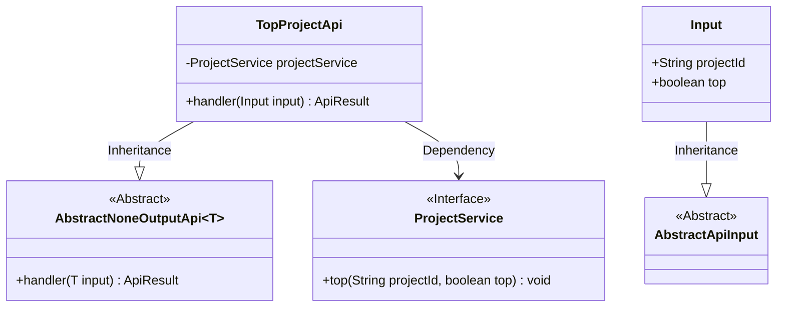
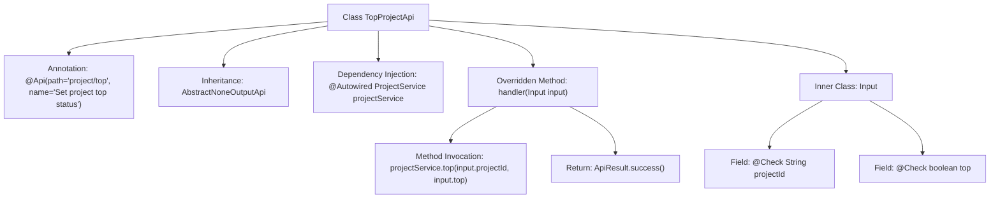

# Basic Information

|      |      |
|------|------|
| Name | TopProjectApi |
| Language | .java |
| Code Path | WeFe/board/board-service/src/main/java/com/welab/wefe/board/service/api/project/project/TopProjectApi.java |
| Package Name | com.welab.wefe.board.service.api.project.project |
| Dependencies | ['com.welab.wefe.board.service.service.ProjectService', 'com.welab.wefe.common.exception.StatusCodeWithException', 'com.welab.wefe.common.fieldvalidate.annotation.Check', 'com.welab.wefe.common.web.api.base.AbstractNoneOutputApi', 'com.welab.wefe.common.web.api.base.Api', 'com.welab.wefe.common.web.dto.AbstractApiInput', 'com.welab.wefe.common.web.dto.ApiResult', 'org.springframework.beans.factory.annotation.Autowired'] |
| Brief Description | TopProjectApi is used to set the top status of a project. It accepts a project ID and a top flag, invokes the ProjectService for processing, and returns no data. Input parameters must be validated for non-null values. |

# Description

This is an API class named TopProjectApi, used to set the top status of a project. It inherits from AbstractNoneOutputApi and uses the generic Input as the input parameter. The class injects ProjectService to handle business logic. The handler method receives an Input object, calls the top method of projectService to update the project's top status, and returns a successful result. The Input inner class inherits from AbstractApiInput and contains two required fields: projectId (project ID) and top (a boolean value indicating whether to top the project). The API path is "project/top", and its name is "Set Project Top Status".

# Class Summary

| Name   | Type  | Description |
|-------|------|-------------|
| TopProjectApi | class | The TopProjectApi is used to set the project's pinned status. It accepts a project ID and a pinned flag, invokes the ProjectService for processing, and returns no data. Input validation is required to ensure non-null values. |

## Class TopProjectApi

|      |      |
|------|------|
| Access Modifier | @Api(path = "project/top", name = "设置项目置顶状态");public |
| Type | class |
| Name | TopProjectApi |
| Description | The TopProjectApi is used to set the project's pinned status. It accepts a project ID and a pinned flag, invokes the ProjectService for processing, and returns no data. Input validation is required to ensure non-null values. |

### UML Class Diagram

This code describes a TopProjectApi class for setting project pinning status, which inherits from the AbstractNoneOutputApi generic class and processes Input-type parameters. Input is an inner class inheriting from AbstractApiInput, containing projectId and top fields. TopProjectApi implements the pinning functionality through dependency-injected ProjectService interface. The class diagram clearly illustrates inheritance and dependency relationships, reflecting the basic architecture of API request handling.

### Internal Method Call Graph

This code describes an API class named TopProjectApi for handling project top status setting. The class inherits from AbstractNoneOutputApi and implements the handler method, invoking the top method of ProjectService to complete the core logic. The inner class Input defines required request parameters projectId and top, validated via @Check annotation. The flowchart clearly illustrates the class structure, dependency relationships, and method invocation chain, highlighting the complete workflow from request processing to service call.

### Field List

| Name  | Type  | Description |
|-------|-------|------|
| projectService | ProjectService | Using @Autowired to automatically inject an instance of ProjectService. |

### Method List

| Name  | Type  | Description |
|-------|-------|------|
| handler | ApiResult | This method overrides the parent class handler, invokes the top method of projectService to process the input parameters projectId and top, and returns ApiResult upon success. |

