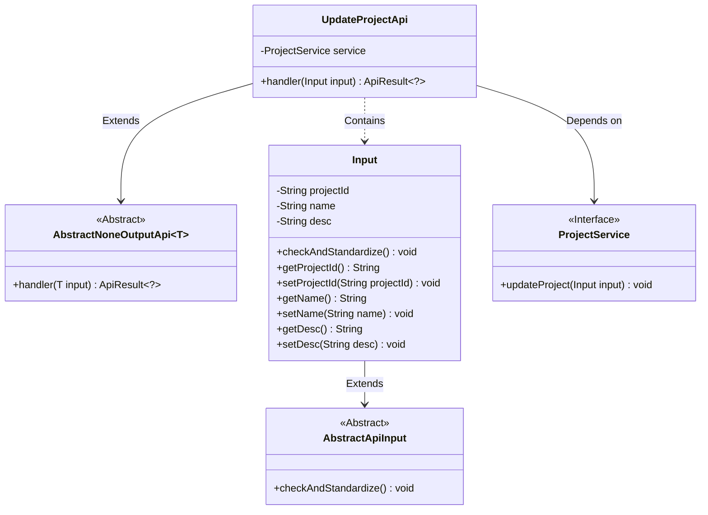
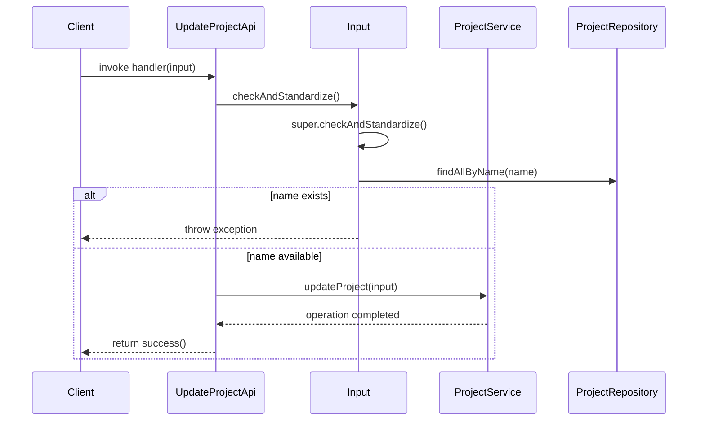

# Basic Information

|      |      |
|------|------|
| Name | UpdateProjectApi |
| Language | .java |
| Code Path | WeFe/board/board-service/src/main/java/com/welab/wefe/board/service/api/project/project/UpdateProjectApi.java |
| Package Name | com.welab.wefe.board.service.api.project.project |
| Dependencies | ['com.welab.wefe.board.service.database.entity.job.ProjectMySqlModel', 'com.welab.wefe.board.service.database.repository.ProjectRepository', 'com.welab.wefe.board.service.service.ProjectService', 'com.welab.wefe.common.StatusCode', 'com.welab.wefe.common.exception.StatusCodeWithException', 'com.welab.wefe.common.fieldvalidate.annotation.Check', 'com.welab.wefe.common.web.Launcher', 'com.welab.wefe.common.web.api.base.AbstractNoneOutputApi', 'com.welab.wefe.common.web.api.base.Api', 'com.welab.wefe.common.web.dto.AbstractApiInput', 'com.welab.wefe.common.web.dto.ApiResult', 'org.springframework.beans.factory.annotation.Autowired', 'java.util.List'] |
| Brief Description | API class for updating project information, including project ID, name, and description fields. The name must be unique, and the service will update the project after validation. |

# Description

This is an API class for updating project information, with the path "project/update". It inherits from AbstractNoneOutputApi, and the input parameter is the inner class Input. Input includes project ID, name, and description fields, among which project ID and name are mandatory. During parameter validation, it checks whether the project name is duplicated, and throws an exception if duplication occurs. The processing logic updates project information through ProjectService.

# Class Summary

| Name   | Type  | Description |
|-------|------|-------------|
| UpdateProjectApi | class | The UpdateProjectApi is used to update project information, including project ID, name, and description, with the name being non-repetitive. After validating the input parameters, it invokes the service to update the project. |

## Class UpdateProjectApi

|      |      |
|------|------|
| Access Modifier | @Api(path = "project/update", name = "update project info");public |
| Type | class |
| Name | UpdateProjectApi |
| Description | The UpdateProjectApi is used to update project information, including project ID, name, and description, with the name being non-repetitive. After validating the input parameters, it invokes the service to update the project. |

### UML Class Diagram

This class diagram illustrates the structure of an API for updating project information. The UpdateProjectApi inherits from the generic class AbstractNoneOutputApi and contains an inner class Input for handling request parameters. Input inherits from AbstractApiInput and implements parameter validation logic. UpdateProjectApi relies on the ProjectService interface to perform project update operations, demonstrating clear hierarchical relationships and separation of responsibilities.

### Internal Method Call Graph

```mermaid
graph TD
    A["Class UpdateProjectApi"]
    B["Annotation: @Api(path='project/update', name='update project info')"]
    C["Inheritance: AbstractNoneOutputApi<Input>"]
    D["Dependency Injection: @Autowired ProjectService service"]
    E["Overridden Method: handler(Input input)"]
    F["Nested Class Input"]
    G["Field: String projectId @Check"]
    H["Field: String name @Check"]
    I["Field: String desc @Check"]
    J["Method: checkAndStandardize()"]
    K["Method: getter/setter"]
    L["Invocation: service.updateProject(input)"]
    M["Return: success()"]
    N["Validation: super.checkAndStandardize()"]
    O["Query: ProjectRepository.findAllByName(name)"]
    P["Exception: StatusCode.PARAMETER_VALUE_INVALID"]

    A --> B
    A --> C
    A --> D
    A --> E
    A --> F
    F --> G
    F --> H
    F --> I
    F --> J
    F --> K
    E --> L
    E --> M
    J --> N
    J --> O
    J --> P
```

This code implements a project update API, primarily consisting of two core functionalities: input parameter validation and project updating. The flowchart illustrates class structure relationships, where UpdateProjectApi inherits from an abstract class and injects ProjectService, while the nested Input class handles parameter validation. The sequence diagram depicts the API call flow: first performing input validation (checking project name uniqueness), then invoking the service layer to update project data upon successful validation. The validation process involves database queries and business rule verification to ensure project names are unique. The overall design embodies a layered validation approach, with basic validation at the gateway layer and in-depth validation at the business layer.

### Field List

| Name  | Type  | Description |
|-------|-------|------|
| service | ProjectService | Using @Autowired to automatically inject an instance of ProjectService. |

### Method List

| Name  | Type  | Description |
|-------|-------|------|
| handler | ApiResult<?> | Rewrite the handler method to call the service for updating the item and return a successful result, potentially throwing a StatusCodeWithException. |

