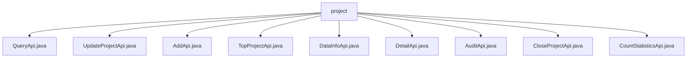

# Basic Information

|      |      |
|------|------|
| Name | project |
| Language | .java |
| Code Path | WeFe/board/board-service/src/main/java/com/welab/wefe/board/service/api/project/project |
| Package Name | docs.board.board-service.src.main.java.com.welab.wefe.board.service.api.project.project |
| Brief Description | QueryApi queries the project list, UpdateProjectApi updates project information, AddApi adds a new project, TopProjectApi sets the top status, DataInfoApi retrieves project data, DetailApi queries project details, AuditApi handles reviews, CloseProjectApi closes a project, CountStatisticsApi counts project quantities. |

# Description

## Overview  
The core responsibility of this module is to provide comprehensive project management functionalities, including project CRUD operations, status changes, data queries, and statistical analysis. All APIs inherit from abstract base classes (e.g., AbstractApi) and implement business logic through ProjectService, following a resource controller-like pattern.  

The interface specifications uniformly adopt the RESTful style. Input parameters mostly inherit from PagingInput or AbstractApiInput, while outputs are typically paginated models or specific DTOs. Key data structures include ProjectQueryOutputModel (with pagination details), ProjectOutputModel (project details), and CountStatisticsOutput (statistical results).  

The only external dependency is ProjectService, which encapsulates business logic. For example, QueryApi injects this service to handle paginated queries, while AddApi invokes its methods to validate and create projects. All APIs include strict parameter validation, such as anti-SQL injection annotations and non-null checks.  

## Key Business Scenarios  
The module supports full lifecycle project management. A typical workflow is: create a project (AddApi) → query details (DetailApi) → update information (UpdateProjectApi) → pin/close (TopProjectApi/CloseProjectApi) → perform statistical analysis (CountStatisticsApi).  

Interaction modes fall into three categories: data operations (e.g., CRUD), status changes (e.g., approval/pinning), and statistical queries. For instance, AuditApi handles approval status changes, while DataInfoApi aggregates project-related data. All APIs return standardized responses and throw status codes for exceptions.  

Functional completeness is reflected in the coverage of core business scenarios, such as multi-condition paginated queries (QueryApi), project data aggregation (DataInfoApi), and multi-dimensional statistics (CountStatisticsApi). Typical applications include project management backends and data dashboards that require project-level data.

### Package Internal Structure View

This flowchart illustrates the structure of 9 API files under the project directory, with all Java files directly subordinate to the project node. These API files encompass different functional modules such as querying, updating, adding, and topping projects, forming a complete project service interface system where each file represents an independent functional endpoint.

# File List

| Name   | Type  | Description |
|-------|------|-------------|
| [QueryApi.java](QueryApi.md) | file | The API for querying the project list includes pagination and various filtering conditions such as name, status, time, role, etc., and invokes the ProjectService to process the request. |
| [UpdateProjectApi.java](UpdateProjectApi.md) | file | API class for updating project information, including project ID, name, and description fields. The name must be unique, and the service will update the project after validation. |
| [AddApi.java](AddApi.md) | file | The `AddApi` class is used to add new projects, handling both input and output processing. The input requires validation of project name uniqueness, non-empty collaborators, and no duplicate members. The output returns the project ID. |
| [TopProjectApi.java](TopProjectApi.md) | file | The TopProjectApi is used to set the project's pinned status. It accepts a project ID and a pinned flag, invokes the ProjectService for processing, and returns no data. The input parameters must be validated for non-null values. |
| [DataInfoApi.java](DataInfoApi.md) | file | API class DataInfoApi, path project/data/info, retrieves project information including datasets, members, workflows, and nodes. Input requires project ID, output contains project details and related data lists. |
| [DetailApi.java](DetailApi.md) | file | The DetailApi class handles project detail requests, retrieves the details by calling ProjectService with the projectId, and returns the ProjectOutputModel result. The input parameter Input includes the mandatory project primary key projectId. |
| [AuditApi.java](AuditApi.md) | file | Audit API, used to handle requests for user consent to join a project. Input includes project ID, audit result, and approval comments. Comments must be provided if rejected. Calls ProjectService to complete the audit. |
| [CloseProjectApi.java](CloseProjectApi.md) | file | Project Closure API class, inherits from the no-output abstract API, invokes the project service to close a specified project by ID. The input must include the necessary project ID parameter. |
| [CountStatisticsApi.java](CountStatisticsApi.md) | file | The CountStatisticsApi class is used to count the number of projects, including total counts, categorized statistics by role and review status. It processes input through ProjectService and returns results. |

