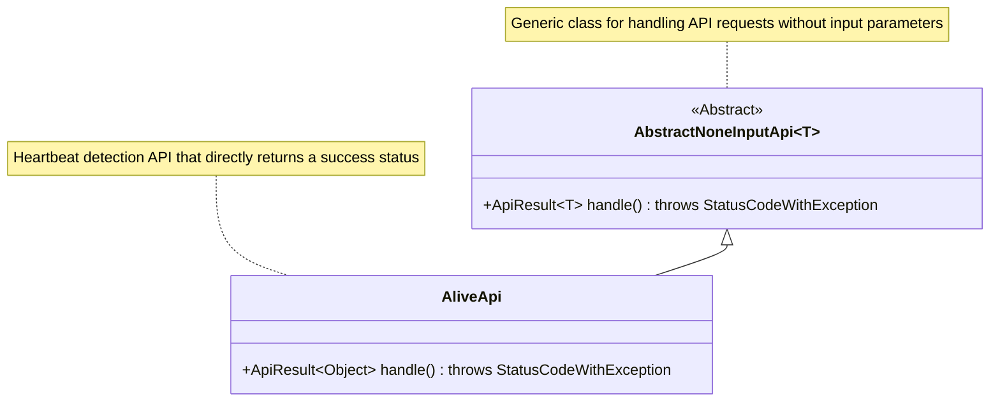
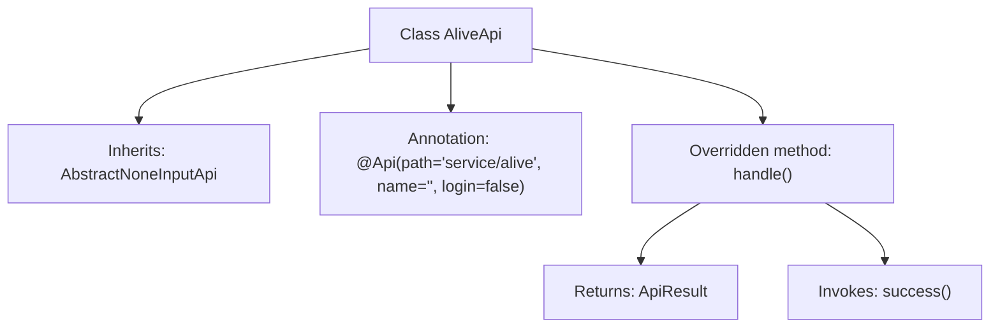

# Basic Information

|      |      |
|------|------|
| Name | AliveApi |
| Language | .java |
| Code Path | WeFe/board/board-service/src/main/java/com/welab/wefe/board/service/api/service/AliveApi.java |
| Package Name | com.welab.wefe.board.service.api.service |
| Dependencies | ['com.welab.wefe.common.exception.StatusCodeWithException', 'com.welab.wefe.common.web.api.base.AbstractNoneInputApi', 'com.welab.wefe.common.web.api.base.Api', 'com.welab.wefe.common.web.dto.ApiResult'] |
| Brief Description | This is a no-login-required liveness detection API class with the path "service/alive", inheriting from AbstractNoneInputApi, which returns a successful result. |

# Description

The code defines a public class named `AliveApi`, which inherits from `AbstractNoneInputApi` with a generic parameter of `Object`. The class is annotated with `@Api`, specifying the path as `"service/alive"`, with no name set, and requiring no login authentication. It overrides the `handle` method, returning a successful `ApiResult` object without any input parameter processing logic. This API is primarily used for service liveliness detection and directly returns a success status.

# Class Summary

| Name   | Type  | Description |
|-------|------|-------------|
| AliveApi | class | This is a no-login survival detection API with the path "service/alive", inherited from AbstractNoneInputApi, which returns a successful result. |

## Class AliveApi

|      |      |
|------|------|
| Access Modifier | @Api(path = "service/alive", name = "", login = false);public |
| Type | class |
| Name | AliveApi |
| Description | This is a no-login survival detection API with the path "service/alive", inherited from AbstractNoneInputApi, which returns a successful result. |

### UML Class Diagram

This code demonstrates a simple implementation of a heartbeat detection API. AliveApi inherits from the abstract class AbstractNoneInputApi and overrides the handle method to process requests. The class diagram clearly illustrates the inheritance relationship, where AbstractNoneInputApi is a generic abstract class, and AliveApi is its concrete implementation specifically designed for heartbeat detection that returns a success status. The @Api annotation indicates this is an API endpoint that does not require login.

### Internal Method Call Graph

This code demonstrates a class named AliveApi that inherits from AbstractNoneInputApi<Object> and is annotated with @Api to define the API path and attributes. The core functionality lies in overriding the handle() method, which directly returns the result of invoking success(), indicating successful API execution. The flowchart clearly illustrates the class inheritance, annotation application, and method invocation logic, making it suitable for implementing a simple alive-check interface.

### Field List

| Name  | Type  | Description |
|-------|-------|------|

### Method List

| Name  | Type  | Description |
|-------|-------|------|
| handle | ApiResult<Object> | Java method override, returns a successful ApiResult, may throw a StatusCodeWithException. |

