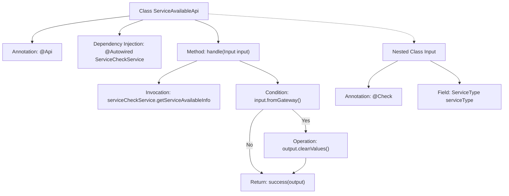

# Basic Information

|      |      |
|------|------|
| Name | ServiceAvailableApi |
| Language | .java |
| Code Path | WeFe/board/board-service/src/main/java/com/welab/wefe/board/service/api/service/ServiceAvailableApi.java |
| Package Name | com.welab.wefe.board.service.api.service |
| Dependencies | ['com.welab.wefe.board.service.service.ServiceCheckService', 'com.welab.wefe.common.exception.StatusCodeWithException', 'com.welab.wefe.common.fieldvalidate.annotation.Check', 'com.welab.wefe.common.web.api.base.AbstractApi', 'com.welab.wefe.common.web.api.base.Api', 'com.welab.wefe.common.web.dto.AbstractApiInput', 'com.welab.wefe.common.web.dto.ApiResult', 'com.welab.wefe.common.wefe.checkpoint.dto.ServiceAvailableCheckOutput', 'com.welab.wefe.common.wefe.enums.ServiceType', 'org.springframework.beans.factory.annotation.Autowired', 'java.io.IOException'] |
| Brief Description | The `ServiceAvailableApi` class is used to query service availability, retrieving information via `ServiceCheckService`, and supports gateway filtering of sensitive data. The input requires specifying the service type. |

# Description

The code defines an API class named `ServiceAvailableApi`, which is used to query the availability information of a specified service type. The API path is `"service/available"`, and its function is to list all checkpoints to display service availability. The class inherits from `AbstractApi`, with the input parameter being an `Input` class containing the mandatory service type, and the output being `ServiceAvailableCheckOutput`. The processing logic retrieves service availability information via `serviceCheckService`, and if the request originates from a gateway, it cleans the output values. Finally, it returns a successful result along with the processed output data.

# Class Summary

| Name   | Type  | Description |
|-------|------|-------------|
| ServiceAvailableApi | class | The `ServiceAvailableApi` class is used to query service availability. It retrieves information through `ServiceCheckService`, processes the input parameter `serviceType`, and sanitizes output values during gateway requests. |


## Class ServiceAvailableApi

|      |      |
|------|------|
| Access Modifier | @Api(path = "service/available", name = "list all checkpoint in board service to show its availability.");public |
| Type | class |
| Name | ServiceAvailableApi |
| Description | The `ServiceAvailableApi` class is used to query service availability. It retrieves information through `ServiceCheckService`, processes the input parameter `serviceType`, and sanitizes output values during gateway requests. |


### UML Class Diagram

```mermaid
classDiagram
    class ServiceAvailableApi {
        -ServiceCheckService serviceCheckService
        +handle(Input input) ApiResult~ServiceAvailableCheckOutput~
    }
    <<Interface>> ServiceCheckService {
        // Interface methods not shown in code
    }
    class AbstractApi~Input, ServiceAvailableCheckOutput~ {
        <<abstract>>
    }
    class ServiceAvailableCheckOutput {
        +cleanValues()
    }
    class AbstractApiInput {
        <<abstract>>
    }
    class Input {
        +ServiceType serviceType
    }
    class ServiceType {
        // Enum or type definition
    }
    class ApiResult~T~ {
        // Generic result class
    }

    ServiceAvailableApi --> AbstractApi~Input, ServiceAvailableCheckOutput~ : extends
    ServiceAvailableApi --> ServiceCheckService : depends
    ServiceAvailableApi ..|> Input : contains (inner class)
    Input --> AbstractApiInput : extends
    AbstractApi~Input, ServiceAvailableCheckOutput~ --> ApiResult~T~ : uses
    AbstractApi~Input, ServiceAvailableCheckOutput~ --> ServiceAvailableCheckOutput : uses
    Input --> ServiceType : associates
```

This class diagram illustrates the structure of `ServiceAvailableApi` and its related classes. `ServiceAvailableApi` inherits from the generic abstract class `AbstractApi`, depends on the `ServiceCheckService` interface, and contains a static inner class `Input`. `Input` extends `AbstractApiInput` and associates with the `ServiceType` enum. `AbstractApi` utilizes generic `ApiResult` and `ServiceAvailableCheckOutput` as return types, the latter featuring a data-cleaning method. The overall architecture reflects a typical pattern where an API processes input, invokes services, and returns results, achieving type safety and code reuse through generics and inheritance.


### Internal Method Call Graph



This code flowchart illustrates the core structure and workflow of the ServiceAvailableApi class. The class is an API interface defined with the @Api annotation for path and description, inheriting AbstractApi with specified input/output types. The main logic resides in the handle method: first retrieving service availability information via serviceCheckService, then determining whether the input originates from a gateway (fromGateway). If true, it cleanses output values before returning the processed result. The nested Input class defines the mandatory serviceType parameter with validation annotations. The entire flow demonstrates typical patterns of API request processing, service invocation, and conditional branching.

### Field List

| Name  | Type  | Description |
|-------|-------|------|
| serviceCheckService | ServiceCheckService | Using @Autowired to automatically inject the ServiceCheckService instance. |

### Method List

| Name  | Type  | Description |
|-------|-------|------|
| handle | ApiResult<ServiceAvailableCheckOutput> | This method processes service availability check requests and returns service availability information. If the request originates from a gateway, it cleans up the output values. Upon success, it returns the processing result. |


