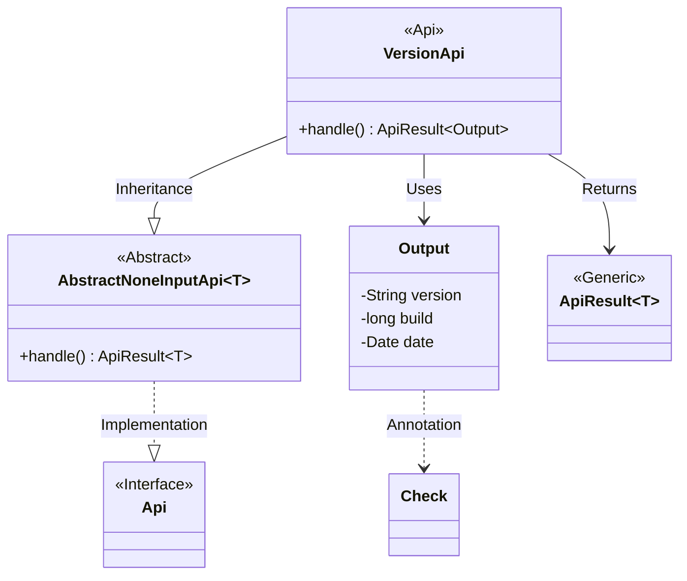
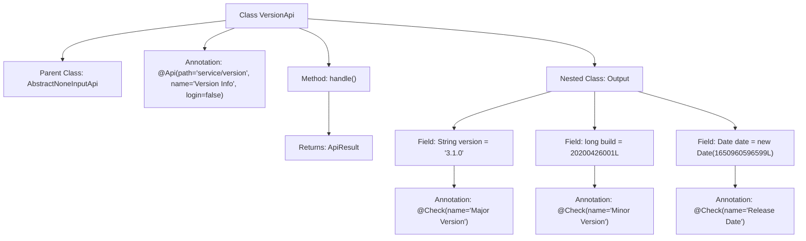

# Basic Information

|      |      |
|------|------|
| Name | VersionApi |
| Language | .java |
| Code Path | WeFe/board/board-service/src/main/java/com/welab/wefe/board/service/api/service/VersionApi.java |
| Package Name | com.welab.wefe.board.service.api.service |
| Dependencies | ['com.welab.wefe.common.exception.StatusCodeWithException', 'com.welab.wefe.common.fieldvalidate.annotation.Check', 'com.welab.wefe.common.web.api.base.AbstractNoneInputApi', 'com.welab.wefe.common.web.api.base.Api', 'com.welab.wefe.common.web.dto.ApiResult', 'java.util.Date'] |
| Brief Description | The Java API class VersionApi provides version information without requiring login. The output includes the major version number 3.1.0, minor version number 20200426001, and release date. |

# Description

The code defines an API class named `VersionApi` for retrieving version information. The API path is `"service/version"`, which can be accessed without login. It inherits from `AbstractNoneInputApi` and returns a type of `VersionApi.Output`. The processing logic directly returns an instance of the `Output` object containing version information.  

The `Output` class includes three fields:  
- `version` represents the major version number, with a value of `"3.1.0"`;  
- `build` represents the minor version number, with a value of `20200426001L`;  
- `date` represents the release date, with a value of a `Date` object converted from the corresponding timestamp.  

All output fields are annotated with the `Check` annotation, specifying their Chinese names.

# Class Summary

| Name   | Type  | Description |
|-------|------|-------------|
| VersionApi | class | This is a version information API class that does not require login. It returns the major version number 3.1.0, the minor version number 20200426001, and the release date April 26, 2022. |

## Class VersionApi

|      |      |
|------|------|
| Access Modifier | @Api(path = "service/version", name = "版本信息", login = false);public |
| Type | class |
| Name | VersionApi |
| Description | This is a version information API class that does not require login. It returns the major version number 3.1.0, the minor version number 20200426001, and the release date April 26, 2022. |

### UML Class Diagram

Class Diagram Description: This diagram illustrates that the VersionApi class inherits from the generic class AbstractNoneInputApi<Output> and implements the Api interface. VersionApi contains a handle method that returns ApiResult<Output>, with its inner class Output comprising three fields annotated with Check. AbstractNoneInputApi serves as an abstract base class, ApiResult is a generic result wrapper class, and Api is a marker interface. The overall structure demonstrates the class hierarchy and dependencies of a version information API.

### Internal Method Call Graph

This code defines a VersionApi class that inherits from AbstractNoneInputApi<Output>, designed to handle version information query requests. The class configures the API path and name via the @Api annotation, with the handle() method returning an Output object containing version data. The nested Output class includes three fields annotated with @Check: version represents the major version, build denotes the minor version, and date indicates the release date, all preset with default values. The flowchart clearly illustrates the class inheritance, method invocation, and hierarchical structure of field annotations.

### Field List

| Name  | Type  | Description |
|-------|-------|------|

### Method List

| Name  | Type  | Description |
|-------|-------|------|
| handle | ApiResult<Output> | Java method override, returning a successful ApiResult containing an empty Output object. |

