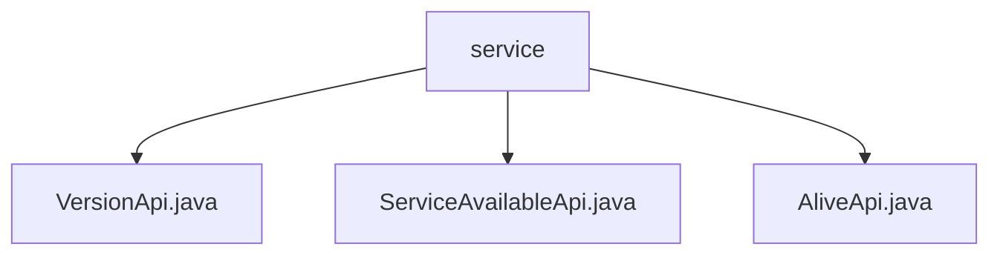

# Basic Information

|      |      |
|------|------|
| Name | service |
| Language | .java |
| Code Path | WeFe/board/board-service/src/main/java/com/welab/wefe/board/service/api/service |
| Package Name | docs.board.board-service.src.main.java.com.welab.wefe.board.service.api.service |
| Brief Description | VersionApi provides version information at the path "service/version", returning version number, build number, and date. ServiceAvailableApi checks service availability at the path "service/available", requiring specification of the service type. AliveApi is used for liveness detection at the path "service/alive", directly returning a success status. |

# Description

## Overview  
This module provides basic service state management functionalities, including version querying, service availability checking, and liveness detection. The interface specifications adhere to the RESTful style. For example, the VersionApi returns version information annotated with the Check annotation, the ServiceAvailableApi requires a service type parameter, and the AliveApi directly returns the liveness status. Key data structures include VersionApi.Output (version number/build number/date) and ServiceAvailableCheckOutput (service checkpoint). Dependencies include the AbstractApi base class and annotation validation framework. For instance, the version information output contains the "3.1.0" major version and the 20200426001L build number.  

## Primary Business Scenarios  
The module supports three typical scenarios: version validation during deployment (similar to an About page), runtime service monitoring (similar to a health check panel), and heartbeat detection at the gateway layer. The business process follows a chained structure. For example, the gateway first calls the AliveApi to confirm liveness and then retrieves detailed status via the ServiceAvailableApi. Interaction modes include parameterless queries (AliveApi), parameterized validation (ServiceAvailableApi), and static data returns (VersionApi). The complete functionality covers fundamental observability requirements for the service lifecycle, such as tracking version iterations through timestamps and build numbers.

### Package Internal Structure View

This flowchart illustrates the API service file structure under the board-service module in the WeFe project. The root node "service" contains three direct child nodes: VersionApi.java, ServiceAvailableApi.java, and AliveApi.java. These three Java files reside at the same hierarchical level and belong to the service API interface implementation classes. This flat structure indicates that these API files are functionally parallel, collectively forming the API layer of the service module.

# File List

| Name   | Type  | Description |
|-------|------|-------------|
| [VersionApi.java](VersionApi.md) | file | The Java API class VersionApi provides version information without requiring login. The output includes the major version number 3.1.0, minor version number 20200426001, and release date. |
| [ServiceAvailableApi.java](ServiceAvailableApi.md) | file | The ServiceAvailableApi class is used to query service availability, retrieving information via the ServiceCheckService, and supports gateway filtering of sensitive data. The input must specify the service type. |
| [AliveApi.java](AliveApi.md) | file | This is a no-login-required liveness detection API class with the path "service/alive", inheriting from AbstractNoneInputApi and returning a successful result. |

