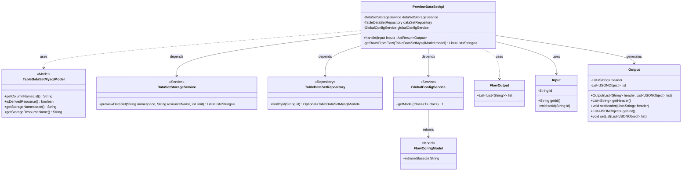

# Basic Information

|      |      |
|------|------|
| Name | PreviewDataSetApi |
| Language | .java |
| Code Path | WeFe/board/board-service/src/main/java/com/welab/wefe/board/service/api/storage/PreviewDataSetApi.java |
| Package Name | com.welab.wefe.board.service.api.storage |
| Dependencies | ['com.alibaba.fastjson.JSONObject', 'com.welab.wefe.board.service.database.entity.data_resource.TableDataSetMysqlModel', 'com.welab.wefe.board.service.database.repository.data_resource.TableDataSetRepository', 'com.welab.wefe.board.service.service.DataSetStorageService', 'com.welab.wefe.board.service.service.globalconfig.GlobalConfigService', 'com.welab.wefe.common.StatusCode', 'com.welab.wefe.common.exception.StatusCodeWithException', 'com.welab.wefe.common.fieldvalidate.annotation.Check', 'com.welab.wefe.common.http.HttpRequest', 'com.welab.wefe.common.http.HttpResponse', 'com.welab.wefe.common.util.StringUtil', 'com.welab.wefe.common.web.api.base.AbstractApi', 'com.welab.wefe.common.web.api.base.Api', 'com.welab.wefe.common.web.dto.AbstractApiInput', 'com.welab.wefe.common.web.dto.ApiResult', 'com.welab.wefe.common.wefe.dto.global_config.FlowConfigModel', 'org.springframework.beans.factory.annotation.Autowired', 'java.util.ArrayList', 'java.util.List'] |
| Brief Description | API class for previewing datasets, which queries datasets by ID and returns column names and data rows. Supports both native and derived datasets, with derived data retrieved from streaming services. The input is a dataset ID, and the output includes table headers and a JSON-formatted data list. |

# Description

The code defines an API class named `PreviewDataSetApi`, designed to preview data collections stored in storage. The API path is `storage/table_data_set/preview`. The class inherits from `AbstractApi` and processes input `Input` and output `Output`. Its primary functions include: locating the data collection model by ID and retrieving column names and row data. For non-derived resources, data is fetched directly from the storage service; for derived resources, data is obtained from the streaming service. Finally, the column names and row data are encapsulated into a list of JSON objects and returned. The input parameter is the dataset ID, and the output includes table headers and a list of row data.

# Class Summary

| Name   | Type  | Description |
|-------|------|-------------|
| PreviewDataSetApi | class | API class for previewing datasets, which queries datasets by ID and returns column names and data rows, supporting both native and derived data source processing. |

## Class PreviewDataSetApi

|      |      |
|------|------|
| Access Modifier | @Api(path = "storage/table_data_set/preview", name = "View data sets in storage");public |
| Type | class |
| Name | PreviewDataSetApi |
| Description | API class for previewing datasets, which queries datasets by ID and returns column names and data rows, supporting both native and derived data source processing. |

### UML Class Diagram

This code describes the implementation of a data preview API, whose main functionality is to query datasets by ID and return formatted preview data. The core class PreviewDataSetApi inherits from AbstractApi and collaborates with three service classes (DataSetStorageService/TableDataSetRepository/GlobalConfigService) to complete data retrieval. It handles two data sources (direct storage or derived resources) and ultimately returns an Output object containing table headers and row data. The diagram illustrates the dependency relationships between components, including service calls, model usage, and data transformation processes.

### Internal Method Call Graph

This flowchart illustrates the core processing logic of the PreviewDataSetApi class. Starting with dependency injection, it handles input parameters through the main method `handle`, selects between direct data preview or fetching data via flow service based on the data source, and finally constructs a JSON-formatted result for return. The process includes key steps such as data querying, conditional checks, service invocation, and result assembly, clearly presenting the call relationships between internal components and data flow paths within the class.

### Field List

| Name  | Type  | Description |
|-------|-------|------|
| dataSetRepository | TableDataSetRepository | Using @Autowired to automatically inject the TableDataSetRepository instance. |
| dataSetStorageService | DataSetStorageService | Using @Autowired to automatically inject an instance of DataSetStorageService. |
| globalConfigService | GlobalConfigService | The code snippet uses the @Autowired annotation to automatically inject an instance of GlobalConfigService. |

### Method List

| Name  | Type  | Description |
|-------|-------|------|
| handle | ApiResult<Output> | The method queries the dataset based on the input ID and returns success if it does not exist. For non-derived data, it previews 100 rows from the storage service, while for derived data, it retrieves them from the workflow. The data is converted into a list of JSON objects by column names, and both the column names and JSON data are returned. |
| getRowsFromFlow | List<List<String>> | Fetching data rows from MySQL model: Construct a URL request interface, parse the returned JSON data into a list of rows, and throw an exception upon failure. |

