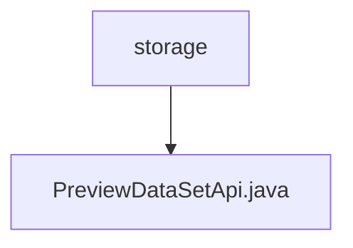

# Basic Information

|      |      |
|------|------|
| Name | storage |
| Language | .java |
| Code Path | WeFe/board/board-service/src/main/java/com/welab/wefe/board/service/api/storage |
| Package Name | docs.board.board-service.src.main.java.com.welab.wefe.board.service.api.storage |
| Brief Description | API class for previewing datasets, which queries datasets by ID and returns column names and data rows. Supports both native and derived datasets, with derived data retrieved from streaming services. The input is a dataset ID, and the output includes table headers and a JSON-formatted data list. |

# Description

The code defines an API class named `PreviewDataSetApi`, designed to preview data collections stored in storage. The API path is `storage/table_data_set/preview`. The class inherits from `AbstractApi` and processes input `Input` and output `Output`. Its primary functions include: locating the data collection model by ID and retrieving column names and row data. For non-derived resources, data is fetched directly from the storage service; for derived resources, data is obtained from the streaming service. Finally, the column names and row data are encapsulated into a list of JSON objects and returned. The input parameter is the dataset ID, and the output includes table headers and a list of row data.

### Package Internal Structure View

This flowchart illustrates the storage API path structure within the board-service module of the WeFe project. The top-level node "storage" represents the storage API directory, which contains a specific API implementation file "PreviewDataSetApi.java". This structure clearly reflects the hierarchical relationship between the API interface and its implementation file, adhering to typical Java project package design conventions.

# File List

| Name   | Type  | Description |
|-------|------|-------------|
| [PreviewDataSetApi.java](PreviewDataSetApi.md) | file | API class for previewing datasets, which queries datasets by ID and returns column names and data rows. Supports both native and derived datasets, with derived data fetched from streaming services. The input is a dataset ID, and the output includes table headers and a JSON-formatted data list. |

