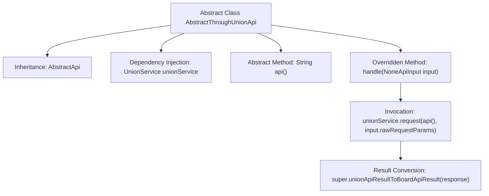

# Basic Information

|      |      |
|------|------|
| Name | AbstractThroughUnionApi |
| Language | .java |
| Code Path | WeFe/board/board-service/src/main/java/com/welab/wefe/board/service/api/union/AbstractThroughUnionApi.java |
| Package Name | com.welab.wefe.board.service.api.union |
| Dependencies | ['com.alibaba.fastjson.JSONObject', 'com.welab.wefe.board.service.sdk.union.UnionService', 'com.welab.wefe.common.exception.StatusCodeWithException', 'com.welab.wefe.common.web.api.base.AbstractApi', 'com.welab.wefe.common.web.dto.ApiResult', 'com.welab.wefe.common.web.dto.NoneApiInput', 'org.springframework.beans.factory.annotation.Autowired'] |
| Brief Description | The abstract class `AbstractThroughUnionApi` extends `AbstractApi`, automatically injects `UnionService`, and defines the abstract method `api()` to process requests and transform results. |

# Description

This is an abstract class named AbstractThroughUnionApi, which inherits from the AbstractApi class, with generic parameters specifying the input type as NoneApiInput and the return type as Object. The class automatically injects a UnionService instance via @Autowired. It defines an abstract method api() for retrieving the API name. The handle method is overridden to initiate requests using unionService and process the returned results, converting the response data into the ApiResult format before returning it. The entire class encapsulates the foundational logic for invoking APIs through UnionService, with the specific API name determined by the implementation of its subclasses.

# Class Summary

| Name   | Type  | Description |
|-------|------|-------------|
| AbstractThroughUnionApi | class | The abstract class `AbstractThroughUnionApi` extends `AbstractApi`, automatically injects `UnionService`, and defines the abstract method `api()` to handle requests and transform results. |


## Class AbstractThroughUnionApi

|      |      |
|------|------|
| Access Modifier | public abstract |
| Type | class |
| Name | AbstractThroughUnionApi |
| Description | The abstract class `AbstractThroughUnionApi` extends `AbstractApi`, automatically injects `UnionService`, and defines the abstract method `api()` to handle requests and transform results. |


### UML Class Diagram

```mermaid
classDiagram
    class AbstractApi~T, R~ {
        <<abstract>>
        +ApiResult~R~ handle(T input) throws StatusCodeWithException
        +ApiResult~R~ unionApiResultToBoardApiResult(JSONObject response)
    }

    class NoneApiInput {
        // Empty input parameter class
    }

    class AbstractThroughUnionApi {
        -UnionService unionService
        +String api() {abstract}
        +ApiResult~Object~ handle(NoneApiInput input) throws StatusCodeWithException
    }

    class UnionService {
        +JSONObject request(String api, Map~String, Object~ params)
    }

    AbstractThroughUnionApi --|> AbstractApi~NoneApiInput, Object~ : Inheritance
    AbstractThroughUnionApi --> UnionService : Dependency
```

This code illustrates the class diagram structure of an abstract class `AbstractThroughUnionApi`, which inherits from the generic class `AbstractApi` with `NoneApiInput` and `Object` specified as type parameters. The class initiates API requests via `UnionService` and converts the results into a unified API response format. The diagram clearly demonstrates the inheritance relationship of abstract classes, the dependency-injected service class, and the method invocation flow, showcasing a typical design pattern for handling API requests with no input parameters.


### Internal Method Call Graph



This flowchart illustrates the structure and key method invocation relationships of the abstract class AbstractThroughUnionApi. The class inherits from the generic abstract class AbstractApi, includes UnionService dependency injection, and defines the abstract method api(). The core logic resides in the overridden handle method: it first invokes unionService.request to obtain a response, then converts the result type via a parent class method. The arrows clearly depict the complete processing flow from method invocation to result return.

### Field List

| Name  | Type  | Description |
|-------|-------|------|
| unionService | UnionService | Automatically inject the UnionService instance. |

### Method List

| Name  | Type  | Description |
|-------|-------|------|
| api | String | Abstract method declaration, returning a string type, used for API calls. |
| handle | ApiResult<Object> | Handle API requests, call unionService and transform the results for return. |


