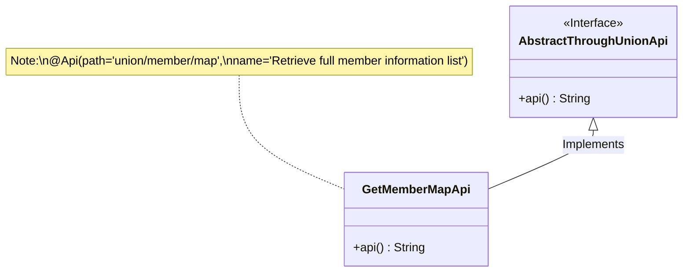
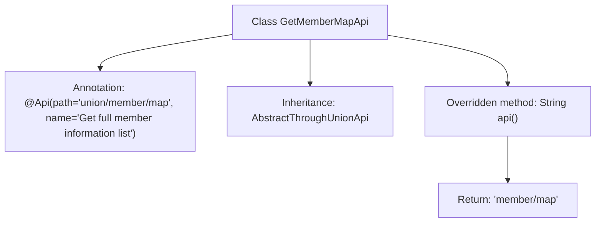

# Basic Information

|      |      |
|------|------|
| Name | GetMemberMapApi |
| Language | .java |
| Code Path | WeFe/board/board-service/src/main/java/com/welab/wefe/board/service/api/union/GetMemberMapApi.java |
| Package Name | com.welab.wefe.board.service.api.union |
| Dependencies | ['com.welab.wefe.common.web.api.base.Api'] |
| Brief Description | API class for retrieving the full member information list, inherits from AbstractThroughUnionApi, with the path union/member/map. |

# Description

This is an API class named GetMemberMapApi, designed to retrieve a comprehensive list of member information. It inherits from the AbstractThroughUnionApi base class and uses the @Api annotation to define its path as "union/member/map" and its name as "Retrieve the full list of member information." The class overrides the api() method, returning the specific API endpoint path "member/map." The overall class structure is concise, focusing solely on providing the functionality to fetch member information lists.

# Class Summary

| Name   | Type  | Description |
|-------|------|-------------|
| GetMemberMapApi | class | API class for retrieving the full member information list, inherits from AbstractThroughUnionApi, with the path union/member/map. |

## Class GetMemberMapApi

|      |      |
|------|------|
| Access Modifier | @Api(path = "union/member/map", name = "获取全量的成员信息列表");public |
| Type | class |
| Name | GetMemberMapApi |
| Description | API class for retrieving the full member information list, inherits from AbstractThroughUnionApi, with the path union/member/map. |

### UML Class Diagram

This code demonstrates an inheritance relationship where the GetMemberMapApi class extends the AbstractThroughUnionApi abstract class (marked as an interface) and implements the api() method. The @Api annotation is used on the class to specify the API path and functional description. This design pattern is a typical implementation of the Template Method pattern, where subclasses provide concrete implementations by overriding the api() method, while the parent class may contain other common logic. The annotation information is attached to the class via a note, clearly indicating the purpose and access path of this API.

### Internal Method Call Graph

This code demonstrates a GetMemberMapApi class that inherits from AbstractThroughUnionApi, defining the API path and name through the @Api annotation. The class overrides the api() method, returning a specific string path 'member/map'. The flowchart clearly presents the class's annotations, inheritance relationships, and core method calls, with a concise and well-structured hierarchy that facilitates understanding of the core functionality implementation of this API class.

### Field List

| Name  | Type  | Description |
|-------|-------|------|

### Method List

| Name  | Type  | Description |
|-------|-------|------|
| api | String | Rewrite the API method to return the string "member/map". |

