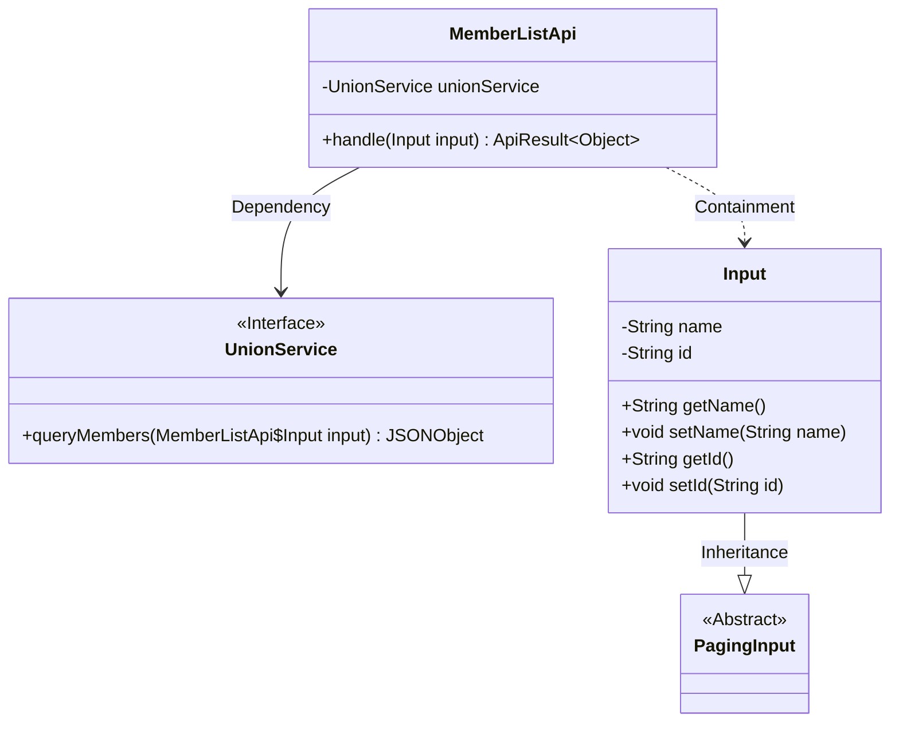

# Basic Information

|      |      |
|------|------|
| Name | MemberListApi |
| Language | .java |
| Code Path | WeFe/board/board-service/src/main/java/com/welab/wefe/board/service/api/union/MemberListApi.java |
| Package Name | com.welab.wefe.board.service.api.union |
| Dependencies | ['com.alibaba.fastjson.JSONObject', 'com.welab.wefe.board.service.dto.base.PagingInput', 'com.welab.wefe.board.service.sdk.union.UnionService', 'com.welab.wefe.common.exception.StatusCodeWithException', 'com.welab.wefe.common.fieldvalidate.annotation.Check', 'com.welab.wefe.common.web.api.base.AbstractApi', 'com.welab.wefe.common.web.api.base.Api', 'com.welab.wefe.common.web.dto.ApiResult', 'org.springframework.beans.factory.annotation.Autowired'] |
| Brief Description | The MemberListApi class is used to query alliance members, inheriting from AbstractApi. It accepts name and ID parameters and invokes UnionService to return results. The input class Input includes pagination parameters along with member name and ID fields. |

# Description

The code defines an API class named `MemberListApi` for querying alliance members. The API path is `union/member/query`, which inherits from the base class `AbstractApi`, processes the input type `Input`, and returns an `Object` type. It invokes the `queryMembers` method through the injected `UnionService` to obtain the result and converts the result into the `ApiResult` format for return.  

The `Input` class inherits from `PagingInput` and includes two validatable fields: `name` (member name) and `id` (member ID), along with corresponding getter and setter methods.

# Class Summary

| Name   | Type  | Description |
|-------|------|-------------|
| MemberListApi | class | The MemberListApi class queries members through UnionService, supporting pagination and filtering by name or ID, and returns JSON results. The input parameters include name and id. |

## Class MemberListApi

|      |      |
|------|------|
| Access Modifier | @Api(path = "union/member/query", name = "Query members from union");public |
| Type | class |
| Name | MemberListApi |
| Description | The MemberListApi class queries members through UnionService, supporting pagination and filtering by name or ID, and returns JSON results. The input parameters include name and id. |

### UML Class Diagram

Class Diagram Description:
The diagram illustrates the structure of the MemberListApi class and its relationships. MemberListApi inherits from AbstractApi, contains a dependency on the UnionService interface for querying member data, and includes a nested static Input class (inheriting from PagingInput). The Input class contains name/id fields with corresponding getters/setters to receive paginated query parameters. MemberListApi processes inputs via the handle method and returns API results, with core business logic delegated to the UnionService implementation.

### Internal Method Call Graph

```mermaid
graph TD
    A["Class MemberListApi"]
    B["Annotation: @Api(path='union/member/query', name='Query members from union')"]
    C["Inheritance: AbstractApi<Input, Object>"]
    D["Dependency Injection: @Autowired UnionService unionService"]
    E["Overridden Method: handle(Input input)"]
    F["Inner Class: Input"]
    G["Parent Class: PagingInput"]
    H["Field: @Check String name"]
    I["Field: @Check String id"]
    J["getter/setter methods"]
    K["Invocation: unionService.queryMembers(input)"]
    L["Result Conversion: unionApiResultToBoardApiResult(result)"]

    A --> B
    A --> C
    A --> D
    A --> E
    A --> F
    F --> G
    F --> H
    F --> I
    F --> J
    E --> K
    E --> L
```

This code demonstrates a Spring framework-based API class MemberListApi for querying union member lists. The class inherits from AbstractApi and implements the handle method, executing actual queries through the injected UnionService. The inner class Input extends PagingInput and contains two query parameters (name and id) with validation annotations. The flowchart clearly presents the class structure, dependency relationships, and method call chain, particularly illustrating the complete workflow from request processing to service invocation, along with key steps like parameter validation and result conversion.

### Field List

| Name  | Type  | Description |
|-------|-------|------|
| unionService | UnionService | Use @Autowired to automatically inject an instance of UnionService. |

### Method List

| Name  | Type  | Description |
|-------|-------|------|
| handle | ApiResult<Object> | This method overrides the parent class logic, invokes the unionService to query member data, and converts the results into the specified format for return. The processing may throw a StatusCodeWithException. |

