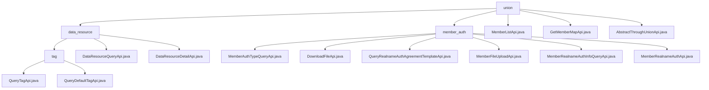

# Basic Information

|      |      |
|------|------|
| Name | union |
| Language | .java |
| Code Path | WeFe/board/board-service/src/main/java/com/welab/wefe/board/service/api/union |
| Package Name | docs.board.board-service.src.main.java.com.welab.wefe.board.service.api.union |
| Brief Description | The data resource management module provides services such as tag query, resource retrieval, and details, adopting a unified interface specification. The member authentication module handles authentication processes, including file uploads and real-name verification. The MemberListApi queries alliance members, while the GetMemberMapApi retrieves the member list. The AbstractThroughUnionApi serves as the foundational abstract class, encapsulating API invocation logic. |

# Description

## Overview  
The core responsibility of this module is to provide federated data resource management and member authentication services, adopting a layered API design pattern. Data resource management includes three types of services: tag query, resource retrieval, and detail acquisition. For example, QueryTagApi returns dynamic/default tags. Member authentication covers type query, file operations, and real-name authentication, such as MemberRealnameAuthApi handling CSR generation. Key data structures include resource ID/type, the extra_data extension field, and authentication-related Input classes (e.g., containing file IDs and entity names). External dependencies include the AbstractApi/AbstractThroughUnionApi base classes, UnionService, CertOperationService, and RestTemplate. Implementation examples include DataResourceDetailApi returning JSONObject and MemberFileUploadApi enabling secure file uploads.

## Key Business Scenarios  
The module supports the entire lifecycle of federated data governance and member authentication. Data resource management adopts a RESTful-like interaction model, with typical scenarios including tag preloading (QueryTagApi) and resource detail display (DataResourceDetailApi validating ID/type). The member authentication process resembles a workflow engine: first querying types (MemberAuthTypeQueryApi), then uploading files (e.g., secured by RSA signatures) and submitting authentication (MemberRealnameAuthApi). API types range from composite queries (e.g., GetMemberMapApi) to file operations (DownloadFileApi). Integration examples are found in federated learning data management modules, with functionality comparable to metadata services in a data middle platform.

### Package Internal Structure View

This flowchart illustrates the API hierarchy of the union module in the WeFe project, comprising two main submodules: data_resource and member_auth. The data_resource submodule is further divided into a tag submodule and two standalone API files, while member_auth contains six specific API implementation files. The top-level union module also directly includes three independent API files, clearly demonstrating the dependency relationships among the APIs.

# File List

| Name   | Type  | Description |
|-------|------|-------------|
| [MemberListApi.java](MemberListApi.md) | file | The MemberListApi class is used to query alliance members, inheriting from AbstractApi. It accepts name and ID parameters and invokes UnionService to return results. The input class Input includes pagination parameters along with member name and ID fields. |
| [GetMemberMapApi.java](GetMemberMapApi.md) | file | API class for retrieving the full member information list, inherits from AbstractThroughUnionApi, with the path union/member/map. |
| [AbstractThroughUnionApi.java](AbstractThroughUnionApi.md) | file | The abstract class `AbstractThroughUnionApi` extends `AbstractApi`, automatically injects `UnionService`, and defines the abstract method `api()` to process requests and transform results. |
| [member_auth](member_auth/_module.md) | package | MemberAuthTypeQueryApi queries member authentication types. DownloadFileApi handles file downloads. QueryRealnameAuthAgreementTemplateApi queries real-name authentication templates. MemberFileUploadApi handles file uploads. MemberRealnameAuthInfoQueryApi queries real-name authentication information. MemberRealnameAuthApi processes real-name authentication requests. |
| [data_resource](data_resource/_module.md) | package | This module provides data resource tag query functionality, including custom and default tag interfaces, with the path such as `union/data_resource/tags/query`. It relies on the base class AbstractThroughUnionApi and supports data classification retrieval and tag preloading scenarios. |

