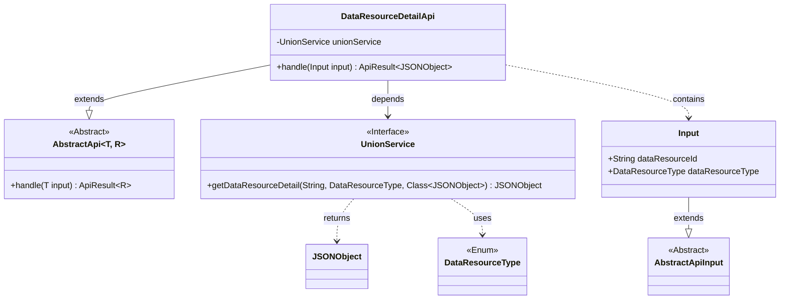

# Basic Information

|      |      |
|------|------|
| Name | DataResourceDetailApi |
| Language | .java |
| Code Path | WeFe/board/board-service/src/main/java/com/welab/wefe/board/service/api/union/data_resource/DataResourceDetailApi.java |
| Package Name | com.welab.wefe.board.service.api.union.data_resource |
| Dependencies | ['com.alibaba.fastjson.JSONObject', 'com.welab.wefe.board.service.sdk.union.UnionService', 'com.welab.wefe.common.exception.StatusCodeWithException', 'com.welab.wefe.common.fieldvalidate.annotation.Check', 'com.welab.wefe.common.web.api.base.AbstractApi', 'com.welab.wefe.common.web.api.base.Api', 'com.welab.wefe.common.web.dto.AbstractApiInput', 'com.welab.wefe.common.web.dto.ApiResult', 'com.welab.wefe.common.wefe.enums.DataResourceType', 'org.springframework.beans.factory.annotation.Autowired', 'java.io.IOException'] |
| Brief Description | Data Resource Details API, which queries details by resource ID and type, returns results in JSON format. The input must include the resource ID and type. |

# Description

The code defines an API class named `DataResourceDetailApi`, which inherits from `AbstractApi` and is used to handle data resource detail requests. The API path is `union/data_resource/detail`, accepting an `Input` class as the input parameter and returning a result of type `JSONObject`. The `Input` class includes two required fields: `dataResourceId` (resource ID) and `dataResourceType` (resource type). The core logic retrieves the resource details through the `getDataResourceDetail` method of `unionService` and returns a successful result. The entire API implements the functionality of querying resource details.

# Class Summary

| Name   | Type  | Description |
|-------|------|-------------|
| DataResourceDetailApi | class | The DataResourceDetailApi interface retrieves data resource details through UnionService by passing the resource ID and type, returning a JSONObject result. |

## Class DataResourceDetailApi

|      |      |
|------|------|
| Access Modifier | @Api(path = "union/data_resource/detail", name = "");public |
| Type | class |
| Name | DataResourceDetailApi |
| Description | The DataResourceDetailApi interface retrieves data resource details through UnionService by passing the resource ID and type, returning a JSONObject result. |

### UML Class Diagram

This code illustrates the implementation structure of a data resource detail API. The DataResourceDetailApi inherits from the generic abstract class AbstractApi, processes Input parameters, and returns JSONObject results. It relies on the UnionService interface to fetch data details, where Input is a nested static class extending AbstractApiInput with two fields containing validation annotations. The UnionService interface defines a method for retrieving data resource details, involving the DataResourceType enum and JSONObject class. The overall design demonstrates clear hierarchical structure and dependency relationships, conforming to typical API service patterns.

### Internal Method Call Graph

```mermaid
graph TD
    A["Class DataResourceDetailApi"]
    B["Inheritance: AbstractApi<Input, JSONObject>"]
    C["Annotation: @Api(path='union/data_resource/detail', name='')"]
    D["Dependency Injection: @Autowired UnionService unionService"]
    E["Overridden Method: handle(Input input)"]
    F["Inner Class: Input extends AbstractApiInput"]
    G["Field: @Check String dataResourceId"]
    H["Field: @Check DataResourceType dataResourceType"]
    I["Method Call: unionService.getDataResourceDetail()"]
    J["Return Result: success(output)"]

    A --> B
    A --> C
    A --> D
    A --> E
    E --> I
    I --> J
    A --> F
    F --> G
    F --> H
```

This code defines an API class named DataResourceDetailApi, which inherits from AbstractApi and handles data resource detail queries. The class contains an @Autowired-injected UnionService and overrides the handle method to invoke the service layer for retrieving detail data. The inner class Input defines required request parameters dataResourceId and dataResourceType with parameter validation annotations. The flowchart illustrates the complete processing flow from API entry to service invocation, including class structure, dependency relationships, and main method call paths.

### Field List

| Name  | Type  | Description |
|-------|-------|------|
| unionService | UnionService | Using @Autowired to automatically inject an instance of UnionService. |

### Method List

| Name  | Type  | Description |
|-------|-------|------|
| handle | ApiResult<JSONObject> | The method processes the input, invokes the service to retrieve data resource details, and returns a successful result. |

