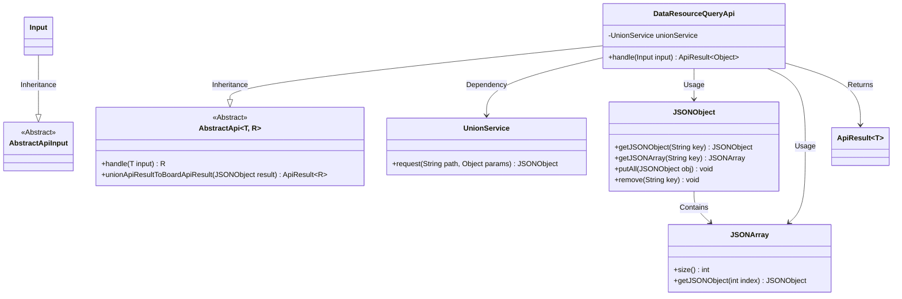

# Basic Information

|      |      |
|------|------|
| Name | DataResourceQueryApi |
| Language | .java |
| Code Path | WeFe/board/board-service/src/main/java/com/welab/wefe/board/service/api/union/data_resource/DataResourceQueryApi.java |
| Package Name | com.welab.wefe.board.service.api.union.data_resource |
| Dependencies | ['com.alibaba.fastjson.JSONArray', 'com.alibaba.fastjson.JSONObject', 'com.welab.wefe.board.service.sdk.union.UnionService', 'com.welab.wefe.common.exception.StatusCodeWithException', 'com.welab.wefe.common.web.api.base.AbstractApi', 'com.welab.wefe.common.web.api.base.Api', 'com.welab.wefe.common.web.dto.AbstractApiInput', 'com.welab.wefe.common.web.dto.ApiResult', 'org.springframework.beans.factory.annotation.Autowired', 'java.io.IOException'] |
| Brief Description | The DataResourceQueryApi class queries data resources through the unionService, processes the extra_data field in the returned results, and merges it into the main data. |

# Description

The code defines an API class named `DataResourceQueryApi`, which is used to query data resources from a federated service. It inherits from `AbstractApi`, accepts an `Input` parameter, and returns an `Object` type result. The request is initiated via the injected `UnionService` with the path `data_resource/query`. When processing the response, it checks and merges the `extra_data` field into the main data item, and finally converts the result into a unified API response format. The `Input` class inherits from `AbstractApiInput` and does not define additional fields.

# Class Summary

| Name   | Type  | Description |
|-------|------|-------------|
| DataResourceQueryApi | class | The DataResourceQueryApi class queries data resources through the UnionService, processes the extra_data field in the returned results, and merges it into the main data. |

## Class DataResourceQueryApi

|      |      |
|------|------|
| Access Modifier | @Api(path = "union/data_resource/query", name = "query data resource from union service");public |
| Type | class |
| Name | DataResourceQueryApi |
| Description | The DataResourceQueryApi class queries data resources through the UnionService, processes the extra_data field in the returned results, and merges it into the main data. |

### UML Class Diagram

Class Diagram Description:
This diagram illustrates the structural relationships of DataResourceQueryApi and its associated classes. DataResourceQueryApi inherits from the generic class AbstractApi<Input, Object>, incorporates a UnionService dependency for data requests, and processes returned JSON data structures. The Input class inherits from AbstractApiInput, serving as the API's input parameters. JSONObject and JSONArray classes handle JSON data, while ApiResult encapsulates the return results. The overall flow demonstrates the complete process from request handling to result return.

### Internal Method Call Graph

This code represents an API handler class for querying data resources from a union service. The main workflow includes: initiating a request via UnionService, processing the returned JSON data (extracting the data object, iterating through the list array, merging the extra_data field), and finally converting the result into a standard API format for return. The core logic is implemented by inheriting an abstract class, with Spring's dependency injection used to obtain the service instance.

### Field List

| Name  | Type  | Description |
|-------|-------|------|
| unionService | UnionService | Automatically inject the UnionService instance. |

### Method List

| Name  | Type  | Description |
|-------|-------|------|
| handle | ApiResult<Object> | This method processes the input request, invokes the unionService to retrieve data resource query results, checks and merges the extra_data field into the main data, and finally transforms and returns the API result. |

