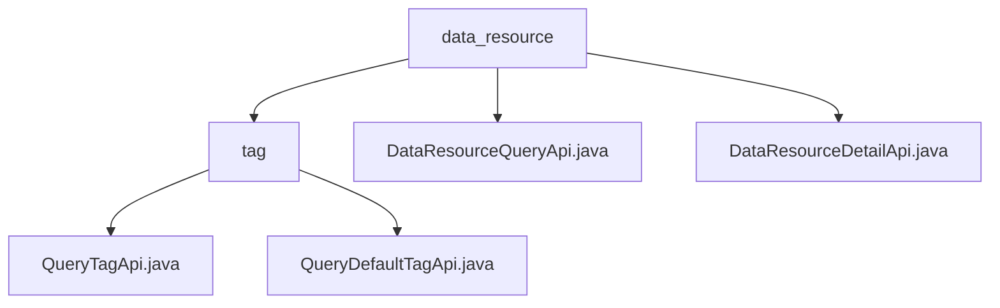

# Basic Information

|      |      |
|------|------|
| Name | data_resource |
| Language | .java |
| Code Path | WeFe/board/board-service/src/main/java/com/welab/wefe/board/service/api/union/data_resource |
| Package Name | docs.board.board-service.src.main.java.com.welab.wefe.board.service.api.union.data_resource |
| Brief Description | This module provides data resource tag query functionality, including custom and default tag interfaces, with the path such as `union/data_resource/tags/query`. It relies on the base class AbstractThroughUnionApi and supports data classification retrieval and tag preloading scenarios. |

# Description

## Overview  
The core responsibility of this module is to implement data resource management functionalities, including three types of services: tag query, resource retrieval, and detail acquisition. The interface specification adopts a unified inheritance pattern. For instance, QueryTagApi inherits AbstractThroughUnionApi, while DataResourceQueryApi inherits AbstractApi. Access endpoints are defined through path constants, such as `data_resource/query` and `union/data_resource/detail`. Key data structures include resource ID, type, and the extra_data extension field. External dependencies involve the AbstractThroughUnionApi and AbstractApi base classes, as well as UnionService. Implementation examples include tag queries returning dynamic/default tags and resource detail APIs returning data in JSONObject format.  

## Primary Business Scenarios  
The module supports the full lifecycle management of data resources, employing a RESTful-like query interaction model. Complete functionalities encompass tag filtering (e.g., user retrieval invoking QueryTagApi), resource retrieval (e.g., DataResourceQueryApi merging the extra_data field), and detail viewing (e.g., DataResourceDetailApi validating resource ID/type). Typical applications include resource classification, tag preloading, and detail display in data governance platforms. The API types are composite query interfaces, with integration examples visible in federated learning data management modules, resembling metadata services in data middle platforms.

### Package Internal Structure View

This flowchart illustrates the hierarchical structure of the data resource APIs. The top level is the `data_resource` directory, which contains the `tag` subdirectory and two API files. The `tag` directory further includes two tag query API files, clearly presenting the dependency relationships between modules.

# File List

| Name   | Type  | Description |
|-------|------|-------------|
| [DataResourceQueryApi.java](DataResourceQueryApi.md) | file | The DataResourceQueryApi class queries data resources through the unionService, processes the extra_data field in the returned results, and merges it into the main data. |
| [DataResourceDetailApi.java](DataResourceDetailApi.md) | file | Data Resource Details API, which queries details by resource ID and type, returns results in JSON format. The input must include the resource ID and type. |
| [tag](tag/_module.md) | package | The QueryTagApi class inherits from AbstractThroughUnionApi and implements the query tag API, with the path union/data_resource/tags/query. The QueryDefaultTagApi class is similar, implementing the default tag query, with the path union/data_resource/default_tag/query. |

