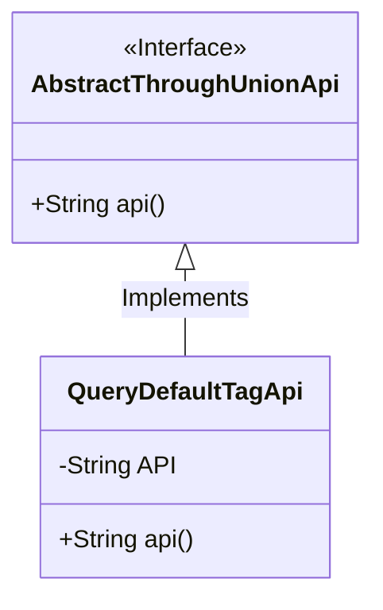
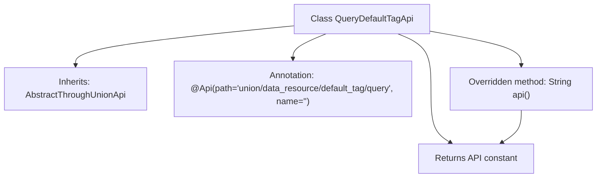

# Basic Information

|      |      |
|------|------|
| Name | QueryDefaultTagApi |
| Language | .java |
| Code Path | WeFe/board/board-service/src/main/java/com/welab/wefe/board/service/api/union/data_resource/tag/QueryDefaultTagApi.java |
| Package Name | com.welab.wefe.board.service.api.union.data_resource.tag |
| Dependencies | ['com.welab.wefe.board.service.api.union.AbstractThroughUnionApi', 'com.welab.wefe.common.web.api.base.Api'] |
| Brief Description | Query Default Tag API, inherited from AbstractThroughUnionApi, with the path data_resource/default_tag/query. |

# Description

The code defines an API class named `QueryDefaultTagApi`, which inherits from the base class `AbstractThroughUnionApi`. The class is annotated with `@Api`, specifying the path as `union/data_resource/default_tag/query`. It contains a private constant `API` with the value `data_resource/default_tag/query`. The `api()` method is overridden to return this `API` constant value. The entire class is designed to implement default tag query functionality.

# Class Summary

| Name   | Type  | Description |
|-------|------|-------------|
| QueryDefaultTagApi | class | Query Default Tag API, inherited from AbstractThroughUnionApi, with the path as data_resource/default_tag/query. |

## Class QueryDefaultTagApi

|      |      |
|------|------|
| Access Modifier | @Api(path = "union/data_resource/default_tag/query", name = "");public |
| Type | class |
| Name | QueryDefaultTagApi |
| Description | Query Default Tag API, inherited from AbstractThroughUnionApi, with the path as data_resource/default_tag/query. |

### UML Class Diagram

This class diagram illustrates an inheritance relationship where the QueryDefaultTagApi class inherits from the AbstractThroughUnionApi interface. AbstractThroughUnionApi is marked as an interface containing an abstract method api(). QueryDefaultTagApi implements this interface, including a private constant API and an overridden api() method. This structure demonstrates a typical interface implementation pattern, where the subclass provides concrete implementation details while maintaining the contractual relationship with the parent interface.

### Internal Method Call Graph

This code demonstrates a QueryDefaultTagApi class that inherits from AbstractThroughUnionApi, primarily used for querying default tag data. The class contains an API path constant and overrides the api() method to return this constant value. The class is annotated with @Api, defining the interface path and an empty name. The flowchart clearly presents the class inheritance relationship, constant definition, annotation usage, and method overriding logic, reflecting a concise API encapsulation design pattern.

### Field List

| Name  | Type  | Description |
|-------|-------|------|
| API = "data_resource/default_tag/query" | String | Private static constant API storage data resource default label query interface path. |

### Method List

| Name  | Type  | Description |
|-------|-------|------|
| api | String | Rewrite the API method to return API constant values. |

