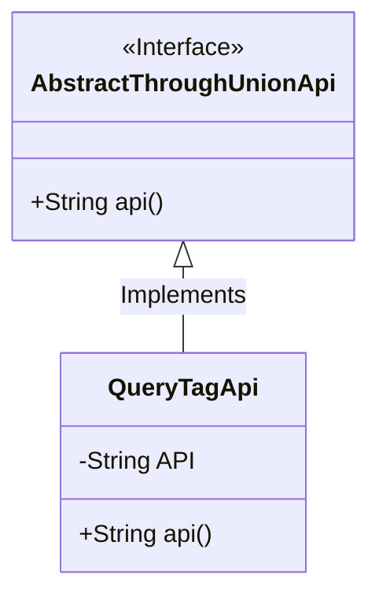
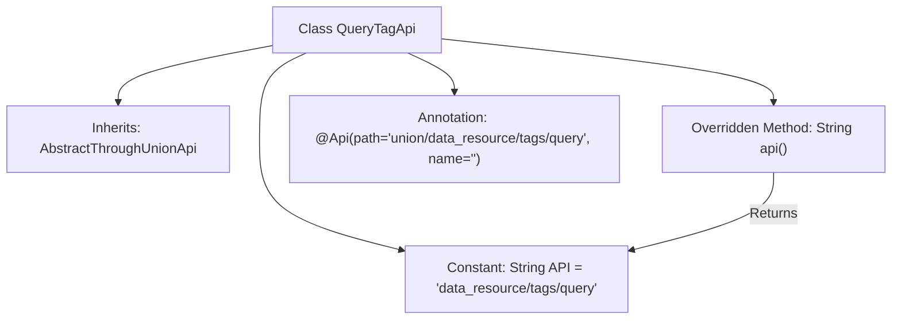

# Basic Information

|      |      |
|------|------|
| Name | QueryTagApi |
| Language | .java |
| Code Path | WeFe/board/board-service/src/main/java/com/welab/wefe/board/service/api/union/data_resource/tag/QueryTagApi.java |
| Package Name | com.welab.wefe.board.service.api.union.data_resource.tag |
| Dependencies | ['com.welab.wefe.board.service.api.union.AbstractThroughUnionApi', 'com.welab.wefe.common.web.api.base.Api'] |
| Brief Description | This is an API class named QueryTagApi, which inherits from AbstractThroughUnionApi, used for querying data resource tags with the path "data_resource/tags/query". |

# Description

The code defines an API class named `QueryTagApi`, which inherits from the base class `AbstractThroughUnionApi`. The class is annotated with `@Api`, specifying the path as `union/data_resource/tags/query`. It contains a private constant `API` with the value `data_resource/tags/query`. The `api()` method is overridden to return this `API` constant value. Overall, it implements an API interface for querying tags.

# Class Summary

| Name   | Type  | Description |
|-------|------|-------------|
| QueryTagApi | class | This is an API class named QueryTagApi, with the path union/data_resource/tags/query, inheriting from AbstractThroughUnionApi, and returning a fixed API string. |

## Class QueryTagApi

|      |      |
|------|------|
| Access Modifier | @Api(path = "union/data_resource/tags/query", name = "");public |
| Type | class |
| Name | QueryTagApi |
| Description | This is an API class named QueryTagApi, with the path union/data_resource/tags/query, inheriting from AbstractThroughUnionApi, and returning a fixed API string. |

### UML Class Diagram

This class diagram illustrates a simple API implementation structure. The QueryTagApi class inherits from the AbstractThroughUnionApi interface and implements its api() method. The class contains a private constant API string and returns this constant by overriding the api() method. The @Api annotation indicates that this is an API endpoint class with the path "union/data_resource/tags/query". The overall structure demonstrates a typical design pattern of implementing interface methods through inheritance, used for unified management of API paths.

### Internal Method Call Graph

The flowchart depicts the structure of the QueryTagApi class, which inherits from AbstractThroughUnionApi and includes a constant API and an overridden api() method. The @Api annotation defines the API path, and the api() method returns the predefined API constant value. The diagram illustrates the class inheritance, constant definition, and the logical flow of method implementation.

### Field List

| Name  | Type  | Description |
|-------|-------|------|
| API = "data_resource/tags/query" | String | Private static constant API storage data resource label query path. |

### Method List

| Name  | Type  | Description |
|-------|-------|------|
| api | String | This is a Java method override that returns an API constant string. |

