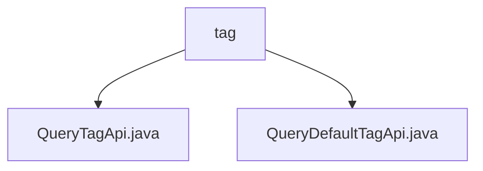

# Basic Information

|      |      |
|------|------|
| Name | tag |
| Language | .java |
| Code Path | WeFe/board/board-service/src/main/java/com/welab/wefe/board/service/api/union/data_resource/tag |
| Package Name | docs.board.board-service.src.main.java.com.welab.wefe.board.service.api.union.data_resource.tag |
| Brief Description | The QueryTagApi class inherits from AbstractThroughUnionApi and implements the query tag API, with the path union/data_resource/tags/query. The QueryDefaultTagApi class is similar, implementing the default tag query, with the path union/data_resource/default_tag/query. |

# Description

## Overview  
The core responsibility of this module is to implement data resource tag query functionality, including two types of query interfaces: custom tags and default tags. The interface specifications follow a unified design pattern, all inheriting from the base class AbstractThroughUnionApi and defining paths via the @Api annotation. For example, the path for QueryTagApi is `union/data_resource/tags/query`, and the path for QueryDefaultTagApi is `union/data_resource/default_tag/query`. Key data structures include API path constants, such as `data_resource/tags/query`. The only external dependency is the base class AbstractThroughUnionApi. Implementation examples include QueryTagApi returning tag data and QueryDefaultTagApi returning system-preset tags.  

## Main Business Scenarios  
The module serves data resource tag management scenarios, adopting a RESTful-style query pattern. Complete functionality includes dynamic tag queries and default tag retrieval. For instance, users call QueryTagApi when filtering data, while the system loads QueryDefaultTagApi during initialization. The interaction mode is exclusively HTTP GET requests, with typical applications including data classification retrieval and tag preloading. The API type falls under data query interfaces, and integration examples can be seen in the tag management module of data governance platforms.

### Package Internal Structure View

This flowchart illustrates two Java files under the tag directory: QueryTagApi.java and QueryDefaultTagApi.java. Both files are directly subordinate to the tag directory with no deeper nesting structure. The diagram clearly presents the direct hierarchical relationship between the tag directory and the two API files it contains.

# File List

| Name   | Type  | Description |
|-------|------|-------------|
| [QueryTagApi.java](QueryTagApi.md) | file | This is an API class named QueryTagApi, which inherits from AbstractThroughUnionApi, used for querying data resource tags, with the path "data_resource/tags/query". |
| [QueryDefaultTagApi.java](QueryDefaultTagApi.md) | file | Query Default Tag API, inherited from AbstractThroughUnionApi, with the path data_resource/default_tag/query. |

