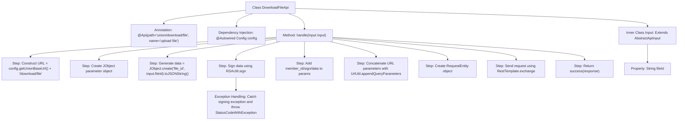

# Basic Information

|      |      |
|------|------|
| Name | DownloadFileApi |
| Language | .java |
| Code Path | WeFe/board/board-service/src/main/java/com/welab/wefe/board/service/api/union/member_auth/DownloadFileApi.java |
| Package Name | com.welab.wefe.board.service.api.union.member_auth |
| Dependencies | ['com.welab.wefe.board.service.constant.Config', 'com.welab.wefe.board.service.service.CacheObjects', 'com.welab.wefe.common.StatusCode', 'com.welab.wefe.common.exception.StatusCodeWithException', 'com.welab.wefe.common.util.JObject', 'com.welab.wefe.common.util.RSAUtil', 'com.welab.wefe.common.util.UrlUtil', 'com.welab.wefe.common.web.api.base.AbstractApi', 'com.welab.wefe.common.web.api.base.Api', 'com.welab.wefe.common.web.dto.AbstractApiInput', 'com.welab.wefe.common.web.dto.ApiResult', 'org.springframework.beans.factory.annotation.Autowired', 'org.springframework.http.HttpMethod', 'org.springframework.http.RequestEntity', 'org.springframework.http.ResponseEntity', 'org.springframework.web.client.RestTemplate', 'java.io.IOException'] |
| Brief Description | The DownloadFileApi class handles file download requests by verifying RSA signatures, concatenating URL parameters, and invoking remote services to retrieve file byte streams for return. The input parameter is fileId. |

# Description

The code defines an API class named `DownloadFileApi`, designed to handle file download requests. It inherits from `AbstractApi`, accepts an `Input` parameter, and returns `ResponseEntity<byte[]>`. The main workflow includes: constructing a download URL, generating secure parameters using RSA signatures, and sending a GET request via `RestTemplate` to retrieve file data. The `Input` class contains a `fileId` field as the request parameter. Exception handling involves throwing `StatusCodeWithException` when signature generation fails.

# Class Summary

| Name   | Type  | Description |
|-------|------|-------------|
| DownloadFileApi | class | The DownloadFileApi class handles file download requests by verifying RSA signatures, concatenating URL parameters, and invoking remote services to obtain file byte streams. The input parameter is fileId. |


## Class DownloadFileApi

|      |      |
|------|------|
| Access Modifier | @Api(path = "union/download/file", name = "upload file");public |
| Type | class |
| Name | DownloadFileApi |
| Description | The DownloadFileApi class handles file download requests by verifying RSA signatures, concatenating URL parameters, and invoking remote services to obtain file byte streams. The input parameter is fileId. |


### UML Class Diagram

```mermaid
classDiagram
    class DownloadFileApi {
        -Config config
        +handle(DownloadFileApi~Input~ input) ApiResult~ResponseEntity~byte[]~~
    }
    <<Interface>> DownloadFileApi {
        <<AbstractApi>>
    }
    class Config {
        +getUnionBaseUrl() String
    }
    class RSAUtil {
        +sign(String data, PrivateKey privateKey, String charset) String
    }
    class CacheObjects {
        +getRsaPrivateKey() PrivateKey
        +getMemberId() String
    }
    class UrlUtil {
        +appendQueryParameters(String url, JObject params) String
        +createUri(String url) URI
    }
    class RestTemplate {
        +exchange(RequestEntity requestEntity, Class~T~ responseType) ResponseEntity~T~
    }
    class Input {
        +String fileId
    }
    <<Interface>> Input {
        <<AbstractApiInput>>
    }

    DownloadFileApi --> Config : Dependency
    DownloadFileApi --> RSAUtil : Call signing method
    DownloadFileApi --> CacheObjects : Get key and member ID
    DownloadFileApi --> UrlUtil : URL processing
    DownloadFileApi --> RestTemplate : HTTP request
    DownloadFileApi --> Input : Use input parameters
```

Class diagram description: This diagram illustrates the DownloadFileApi class and its relationships, inheriting from the AbstractApi generic class to handle file download requests. Core dependencies include the Config configuration class, RSAUtil signing utility, CacheObjects cache management, UrlUtil URL tool, and RestTemplate network request component. The Input inner class inherits from AbstractApiInput and contains a file ID field. Clear arrows annotate collaboration between classes, demonstrating the complete file download workflow.


### Internal Method Call Graph



This code flowchart illustrates the complete processing flow of the DownloadFileApi class. The API implements file download functionality through a RESTful interface, with key steps including: initializing configuration parameters, constructing cryptographic signatures, assembling request parameters, sending HTTP requests, and returning binary response data. The exception handling module captures errors during the signing process and converts them into system exceptions. The inner class Input defines the required fileId input parameter. The entire flow strictly follows the logical chain of request construction → security verification → remote invocation → result encapsulation, embodying a typical secure API design pattern.

### Field List

| Name  | Type  | Description |
|-------|-------|------|
| config | Config | Automatically inject Config configuration instances. |

### Method List

| Name  | Type  | Description |
|-------|-------|------|
| handle | ApiResult<ResponseEntity<byte[]>> | Method to handle file download requests, concatenate URLs and generate RSA signatures, and retrieve file byte streams via GET requests to return results. |


