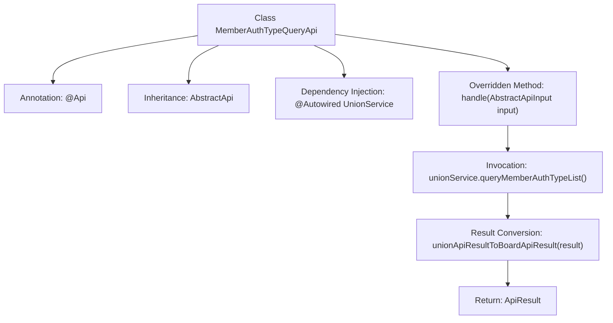

# Basic Information

|      |      |
|------|------|
| Name | MemberAuthTypeQueryApi |
| Language | .java |
| Code Path | WeFe/board/board-service/src/main/java/com/welab/wefe/board/service/api/union/member_auth/MemberAuthTypeQueryApi.java |
| Package Name | com.welab.wefe.board.service.api.union.member_auth |
| Dependencies | ['com.alibaba.fastjson.JSONObject', 'com.welab.wefe.board.service.sdk.union.UnionService', 'com.welab.wefe.common.exception.StatusCodeWithException', 'com.welab.wefe.common.web.api.base.AbstractApi', 'com.welab.wefe.common.web.api.base.Api', 'com.welab.wefe.common.web.dto.AbstractApiInput', 'com.welab.wefe.common.web.dto.ApiResult', 'org.springframework.beans.factory.annotation.Autowired'] |
| Brief Description | This is an API for querying member authentication types, with the path union/member/authtype/query. It retrieves data through UnionService and returns the results. |

# Description

This is a Java class named MemberAuthTypeQueryApi, designed for querying alliance member authentication types. It extends the AbstractApi class with generic parameters AbstractApiInput and Object. The class is annotated with @Api, specifying the path as union/member/authtype/query and the name as "Query member authtype from union". Inside the class, an instance of UnionService is injected via the @Autowired annotation. The handle method is overridden to invoke the queryMemberAuthTypeList method of unionService, then converts the result type to ApiResult<Object> using the unionApiResultToBoardApiResult method. This method may throw a StatusCodeWithException.

# Class Summary

| Name   | Type  | Description |
|-------|------|-------------|
| MemberAuthTypeQueryApi | class | This is an API class for querying member authentication types, with the path union/member/authtype/query. It retrieves and returns results by invoking the queryMemberAuthTypeList method of unionService. |


## Class MemberAuthTypeQueryApi

|      |      |
|------|------|
| Access Modifier | @Api(path = "union/member/authtype/query", name = "Query member authtype from union");public |
| Type | class |
| Name | MemberAuthTypeQueryApi |
| Description | This is an API class for querying member authentication types, with the path union/member/authtype/query. It retrieves and returns results by invoking the queryMemberAuthTypeList method of unionService. |


### UML Class Diagram

```mermaid
classDiagram
    class AbstractApi~T, R~ {
        <<abstract>>
        +handle(T input) R
    }
    // AbstractApi is a generic API base class defining input/output types with generics

    class MemberAuthTypeQueryApi {
        -UnionService unionService
        +handle(AbstractApiInput input) ApiResult~Object~
    }
    // Member authentication type query API, inheriting from AbstractApi with specified generic parameters

    class UnionService {
        <<Interface>>
        +queryMemberAuthTypeList() JSONObject
    }
    // Union service interface providing member authentication type query capability

    MemberAuthTypeQueryApi --> AbstractApi : Inherits
    MemberAuthTypeQueryApi --> UnionService : Depends on
```

This code demonstrates the implementation structure of a member authentication type query API. MemberAuthTypeQueryApi inherits from the generic base class AbstractApi and retrieves authentication type data through the injected UnionService interface. The class diagram clearly illustrates three-tier relationships: inheritance between the concrete API implementation class and abstract base class, dependency on the service interface, and type constraints among components. UnionService serves as an independent interface, whose implementation class can provide concrete functionality via dependency injection.


### Internal Method Call Graph



This code demonstrates a Spring framework-based API class for querying member authentication types. The flowchart clearly illustrates the class inheritance structure, dependency-injected services, and core processing logic: retrieving data via UnionService, transforming the result format, and returning it. The @Api annotation defines the interface path and name, while the handle method implements the parent class's abstract method and handles business logic.

### Field List

| Name  | Type  | Description |
|-------|-------|------|
| unionService | UnionService | Automatically inject the UnionService instance. |

### Method List

| Name  | Type  | Description |
|-------|-------|------|
| handle | ApiResult<Object> | This method processes API requests, calls the unionService to query the list of member authentication types, and converts the results into a unified API format for return. |


