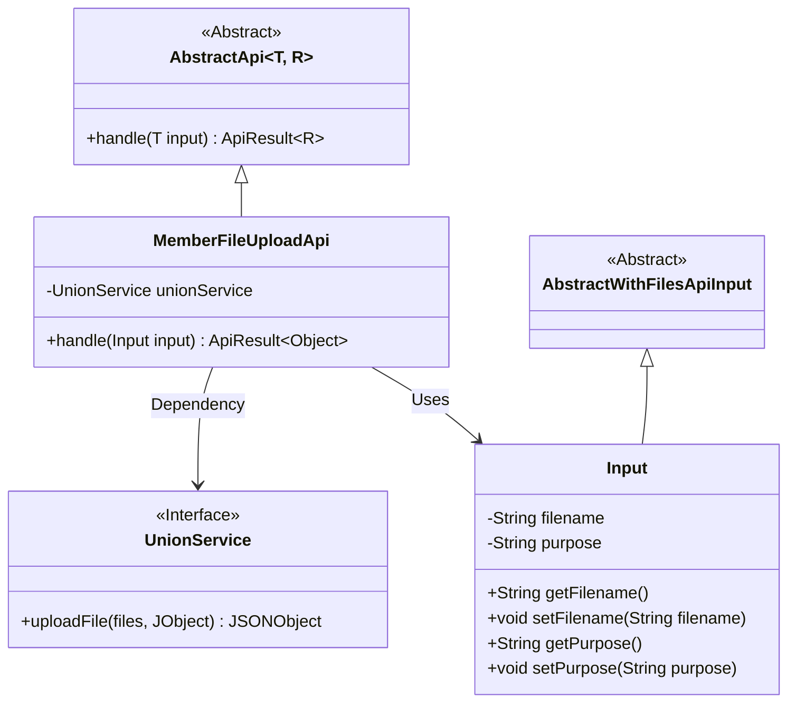
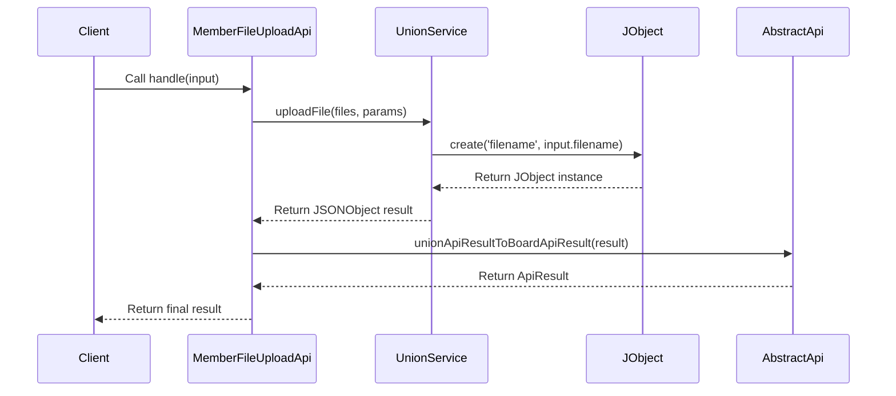

# Basic Information

|      |      |
|------|------|
| Name | MemberFileUploadApi |
| Language | .java |
| Code Path | WeFe/board/board-service/src/main/java/com/welab/wefe/board/service/api/union/member_auth/MemberFileUploadApi.java |
| Package Name | com.welab.wefe.board.service.api.union.member_auth |
| Dependencies | ['com.alibaba.fastjson.JSONObject', 'com.welab.wefe.board.service.sdk.union.UnionService', 'com.welab.wefe.common.exception.StatusCodeWithException', 'com.welab.wefe.common.util.JObject', 'com.welab.wefe.common.web.api.base.AbstractApi', 'com.welab.wefe.common.web.api.base.Api', 'com.welab.wefe.common.web.dto.AbstractWithFilesApiInput', 'com.welab.wefe.common.web.dto.ApiResult', 'org.springframework.beans.factory.annotation.Autowired'] |
| Brief Description | The `MemberFileUploadApi` class handles file upload requests, invokes the `UnionService` to upload files, and returns the results. Input parameters include the filename and purpose. |

# Description

This is an API class named MemberFileUploadApi, designed to handle file upload requests. It inherits from the AbstractApi class, accepts input parameters of type Input, and returns results of type Object. The API path is union/member/file/upload, and its name is "upload file." The class processes uploaded files by invoking the uploadFile method through the injected UnionService and converts the result into an ApiResult for return. The Input inner class inherits from AbstractWithFilesApiInput and includes two string properties, filename and purpose, along with their corresponding getter and setter methods.

# Class Summary

| Name   | Type  | Description |
|-------|------|-------------|
| MemberFileUploadApi | class | This is a file upload API class with the path union/member/file/upload. It uses UnionService to handle upload requests, accepts filename and purpose parameters, and returns the processing result. |

## Class MemberFileUploadApi

|      |      |
|------|------|
| Access Modifier | @Api(path = "union/member/file/upload", name = "upload file");public |
| Type | class |
| Name | MemberFileUploadApi |
| Description | This is a file upload API class with the path union/member/file/upload. It uses UnionService to handle upload requests, accepts filename and purpose parameters, and returns the processing result. |

### UML Class Diagram

This code describes a file upload API implementation class MemberFileUploadApi, which inherits from the generic abstract class AbstractApi, processes Input-type parameters and returns Object-type results. The class contains a dependency on UnionService for actual file upload operations. The Input class inherits from AbstractWithFilesApiInput and includes two attributes: filename and purpose. The overall structure demonstrates a typical API layer implementation pattern, where core business logic is handled through the service layer while encapsulating the input parameters required for file upload.

### Internal Method Call Graph

```mermaid
graph TD
    A["Class MemberFileUploadApi"]
    B["Annotation: @Api(path='union/member/file/upload', name='upload file')"]
    C["Inheritance: AbstractApi<Input, Object>"]
    D["Dependency Injection: @Autowired UnionService unionService"]
    E["Overridden Method: handle(Input input)"]
    F["Invocation: unionService.uploadFile()"]
    G["Creation: JObject.create()"]
    H["Result Conversion: unionApiResultToBoardApiResult()"]
    I["Nested Class Input"]
    J["Property: String filename"]
    K["Property: String purpose"]
    L["Getter/Setter Methods"]

    A --> B
    A --> C
    A --> D
    A --> E
    E --> F
    F --> G
    F --> H
    A --> I
    I --> J
    I --> K
    I --> L
```

This code implements a file upload API interface that inherits from the AbstractApi base class, utilizing UnionService to handle the file upload business logic. The flowchart illustrates the class structure relationships, including annotations, dependency injection, and method invocation chains. The sequence diagram details the complete call process from client request to final result return, highlighting the interaction flow of file upload parameter encapsulation and service invocation. The nested Input class is used to encapsulate metadata information for uploaded files.

### Field List

| Name  | Type  | Description |
|-------|-------|------|
| unionService | UnionService | Automatically inject the UnionService instance. |

### Method List

| Name  | Type  | Description |
|-------|-------|------|
| handle | ApiResult<Object> | Rewrite the file upload handling method to call the unionService for file upload and return the converted result. |

