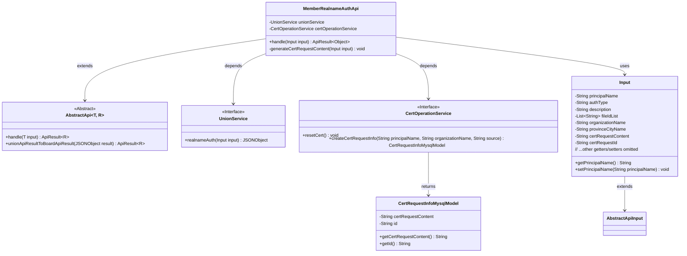
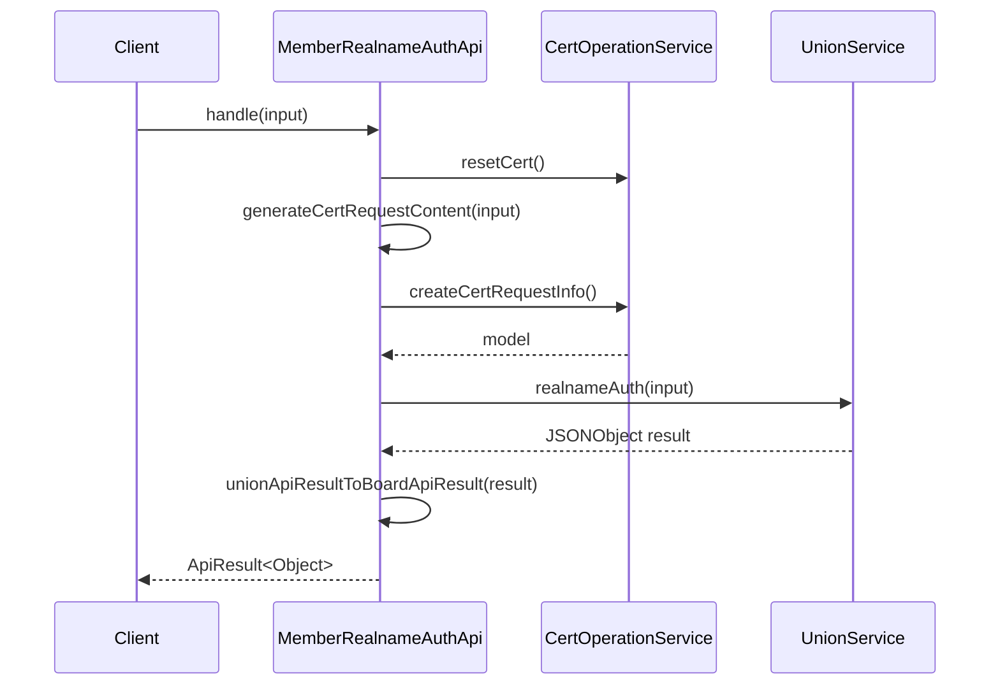

# Basic Information

|      |      |
|------|------|
| Name | MemberRealnameAuthApi |
| Language | .java |
| Code Path | WeFe/board/board-service/src/main/java/com/welab/wefe/board/service/api/union/member_auth/MemberRealnameAuthApi.java |
| Package Name | com.welab.wefe.board.service.api.union.member_auth |
| Dependencies | ['com.alibaba.fastjson.JSONObject', 'com.welab.wefe.board.service.database.entity.cert.CertRequestInfoMysqlModel', 'com.welab.wefe.board.service.sdk.union.UnionService', 'com.welab.wefe.board.service.service.CertOperationService', 'com.welab.wefe.common.StatusCode', 'com.welab.wefe.common.exception.StatusCodeWithException', 'com.welab.wefe.common.web.api.base.AbstractApi', 'com.welab.wefe.common.web.api.base.Api', 'com.welab.wefe.common.web.dto.AbstractApiInput', 'com.welab.wefe.common.web.dto.ApiResult', 'org.springframework.beans.factory.annotation.Autowired', 'java.io.IOException', 'java.util.List'] |
| Brief Description | Real-name Authentication API class, handling user real-name authentication requests, generating certificate requests, and invoking alliance services to complete authentication. Includes input parameter classes for recording user information and certificate request content. |

# Description

The code defines an API class named `MemberRealnameAuthApi`, designed to handle real-name authentication requests. The API path is `union/member/realname/auth`. The class inherits from `AbstractApi`, with the input type being the inner class `Input` and the return type being `Object`. Its primary functions include resetting local certificates, generating Certificate Signing Request (CSR) content, and invoking the real-name authentication service.  

The inner class `Input` contains multiple fields, such as subject name, authentication type, description, file ID list, organization name, province/city name, certificate request content, and ID, all of which are equipped with getter and setter methods. During processing, exceptions such as `StatusCodeWithException` and `IOException` may be thrown.

# Class Summary

| Name   | Type  | Description |
|-------|------|-------------|
| MemberRealnameAuthApi | class | Member Real-Name Authentication API, processes input parameters to generate certificate requests, invokes the real-name authentication service, and returns the results. |

## Class MemberRealnameAuthApi

|      |      |
|------|------|
| Access Modifier | @Api(path = "union/member/realname/auth", name = "apply realname auth");public |
| Type | class |
| Name | MemberRealnameAuthApi |
| Description | Member Real-Name Authentication API, processes input parameters to generate certificate requests, invokes the real-name authentication service, and returns the results. |

### UML Class Diagram

Class Diagram Description: This diagram illustrates the core structure of the real-name authentication API. MemberRealnameAuthApi inherits from the generic abstract class AbstractApi and depends on two service interfaces: UnionService and CertOperationService. Input serves as an internal data transfer object inheriting from AbstractApiInput, containing fields required for authentication. CertOperationService operations return the CertRequestInfoMysqlModel class. The overall implementation covers business processes including certificate reset, CSR generation, and consortium blockchain real-name authentication.

### Internal Method Call Graph

```mermaid
graph TD
    A["Class MemberRealnameAuthApi"]
    B["Inheritance: AbstractApi<Input, Object>"]
    C["Dependency: UnionService unionService"]
    D["Dependency: CertOperationService certOperationService"]
    E["Main method: handle(Input input)"]
    F["Helper method: generateCertRequestContent(Input input)"]
    G["Inner class: Input"]
    H["Method: resetCert()"]
    I["Method: createCertRequestInfo()"]
    J["Method: realnameAuth()"]
    K["Method: unionApiResultToBoardApiResult()"]

    A --> B
    A --> C
    A --> D
    A --> E
    A --> F
    A --> G
    E --> H
    E --> F
    F --> I
    E --> J
    E --> K
    C --> J
    D --> H
    D --> I
```

This code implements a real-name authentication API. The main workflow includes: resetting certificates, generating certificate request content, invoking union services for real-name authentication, and finally converting the result format. The flowchart illustrates the class structure and dependencies, while the sequence diagram details the processing of authentication requests, involving interactions between two key components: certificate operations and union services. The code ensures system stability through exception handling and logging, with the Input inner class encapsulating all required authentication parameters.

### Field List

| Name  | Type  | Description |
|-------|-------|------|
| certOperationService | CertOperationService | Using @Autowired to automatically inject an instance of CertOperationService. |
| unionService | UnionService | Automatically inject the UnionService instance. |

### Method List

| Name  | Type  | Description |
|-------|-------|------|
| handle | ApiResult<Object> | Processing member real-name authentication: reset local certificate, generate CSR request, invoke real-name authentication service, and convert the result. |
| generateCertRequestContent | void | Generate certificate request content, set the request ID and content, log errors when exceptions occur, and throw a system error. |

