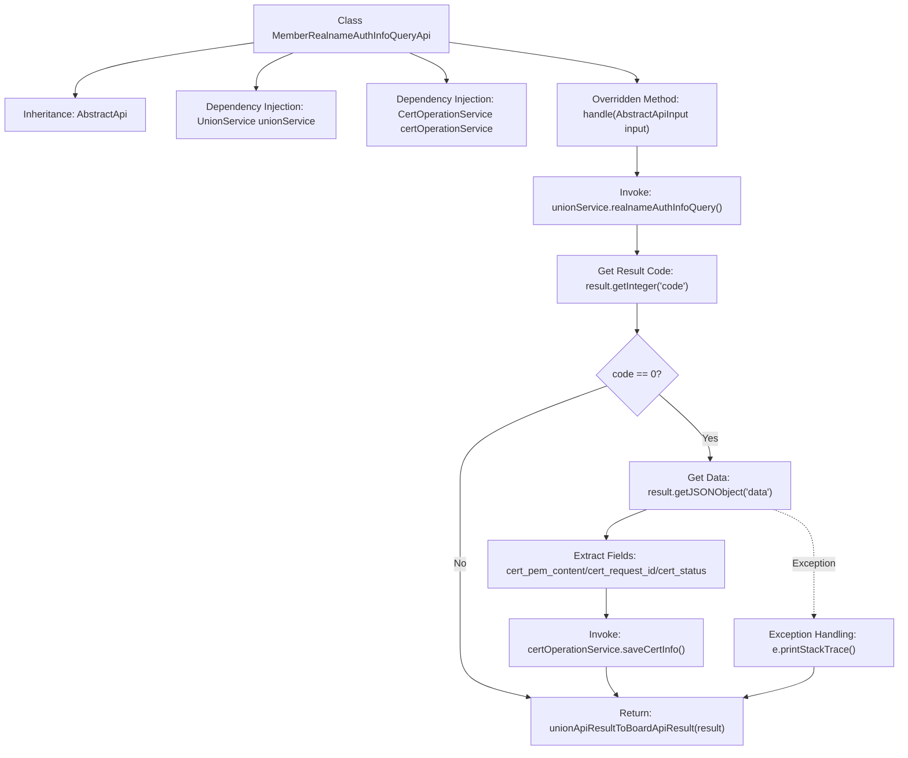

# Basic Information

|      |      |
|------|------|
| Name | MemberRealnameAuthInfoQueryApi |
| Language | .java |
| Code Path | WeFe/board/board-service/src/main/java/com/welab/wefe/board/service/api/union/member_auth/MemberRealnameAuthInfoQueryApi.java |
| Package Name | com.welab.wefe.board.service.api.union.member_auth |
| Dependencies | ['java.io.IOException', 'org.springframework.beans.factory.annotation.Autowired', 'com.alibaba.fastjson.JSONObject', 'com.welab.wefe.board.service.sdk.union.UnionService', 'com.welab.wefe.board.service.service.CertOperationService', 'com.welab.wefe.common.exception.StatusCodeWithException', 'com.welab.wefe.common.web.api.base.AbstractApi', 'com.welab.wefe.common.web.api.base.Api', 'com.welab.wefe.common.web.dto.AbstractApiInput', 'com.welab.wefe.common.web.dto.ApiResult'] |
| Brief Description | API class for querying real-name authentication information, which calls UnionService to retrieve authentication data. If successful, it saves the certificate information, request ID, and status via CertOperationService, and finally returns the processing result. |

# Description

This is an API class named MemberRealnameAuthInfoQueryApi, designed to query real-name authentication agreement template information. It inherits from the AbstractApi base class, accepts AbstractApiInput as input, and returns an Object type result. The API processes business logic through the injected UnionService and CertOperationService. The main logic involves calling the unionService's realnameAuthInfoQuery method to obtain results. When the return code is 0, it extracts the certificate content, request ID, and status information from the results and saves these details via certOperationService. Finally, it converts the results into a unified API format for return. During processing, exceptions are caught and logged but do not interrupt the flow.

# Class Summary

| Name   | Type  | Description |
|-------|------|-------------|
| MemberRealnameAuthInfoQueryApi | class | API for querying real-name authentication information, calls UnionService to obtain results, saves certificate information to CertOperationService upon success, and finally returns the processing result. |


## Class MemberRealnameAuthInfoQueryApi

|      |      |
|------|------|
| Access Modifier | @Api(path = "union/member/realname/authInfo/query", name = "realname auth agreement template query");public |
| Type | class |
| Name | MemberRealnameAuthInfoQueryApi |
| Description | API for querying real-name authentication information, calls UnionService to obtain results, saves certificate information to CertOperationService upon success, and finally returns the processing result. |


### UML Class Diagram

```mermaid
classDiagram
    class AbstractApi~T, R~ {
        <<Abstract>>
        +handle(T input) R
    }
    // AbstractApi is the base class defining common API processing logic

    class MemberRealnameAuthInfoQueryApi {
        -UnionService unionService
        -CertOperationService certOperationService
        +handle(AbstractApiInput input) ApiResult~Object~
    }
    // Concrete API implementation for real-name authentication information query

    class UnionService {
        <<Interface>>
        +realnameAuthInfoQuery() JSONObject
    }
    // Provides interface for real-name authentication query service

    class CertOperationService {
        <<Interface>>
        +saveCertInfo(String, String, String) void
    }
    // Provides interface for certificate information storage service

    AbstractApi <|-- MemberRealnameAuthInfoQueryApi
    MemberRealnameAuthInfoQueryApi --> UnionService : Invokes query service
    MemberRealnameAuthInfoQueryApi --> CertOperationService : Invokes storage service
```

Class diagram description: This structure demonstrates the implementation hierarchy of a real-name authentication information query API. MemberRealnameAuthInfoQueryApi inherits from the generic abstract class AbstractApi, depends on UnionService to obtain authentication information, and calls CertOperationService to store certificate data. Both services are defined as interfaces, reflecting the Dependency Inversion Principle. When the query returns a successful status code, it parses and saves the certificate content, request ID, and status information before converting the API response format. Exception handling adopts silent capture to ensure the main flow remains unaffected.


### Internal Method Call Graph



This flowchart illustrates the core processing logic of the real-name authentication information query API. It first queries authentication information through UnionService, then determines whether to process data based on the return code: if successful, it extracts certificate content, request ID, and status, and saves the information via CertOperationService; regardless of success, it ultimately converts and returns the result format. The process includes an exception handling branch, comprehensively covering both normal flow and error scenario processing paths.

### Field List

| Name  | Type  | Description |
|-------|-------|------|
| unionService | UnionService | Automatically inject the UnionService instance. |
| certOperationService | CertOperationService | Automatically inject the CertOperationService instance. |

### Method List

| Name  | Type  | Description |
|-------|-------|------|
| handle | ApiResult<Object> | This method handles real-name authentication queries by invoking a service to retrieve results and then checking the status code. If successful, it extracts the certificate content, request ID, and status, saving them to the service. Finally, it converts and returns the API result. |


